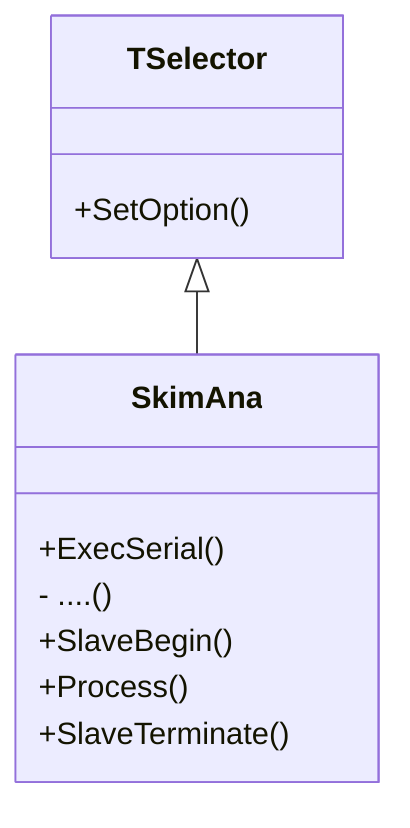
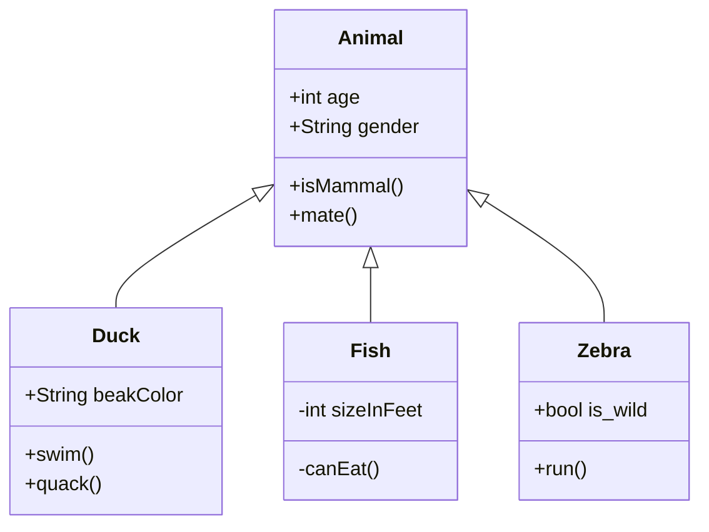

# Table of Contents
1. [Motivation](#motivation)
2. [Quick Start](#quick-start)
   - [Local processing](#local-processing)
   - [GRID job submission](#grid-job-submission)
3. [Description and processing flow](#description-and-processing-flow)
   - [Description of subfolders](#description-of-subfolders)
   - [Processing flow](#processing-flow)
4. [Acknowledgement](#acknowledgement)

## Motivation

In this folder, we process the Skim files and apply various corrections and scale factors. 
The final outputs are stored as TH1 and TTree objects in separate files.
The codes `SkimAna.C` and `SkimAna.h` are the central codes that call other classes and methods to perform the main tasks.

We first show how to quick start the analysis and then describe the list of important codes and processing flow.

---
## Quick Start

### Local processing

Once the repository is downloaded in a `lxplus` machine, the final output of TH1/TTree objects can be produced by processing a skim file in three simple steps.

1. CMSSW : Set the environment for CMSSW. The CMSSW_X_X_X can be created in other location irrespective of the download directory of current project. Since we are using `correctionlib` for reading the json files, we use CMSSW_12_1_X as per suggestion at . 

   ```console
   export SCRAM_ARCH=slc7_amd64_gcc900
   source /cvmfs/cms.cern.ch/cmsset_default.sh
   scramv1 project CMSSW CMSSW_12_1_0
   cd CMSSW_12_1_0/src
   cmsenv
   ```

2. Compile : Now change directory to downloaded KinFit_Skim/CBA_Skim folder and run the following command.
   ```console
   [idas@lxplus7113 CBA_Skim]$ make
   ```

   <details>
         <summary markdown="span"> Click to check expected output.</summary>
   
   
	 ```console	 
	 g++ -fPIC -g  -c `root-config --libs` -I`root-config --incdir` -std=c++17 -D STANDALONE src/FactorizedJetCorrector.cpp -o src/FactorizedJetCorrector.o
	 g++ -fPIC -g  -c `root-config --libs` -I`root-config --incdir` -std=c++17 -D STANDALONE src/JetCorrectorParameters.cpp -o src/JetCorrectorParameters.o
	 g++ -fPIC -g  -c `root-config --libs` -I`root-config --incdir` -std=c++17 -D STANDALONE src/SimpleJetCorrector.cpp -o src/SimpleJetCorrector.o
	 g++ -fPIC -g  -c `root-config --libs` -I`root-config --incdir` -std=c++17 -D STANDALONE src/JetCorrectionUncertainty.cpp -o src/JetCorrectionUncertainty.o 
	 g++ -fPIC -g  -c `root-config --libs` -I`root-config --incdir` -std=c++17 -D STANDALONE src/SimpleJetCorrectionUncertainty.cpp -o src/SimpleJetCorrectionUncertainty.o
	 g++ -fPIC -g  -c `root-config --libs` -I`root-config --incdir` -std=c++17 -D STANDALONE src/JECvariation.cpp -o src/JECvariation.o
	 g++ -fPIC -g  -c `root-config --libs` -I`root-config --incdir` -std=c++17 -D STANDALONE src/JetResolutionObject.cc -o src/JetResolutionObject.o
	 g++ -fPIC -g  -c `root-config --libs` -I`root-config --incdir` -std=c++17 -D STANDALONE src/JetResolution.cc -o src/JetResolution.o
	 g++ -fPIC -g  -c -I`root-config --incdir` -std=c++17 -D STANDALONE src/EventTree.cpp -o src/EventTree.o
	 g++ -fPIC -g  -c -I`root-config --incdir` -std=c++17 -D STANDALONE src/Selector.cpp -o src/Selector.o
	 g++ -fPIC -g  -c -I`root-config --incdir` -std=c++17 -D STANDALONE src/EventPick.cpp -o src/EventPick.o
	 g++ -fPIC -g  -c `root-config --libs` -I`root-config --incdir` -std=c++17 -D STANDALONE src/RoccoR.cc -o src/RoccoR.o
	 g++ -fPIC -g  -c -I`root-config --incdir` -std=c++17 -D STANDALONE src/PUReweight.cpp -o src/PUReweight.o
	 g++ -fPIC -g  -c -I`root-config --incdir` -std=c++17 -D STANDALONE src/BTagCalibrationStandalone.cpp -o src/BTagCalibrationStandalone.o
	 g++ -fPIC -g  -o SkimAna `correction config --cflags --ldflags --rpath` `root-config --libs` -I`root-config --incdir` -I/cvmfs/cms.cern.ch/slc7_amd64_gcc900/cms/cmssw/CMSSW_12_1_0/src -L/cvmfs/cms.cern.ch/slc7_amd64_gcc900/cms/cmssw/CMSSW_12_1_0/lib/slc7_amd64_gcc900 -std=c++17 -D STANDALONE src/EventTree.o src/EventPick.o src/Selector.o  src/PUReweight.o src/BTagCalibrationStandalone.o src/Utils.cc src/FactorizedJetCorrector.o src/JetCorrectorParameters.o src/SimpleJetCorrector.o src/JetCorrectionUncertainty.o src/SimpleJetCorrectionUncertainty.o src/JECvariation.o src/RoccoR.o src/JetResolution.cc src/JetResolutionObject.cc SkimAna.C -lPhysicsToolsKinFitter -lEG -lProof
	 ```
   </details>


3. Excute : Apply the following command to excute the `SkimAna` on a single Skim file mentioned in `HplusM120_2017.txt`.
   ```console
   [idas@lxplus7113 CBA_Skim]$ ./SkimAna HplusM120 2017 input/eos/2017/HplusM120_2017.txt  0 base
   ```

   <details>
         <summary markdown="span"> Click to check expected output.</summary>
   
   
	 ```console	 
	 Input filename: input/eos/2017/HplusM120_2017.txt
	 Total files 1
	 Info in <UnknownClass::ExecSerial>: starting SkimAna with process option: sample=HplusM120|year=2017|input=input/eos/2017/HplusM120_2017.txt|index=0|syst=base|aod=nano|run=prod|trs=yes|total=1
	 Info in <TSelector::ExecSerial>: opening file root://eosuser.cern.ch//eos/cms/store/group/phys_higgs/HiggsExo/idas/cms-hcs-run2/Skim_NanoAODUL/2017/HplusM120_Skim_NanoAOD.root
	 Info in <TSelector::SlaveBegin>: starting SkimAna with process option: sample=HplusM120|year=2017|input=input/eos/2017/HplusM120_2017.txt|index=0|syst=base|aod=nano|run=prod|trs=yes|total=1 (tree: 0x4e3fd90)
	 Info in <TSelector::SlaveBegin>: sample : HplusM120, year : 2017, mode : 
	 Info in <TSelector::SelectSyst>: Syst : base
	 Info in <TSelector::Init>: tree: 0x4e3fd90
	 Info in <TSelector::SlaveBegin>: CS Init
	 Info in <TSelector::SlaveBegin>: GetNumber of Events and files
	 Info in <TSelector::GetNumberofEvents>: filename : root://eosuser.cern.ch//eos/cms/store/group/phys_higgs/HiggsExo/idas/cms-hcs-run2/Skim_NanoAODUL/2017/HplusM120_Skim_NanoAOD.root
	 sample  "HplusM120" has number of events = 2.35738e+07
	 Info in <TSelector::SlaveBegin>: Loading Lepton SF
	 Info in <TSelector::SlaveBegin>: Loading JEC JER
	 Info in <TSelector::SlaveBegin>: Loading BTag
	 Info in <TSelector::LoadBTag>: Begin
	 Info in <TSelector::LoadBTag>: DeepJet calibration has been selected
	 Info in <TSelector::LoadBTag>: DeepJet calibration has been selected : 2017
	 Info in <TSelector::LoadBTag>: /afs/cern.ch/user/i/idas/CMS-Analysis/NanoAOD-Analysis/CBA_Skim/weightUL/BtagSF/SF/2017/DeepJet_formatted.csv
	 Info in <TSelector::LoadBTag>: /afs/cern.ch/user/i/idas/CMS-Analysis/NanoAOD-Analysis/CBA_Skim/weightUL/BtagSF/SF/2017/ctagger_wp_deepJet_106XUL_v1_formatted.csv
	 Info in <TSelector::SlaveBegin>: Create Histos
	 Output (down, nom, up) : (0.981743,0.989425,0.997108)
	 ===============Sample : HplusM120
	 Syst : base, requested syst : base
	 Syst : puup, requested syst : base
	 Syst : pudown, requested syst : base
	 Syst : mueffup, requested syst : base
	 Syst : mueffdown, requested syst : base
	 Syst : eleeffup, requested syst : base
	 Syst : eleeffdown, requested syst : base
	 Syst : btagbup, requested syst : base
	 Syst : btagbdown, requested syst : base
	 Syst : btaglup, requested syst : base
	 Syst : btagldown, requested syst : base
	 Syst : prefireup, requested syst : base
	 Syst : prefiredown, requested syst : base
	 Syst : pdfup, requested syst : base
	 Syst : pdfdown, requested syst : base
	 Syst : q2fup, requested syst : base
	 Syst : q2down, requested syst : base
	 Syst : isrup, requested syst : base
	 Syst : isrdown, requested syst : base
	 Syst : fsrup, requested syst : base
	 Syst : fsrdown, requested syst : base
	 Syst : bctag1up, requested syst : base
	 Syst : bctag1down, requested syst : base
	 Syst : bctag2up, requested syst : base
	 Syst : bctag2down, requested syst : base
	 Syst : bctag3up, requested syst : base
	 Syst : bctag3down, requested syst : base
	 Syst : pujetidup, requested syst : base
	 Syst : pujetiddown, requested syst : base
	 Info in <TSelector::SlaveBegin>: End of SlaveBegin
	 Info in <TSelector::Notify>: processing fSampleType HplusM120 and file: root://eosuser.cern.ch//eos/cms/store/group/phys_higgs/HiggsExo/idas/cms-hcs-run2/Skim_NanoAODUL/2017/HplusM120_Skim_NanoAOD.root
	 Using event weight 0.46889
	 XS = 266.16
	 lumi = 41529.5
	 nEvents_MC = 2.35738e+07
	 Wrong number of bins in the pileup histogram
	 PU reading file root://eosuser.cern.ch//eos/cms/store/group/phys_higgs/HiggsExo/idas/cms-hcs-run2/Skim_NanoAODUL/2017/HplusM120_Skim_NanoAOD.root
	 Wrong number of bins in the pileup histogram
	 PU reading file root://eosuser.cern.ch//eos/cms/store/group/phys_higgs/HiggsExo/idas/cms-hcs-run2/Skim_NanoAODUL/2017/HplusM120_Skim_NanoAOD.root
	 Wrong number of bins in the pileup histogram
	 PU reading file root://eosuser.cern.ch//eos/cms/store/group/phys_higgs/HiggsExo/idas/cms-hcs-run2/Skim_NanoAODUL/2017/HplusM120_Skim_NanoAOD.root
	 Info in <TSelector::Notify>: Efficientcy file : /afs/cern.ch/user/i/idas/CMS-Analysis/NanoAOD-Analysis/CBA_Skim/weightUL/BtagSF/Efficiency/btag_deepjet/2017/HplusM120_btag_eff_deepjet_2017.root
	 Info in <TSelector::Notify>: Btag threshold : 0.304000
	 PV 1
	 ndof=77.25   (>4)
	 pX=-0.0240631   (<2)
	 pY=0.069397   (<2)
	 pZ=0.544418   (<24)
	 Info in <TSelector::Process>: Processing : 10000(9999) of number of events : 447389 and total number of events : 1227000, year : 2017
	 Info in <TSelector::Process>: Processing : 20000(19999) of number of events : 447389 and total number of events : 1227000, year : 2017
	 Info in <TSelector::Process>: Processing : 30000(29999) of number of events : 447389 and total number of events : 1227000, year : 2017
	 Info in <TSelector::Process>: Processing : 40000(39999) of number of events : 447389 and total number of events : 1227000, year : 2017
	 Info in <TSelector::Process>: Processing : 50000(49999) of number of events : 447389 and total number of events : 1227000, year : 2017
	 Info in <TSelector::Process>: Processing : 60000(59999) of number of events : 447389 and total number of events : 1227000, year : 2017
	 Info in <TSelector::Process>: Processing : 70000(69999) of number of events : 447389 and total number of events : 1227000, year : 2017
	 Info in <TSelector::Process>: Processing : 80000(79999) of number of events : 447389 and total number of events : 1227000, year : 2017
	 Info in <TSelector::Process>: Processing : 90000(89999) of number of events : 447389 and total number of events : 1227000, year : 2017
	 Info in <TSelector::Process>: Processing : 100000(99999) of number of events : 447389 and total number of events : 1227000, year : 2017
	 Info in <TSelector::Process>: Processing : 110000(109999) of number of events : 447389 and total number of events : 1227000, year : 2017
	 Info in <TSelector::Process>: Processing : 120000(119999) of number of events : 447389 and total number of events : 1227000, year : 2017
	 Info in <TSelector::Process>: Processing : 130000(129999) of number of events : 447389 and total number of events : 1227000, year : 2017
	 Info in <TSelector::Process>: Processing : 140000(139999) of number of events : 447389 and total number of events : 1227000, year : 2017
	 Info in <TSelector::Process>: Processing : 150000(149999) of number of events : 447389 and total number of events : 1227000, year : 2017
	 Info in <TSelector::Process>: Processing : 160000(159999) of number of events : 447389 and total number of events : 1227000, year : 2017
	 Info in <TSelector::Process>: Processing : 170000(169999) of number of events : 447389 and total number of events : 1227000, year : 2017
	 Info in <TSelector::Process>: Processing : 180000(179999) of number of events : 447389 and total number of events : 1227000, year : 2017
	 Info in <TSelector::Process>: Processing : 190000(189999) of number of events : 447389 and total number of events : 1227000, year : 2017
	 Info in <TSelector::Process>: Processing : 200000(199999) of number of events : 447389 and total number of events : 1227000, year : 2017
	 Info in <TSelector::Process>: Processing : 210000(209999) of number of events : 447389 and total number of events : 1227000, year : 2017
	 Info in <TSelector::Process>: Processing : 220000(219999) of number of events : 447389 and total number of events : 1227000, year : 2017
	 Info in <TSelector::Process>: Processing : 230000(229999) of number of events : 447389 and total number of events : 1227000, year : 2017
	 Info in <TSelector::Process>: Processing : 240000(239999) of number of events : 447389 and total number of events : 1227000, year : 2017
	 Info in <TSelector::Process>: Processing : 250000(249999) of number of events : 447389 and total number of events : 1227000, year : 2017
	 Info in <TSelector::Process>: Processing : 260000(259999) of number of events : 447389 and total number of events : 1227000, year : 2017
	 Info in <TSelector::Process>: Processing : 270000(269999) of number of events : 447389 and total number of events : 1227000, year : 2017
	 Info in <TSelector::Process>: Processing : 280000(279999) of number of events : 447389 and total number of events : 1227000, year : 2017
	 Info in <TSelector::Process>: Processing : 290000(289999) of number of events : 447389 and total number of events : 1227000, year : 2017
	 Info in <TSelector::Process>: Processing : 300000(299999) of number of events : 447389 and total number of events : 1227000, year : 2017
	 Info in <TSelector::Process>: Processing : 310000(309999) of number of events : 447389 and total number of events : 1227000, year : 2017
	 Info in <TSelector::Process>: Processing : 320000(319999) of number of events : 447389 and total number of events : 1227000, year : 2017
	 Info in <TSelector::Process>: Processing : 330000(329999) of number of events : 447389 and total number of events : 1227000, year : 2017
	 Info in <TSelector::Process>: Processing : 340000(339999) of number of events : 447389 and total number of events : 1227000, year : 2017
	 Info in <TSelector::Process>: Processing : 350000(349999) of number of events : 447389 and total number of events : 1227000, year : 2017
	 Info in <TSelector::Process>: Processing : 360000(359999) of number of events : 447389 and total number of events : 1227000, year : 2017
	 Info in <TSelector::Process>: Processing : 370000(369999) of number of events : 447389 and total number of events : 1227000, year : 2017
	 Info in <TSelector::Process>: Processing : 380000(379999) of number of events : 447389 and total number of events : 1227000, year : 2017
	 Info in <TSelector::Process>: Processing : 390000(389999) of number of events : 447389 and total number of events : 1227000, year : 2017
	 Info in <TSelector::Process>: Processing : 400000(399999) of number of events : 447389 and total number of events : 1227000, year : 2017
	 Info in <TSelector::Process>: Processing : 410000(409999) of number of events : 447389 and total number of events : 1227000, year : 2017
	 Info in <TSelector::Process>: Processing : 420000(419999) of number of events : 447389 and total number of events : 1227000, year : 2017
	 Info in <TSelector::Process>: Processing : 430000(429999) of number of events : 447389 and total number of events : 1227000, year : 2017
	 Info in <TSelector::Process>: Processing : 440000(439999) of number of events : 447389 and total number of events : 1227000, year : 2017
	 Info in <TSelector::SlaveTerminate>: sample : HplusM120, year : 2017, mode : 
	 DataMu & 244686.0 & 210189.0 & 120681.0 & 110417.0 & 55290.0 & 44637.0 & 43891.0 & 30490.0 & 7734.0 \\\hline 
	 WtMu & 2.1654e+06 & 1.8138e+06 & 974724.7 & 893635.8 & 426592.4 & 342535.9 & 333051.0 & 229136.6 & 31495.5 \\\hline 
	 DataEle & 187400.0 & 153056.0 & 88441.0 & 80736.0 & 40618.0 & 31950.0 & 31467.0 & 21642.0 & 5383.0 \\\hline 
	 WtEle & 1.6343e+06 & 1.2305e+06 & 666226.7 & 608397.9 & 294183.3 & 229086.9 & 223281.4 & 152158.8 & 20004.9 \\\hline 
	 ```
   </details>
   
   The arguments are,

   `./SkimAna $samplename $year $skim_filelist  $skim_index $syst_type`

   -  `samplename` : This represents the sample names such as *TTbar*,*singleTop*. Find the full list defined as `samples_$year` at . 
   -  `skim_filelist` : This file contains the list of Skim files for a given sample type (e.g. *TTbar*). Such input files contianing the Skim filelist can be checked at `input/eos/$year/`. Note that for 2016, the preVFP and postVFP file lists are available at,  `input/eos/2016/pre` and `input/eos/2016/post`, respectively.
   -  `skim_index` : This index tells that n-th file of skim file list will be processed.
   -  `syst_type` : These are possible systematics types. See a longer list defined as `syst_$year` (or `syst_long_$year`) at . Note that, to optimize the GRID computation time for KinFit few additional systematics are processed while executing for `base` type systematics. The additional types are listed as `const char *systbase[]` in . Therefore, for all MC samples the total list of systematics comprises with `syst_$year + systbase[]`, but *TTbar*, for which it is `syst_long_$year + systbase[]`. There are no systematics required for the analysis of data (e.g. *DataMu*, *DataEle* samples), however for Data Driven QCD estimations we require results with different Iso cuts. This is performed during the `iso20` type systematics processing of data samples.


### GRID job submission

Three additional steps are required to submit multiple GRID jobs (~15K in present case).

1. Intialize the GRID user token via,
   ```console
   [idas@lxplus7113 CBA_Skim]$ voms-proxy-init -voms cms
   ```

   <details>
         <summary markdown="span"> Click to check expected output.</summary>
   
   
	 ```console	 
	 Enter GRID pass phrase for this identity:
	 Contacting lcg-voms2.cern.ch:15002 [/DC=ch/DC=cern/OU=computers/CN=lcg-voms2.cern.ch] "cms"...
	 Remote VOMS server contacted succesfully.


	 Created proxy in /afs/cern.ch/user/i/idas/xx/yy/zz/x509up.

	 Your proxy is valid until Sat May 14 08:36:10 CEST 2022
	 ```
   </details>


2. Go inside the `condor` directory, then execute,
   ```console
   [idas@lxplus7113 condor]$ python createJdlFiles_cbaskim_syst.py
   ```

   <details>
         <summary markdown="span"> Click to check expected output.</summary>
   
   
	 ```console	 
	 tar: Removing leading `../../' from member names
	 ../../CBA_Skim/
	 ../../CBA_Skim/input/
	 ../../CBA_Skim/input/eos/
	 ../../CBA_Skim/input/eos/2016/
	 ../../CBA_Skim/input/eos/2016/DataEle_2016.txt
	 ../../CBA_Skim/input/eos/2016/DataMu_2016.txt
	 ../../CBA_Skim/input/eos/2016/DYjets_2016.txt
	 ../../CBA_Skim/input/eos/2016/HplusM080_2016.txt
	 ../../CBA_Skim/input/eos/2016/HplusM090_2016.txt
	 ../../CBA_Skim/input/eos/2016/HplusM100_2016.txt
	 ../../CBA_Skim/input/eos/2016/HplusM110_2016.txt
	 ../../CBA_Skim/input/eos/2016/HplusM120_2016.txt
	 ../../CBA_Skim/input/eos/2016/HplusM130_2016.txt
	 ../../CBA_Skim/input/eos/2016/HplusM140_2016.txt
	 ../../CBA_Skim/input/eos/2016/HplusM150_2016.txt
	 ../../CBA_Skim/input/eos/2016/HplusM155_2016.txt
	 ../../CBA_Skim/input/eos/2016/HplusM160_2016.txt
	 ../../CBA_Skim/input/eos/2016/HminusM080_2016.txt
	 ../../CBA_Skim/input/eos/2016/HminusM090_2016.txt
	 ../../CBA_Skim/input/eos/2016/HminusM100_2016.txt
	 ../../CBA_Skim/input/eos/2016/HminusM110_2016.txt
	 ../../CBA_Skim/input/eos/2016/HminusM120_2016.txt
	 ../../CBA_Skim/input/eos/2016/HminusM130_2016.txt
	 ../../CBA_Skim/input/eos/2016/HminusM140_2016.txt
	 ../../CBA_Skim/input/eos/2016/HminusM150_2016.txt
	 ../../CBA_Skim/input/eos/2016/HminusM155_2016.txt
	 ../../CBA_Skim/input/eos/2016/HminusM160_2016.txt
	 ../../CBA_Skim/input/eos/2016/MCQCDEle_2016.txt
	 ../../CBA_Skim/input/eos/2016/MCQCDMu_2016.txt
	 ../../CBA_Skim/input/eos/2016/TTbar_2016.txt
	 ../../CBA_Skim/input/eos/2016/singleTop_2016.txt
	 ../../CBA_Skim/input/eos/2016/Wjets_2016.txt
	 ../../CBA_Skim/input/eos/2016/VBFusion_2016.txt
	 ../../CBA_Skim/input/eos/2016/CP5down_TTbar_2016.txt
	 ../../CBA_Skim/input/eos/2016/CP5up_TTbar_2016.txt
	 ../../CBA_Skim/input/eos/2016/hdampdown_TTbar_2016.txt
	 ../../CBA_Skim/input/eos/2016/hdampup_TTbar_2016.txt
	 ../../CBA_Skim/input/eos/2016/mtopup_TTbar_2016.txt
	 ../../CBA_Skim/input/eos/2016/mtopdown_TTbar_2016.txt
	 ../../CBA_Skim/input/eos/2016/post/
	 ../../CBA_Skim/input/eos/2016/post/CP5down_TTbar_2016.txt
	 ../../CBA_Skim/input/eos/2016/post/CP5up_TTbar_2016.txt
	 ../../CBA_Skim/input/eos/2016/post/DYjets_2016.txt
	 ../../CBA_Skim/input/eos/2016/post/DataEle_2016.txt
	 ../../CBA_Skim/input/eos/2016/post/DataMu_2016.txt
	 ../../CBA_Skim/input/eos/2016/post/HminusM080_2016.txt
	 ../../CBA_Skim/input/eos/2016/post/HminusM090_2016.txt
	 ../../CBA_Skim/input/eos/2016/post/HminusM100_2016.txt
	 ../../CBA_Skim/input/eos/2016/post/HminusM110_2016.txt
	 ../../CBA_Skim/input/eos/2016/post/HminusM120_2016.txt
	 ../../CBA_Skim/input/eos/2016/post/HminusM130_2016.txt
	 ../../CBA_Skim/input/eos/2016/post/HminusM140_2016.txt
	 ../../CBA_Skim/input/eos/2016/post/HminusM150_2016.txt
	 ../../CBA_Skim/input/eos/2016/post/HminusM155_2016.txt
	 ../../CBA_Skim/input/eos/2016/post/HminusM160_2016.txt
	 ../../CBA_Skim/input/eos/2016/post/HplusM080_2016.txt
	 ../../CBA_Skim/input/eos/2016/post/HplusM090_2016.txt
	 ../../CBA_Skim/input/eos/2016/post/HplusM100_2016.txt
	 ../../CBA_Skim/input/eos/2016/post/HplusM110_2016.txt
	 ../../CBA_Skim/input/eos/2016/post/HplusM120_2016.txt
	 ../../CBA_Skim/input/eos/2016/post/HplusM130_2016.txt
	 ../../CBA_Skim/input/eos/2016/post/HplusM140_2016.txt
	 ../../CBA_Skim/input/eos/2016/post/HplusM150_2016.txt
	 ../../CBA_Skim/input/eos/2016/post/HplusM155_2016.txt
	 ../../CBA_Skim/input/eos/2016/post/TTbar_2016.txt
	 ../../CBA_Skim/input/eos/2016/post/HplusM160_2016.txt
	 ../../CBA_Skim/input/eos/2016/post/MCQCDEle_2016.txt
	 ../../CBA_Skim/input/eos/2016/post/MCQCDMu_2016.txt
	 ../../CBA_Skim/input/eos/2016/post/VBFusion_2016.txt
	 ../../CBA_Skim/input/eos/2016/post/Wjets_2016.txt
	 ../../CBA_Skim/input/eos/2016/post/all_Bkg.txt
	 ../../CBA_Skim/input/eos/2016/post/hdampdown_TTbar_2016.txt
	 ../../CBA_Skim/input/eos/2016/post/hdampup_TTbar_2016.txt
	 ../../CBA_Skim/input/eos/2016/post/mtopdown_TTbar_2016.txt
	 ../../CBA_Skim/input/eos/2016/post/mtopup_TTbar_2016.txt
	 ../../CBA_Skim/input/eos/2016/post/singleTop_2016.txt
	 ../../CBA_Skim/input/eos/2016/pre/
	 ../../CBA_Skim/input/eos/2016/pre/CP5down_TTbar_2016.txt
	 ../../CBA_Skim/input/eos/2016/pre/CP5up_TTbar_2016.txt
	 ../../CBA_Skim/input/eos/2016/pre/DYjets_2016.txt
	 ../../CBA_Skim/input/eos/2016/pre/DataEle_2016.txt
	 ../../CBA_Skim/input/eos/2016/pre/DataMu_2016.txt
	 ../../CBA_Skim/input/eos/2016/pre/HminusM080_2016.txt
	 ../../CBA_Skim/input/eos/2016/pre/HminusM090_2016.txt
	 ../../CBA_Skim/input/eos/2016/pre/HminusM100_2016.txt
	 ../../CBA_Skim/input/eos/2016/pre/HminusM110_2016.txt
	 ../../CBA_Skim/input/eos/2016/pre/HminusM120_2016.txt
	 ../../CBA_Skim/input/eos/2016/pre/HminusM130_2016.txt
	 ../../CBA_Skim/input/eos/2016/pre/HminusM140_2016.txt
	 ../../CBA_Skim/input/eos/2016/pre/HminusM150_2016.txt
	 ../../CBA_Skim/input/eos/2016/pre/HminusM155_2016.txt
	 ../../CBA_Skim/input/eos/2016/pre/HminusM160_2016.txt
	 ../../CBA_Skim/input/eos/2016/pre/HplusM080_2016.txt
	 ../../CBA_Skim/input/eos/2016/pre/HplusM090_2016.txt
	 ../../CBA_Skim/input/eos/2016/pre/HplusM100_2016.txt
	 ../../CBA_Skim/input/eos/2016/pre/HplusM110_2016.txt
	 ../../CBA_Skim/input/eos/2016/pre/HplusM120_2016.txt
	 ../../CBA_Skim/input/eos/2016/pre/HplusM130_2016.txt
	 ../../CBA_Skim/input/eos/2016/pre/HplusM140_2016.txt
	 ../../CBA_Skim/input/eos/2016/pre/HplusM150_2016.txt
	 ../../CBA_Skim/input/eos/2016/pre/HplusM155_2016.txt
	 ../../CBA_Skim/input/eos/2016/pre/TTbar_2016.txt
	 ../../CBA_Skim/input/eos/2016/pre/HplusM160_2016.txt
	 ../../CBA_Skim/input/eos/2016/pre/MCQCDEle_2016.txt
	 ../../CBA_Skim/input/eos/2016/pre/MCQCDMu_2016.txt
	 ../../CBA_Skim/input/eos/2016/pre/VBFusion_2016.txt
	 ../../CBA_Skim/input/eos/2016/pre/Wjets_2016.txt
	 ../../CBA_Skim/input/eos/2016/pre/all_Bkg.txt
	 ../../CBA_Skim/input/eos/2016/pre/hdampdown_TTbar_2016.txt
	 ../../CBA_Skim/input/eos/2016/pre/hdampup_TTbar_2016.txt
	 ../../CBA_Skim/input/eos/2016/pre/mtopdown_TTbar_2016.txt
	 ../../CBA_Skim/input/eos/2016/pre/mtopup_TTbar_2016.txt
	 ../../CBA_Skim/input/eos/2016/pre/singleTop_2016.txt
	 ../../CBA_Skim/input/eos/2016/all_Bkg.txt
	 ../../CBA_Skim/input/eos/2017/
	 ../../CBA_Skim/input/eos/2017/HplusM080_2017.txt
	 ../../CBA_Skim/input/eos/2017/HplusM090_2017.txt
	 ../../CBA_Skim/input/eos/2017/HplusM100_2017.txt
	 ../../CBA_Skim/input/eos/2017/HplusM110_2017.txt
	 ../../CBA_Skim/input/eos/2017/HplusM120_2017.txt
	 ../../CBA_Skim/input/eos/2017/HplusM130_2017.txt
	 ../../CBA_Skim/input/eos/2017/HplusM140_2017.txt
	 ../../CBA_Skim/input/eos/2017/HplusM150_2017.txt
	 ../../CBA_Skim/input/eos/2017/HplusM155_2017.txt
	 ../../CBA_Skim/input/eos/2017/HplusM160_2017.txt
	 ../../CBA_Skim/input/eos/2017/HminusM080_2017.txt
	 ../../CBA_Skim/input/eos/2017/HminusM090_2017.txt
	 ../../CBA_Skim/input/eos/2017/HminusM100_2017.txt
	 ../../CBA_Skim/input/eos/2017/HminusM110_2017.txt
	 ../../CBA_Skim/input/eos/2017/HminusM120_2017.txt
	 ../../CBA_Skim/input/eos/2017/HminusM130_2017.txt
	 ../../CBA_Skim/input/eos/2017/HminusM140_2017.txt
	 ../../CBA_Skim/input/eos/2017/HminusM150_2017.txt
	 ../../CBA_Skim/input/eos/2017/HminusM155_2017.txt
	 ../../CBA_Skim/input/eos/2017/HminusM160_2017.txt
	 ../../CBA_Skim/input/eos/2017/DataEle_2017.txt
	 ../../CBA_Skim/input/eos/2017/DataMu_2017.txt
	 ../../CBA_Skim/input/eos/2017/DYjets_2017.txt
	 ../../CBA_Skim/input/eos/2017/MCQCDEle_2017.txt
	 ../../CBA_Skim/input/eos/2017/MCQCDMu_2017.txt
	 ../../CBA_Skim/input/eos/2017/TTbar_2017.txt
	 ../../CBA_Skim/input/eos/2017/singleTop_2017.txt
	 ../../CBA_Skim/input/eos/2017/VBFusion_2017.txt
	 ../../CBA_Skim/input/eos/2017/Wjets_2017.txt
	 ../../CBA_Skim/input/eos/2017/CP5up_TTbar_2017.txt
	 ../../CBA_Skim/input/eos/2017/hdampup_TTbar_2017.txt
	 ../../CBA_Skim/input/eos/2017/mtopup_TTbar_2017.txt
	 ../../CBA_Skim/input/eos/2017/CP5down_TTbar_2017.txt
	 ../../CBA_Skim/input/eos/2017/hdampdown_TTbar_2017.txt
	 ../../CBA_Skim/input/eos/2017/mtopdown_TTbar_2017.txt
	 ../../CBA_Skim/input/eos/2018/
	 ../../CBA_Skim/input/eos/2018/DYjets_2018.txt
	 ../../CBA_Skim/input/eos/2018/DataEle_2018.txt
	 ../../CBA_Skim/input/eos/2018/DataMu_2018.txt
	 ../../CBA_Skim/input/eos/2018/MCQCDEle_2018.txt
	 ../../CBA_Skim/input/eos/2018/MCQCDMu_2018.txt
	 ../../CBA_Skim/input/eos/2018/TTbar_2018.txt
	 ../../CBA_Skim/input/eos/2018/VBFusion_2018.txt
	 ../../CBA_Skim/input/eos/2018/Wjets_2018.txt
	 ../../CBA_Skim/input/eos/2018/HminusM080_2018.txt
	 ../../CBA_Skim/input/eos/2018/singleTop_2018.txt
	 ../../CBA_Skim/input/eos/2018/HminusM090_2018.txt
	 ../../CBA_Skim/input/eos/2018/HminusM100_2018.txt
	 ../../CBA_Skim/input/eos/2018/HminusM110_2018.txt
	 ../../CBA_Skim/input/eos/2018/HminusM120_2018.txt
	 ../../CBA_Skim/input/eos/2018/HminusM130_2018.txt
	 ../../CBA_Skim/input/eos/2018/HminusM140_2018.txt
	 ../../CBA_Skim/input/eos/2018/HminusM150_2018.txt
	 ../../CBA_Skim/input/eos/2018/HminusM155_2018.txt
	 ../../CBA_Skim/input/eos/2018/HminusM160_2018.txt
	 ../../CBA_Skim/input/eos/2018/HplusM080_2018.txt
	 ../../CBA_Skim/input/eos/2018/HplusM090_2018.txt
	 ../../CBA_Skim/input/eos/2018/HplusM100_2018.txt
	 ../../CBA_Skim/input/eos/2018/HplusM110_2018.txt
	 ../../CBA_Skim/input/eos/2018/HplusM120_2018.txt
	 ../../CBA_Skim/input/eos/2018/HplusM130_2018.txt
	 ../../CBA_Skim/input/eos/2018/HplusM140_2018.txt
	 ../../CBA_Skim/input/eos/2018/HplusM150_2018.txt
	 ../../CBA_Skim/input/eos/2018/HplusM155_2018.txt
	 ../../CBA_Skim/input/eos/2018/HplusM160_2018.txt
	 ../../CBA_Skim/input/eos/2018/CP5down_TTbar_2018.txt
	 ../../CBA_Skim/input/eos/2018/CP5up_TTbar_2018.txt
	 ../../CBA_Skim/input/eos/2018/hdampdown_TTbar_2018.txt
	 ../../CBA_Skim/input/eos/2018/hdampup_TTbar_2018.txt
	 ../../CBA_Skim/input/eos/2018/mtopdown_TTbar_2018.txt
	 ../../CBA_Skim/input/eos/2018/mtopup_TTbar_2018.txt
	 ../../CBA_Skim/input/inlap/
	 ../../CBA_Skim/input/inlap/2016/
	 ../../CBA_Skim/input/inlap/2016/DYjets_2016.txt
	 ../../CBA_Skim/input/inlap/2016/post/
	 ../../CBA_Skim/input/inlap/2016/post/CP5down_TTbar_2016.txt
	 ../../CBA_Skim/input/inlap/2016/post/CP5up_TTbar_2016.txt
	 ../../CBA_Skim/input/inlap/2016/post/DYjets_2016.txt
	 ../../CBA_Skim/input/inlap/2016/post/DYjets_2016_long.txt
	 ../../CBA_Skim/input/inlap/2016/post/DataEle_2016.txt
	 ../../CBA_Skim/input/inlap/2016/post/DataMu_2016.txt
	 ../../CBA_Skim/input/inlap/2016/post/HminusM080_2016.txt
	 ../../CBA_Skim/input/inlap/2016/post/HminusM090_2016.txt
	 ../../CBA_Skim/input/inlap/2016/post/HminusM100_2016.txt
	 ../../CBA_Skim/input/inlap/2016/post/HminusM110_2016.txt
	 ../../CBA_Skim/input/inlap/2016/post/HminusM120_2016.txt
	 ../../CBA_Skim/input/inlap/2016/post/HminusM130_2016.txt
	 ../../CBA_Skim/input/inlap/2016/post/HminusM140_2016.txt
	 ../../CBA_Skim/input/inlap/2016/post/HminusM150_2016.txt
	 ../../CBA_Skim/input/inlap/2016/post/HminusM155_2016.txt
	 ../../CBA_Skim/input/inlap/2016/post/HminusM160_2016.txt
	 ../../CBA_Skim/input/inlap/2016/post/HplusM080_2016.txt
	 ../../CBA_Skim/input/inlap/2016/post/HplusM090_2016.txt
	 ../../CBA_Skim/input/inlap/2016/post/HplusM100_2016.txt
	 ../../CBA_Skim/input/inlap/2016/post/HplusM110_2016.txt
	 ../../CBA_Skim/input/inlap/2016/post/HplusM120_2016.txt
	 ../../CBA_Skim/input/inlap/2016/post/HplusM130_2016.txt
	 ../../CBA_Skim/input/inlap/2016/post/HplusM140_2016.txt
	 ../../CBA_Skim/input/inlap/2016/post/HplusM150_2016.txt
	 ../../CBA_Skim/input/inlap/2016/post/TTbar_2016.txt
	 ../../CBA_Skim/input/inlap/2016/post/HplusM155_2016.txt
	 ../../CBA_Skim/input/inlap/2016/post/HplusM160_2016.txt
	 ../../CBA_Skim/input/inlap/2016/post/MCQCDEle_2016.txt
	 ../../CBA_Skim/input/inlap/2016/post/MCQCDMu_2016.txt
	 ../../CBA_Skim/input/inlap/2016/post/VBFusion_2016.txt
	 ../../CBA_Skim/input/inlap/2016/post/Wjets_2016.txt
	 ../../CBA_Skim/input/inlap/2016/post/hdampdown_TTbar_2016.txt
	 ../../CBA_Skim/input/inlap/2016/post/hdampup_TTbar_2016.txt
	 ../../CBA_Skim/input/inlap/2016/post/mtopdown_TTbar_2016.txt
	 ../../CBA_Skim/input/inlap/2016/post/mtopup_TTbar_2016.txt
	 ../../CBA_Skim/input/inlap/2016/post/singleTop_2016.txt
	 ../../CBA_Skim/input/inlap/2016/pre/
	 ../../CBA_Skim/input/inlap/2016/pre/CP5down_TTbar_2016.txt
	 ../../CBA_Skim/input/inlap/2016/pre/CP5up_TTbar_2016.txt
	 ../../CBA_Skim/input/inlap/2016/pre/DYjets_2016.txt
	 ../../CBA_Skim/input/inlap/2016/pre/DYjets_2016_long.txt
	 ../../CBA_Skim/input/inlap/2016/pre/DataEle_2016.txt
	 ../../CBA_Skim/input/inlap/2016/pre/DataMu_2016.txt
	 ../../CBA_Skim/input/inlap/2016/pre/HminusM080_2016.txt
	 ../../CBA_Skim/input/inlap/2016/pre/HminusM090_2016.txt
	 ../../CBA_Skim/input/inlap/2016/pre/HminusM100_2016.txt
	 ../../CBA_Skim/input/inlap/2016/pre/HminusM110_2016.txt
	 ../../CBA_Skim/input/inlap/2016/pre/HminusM120_2016.txt
	 ../../CBA_Skim/input/inlap/2016/pre/HminusM130_2016.txt
	 ../../CBA_Skim/input/inlap/2016/pre/HminusM140_2016.txt
	 ../../CBA_Skim/input/inlap/2016/pre/HminusM150_2016.txt
	 ../../CBA_Skim/input/inlap/2016/pre/HminusM155_2016.txt
	 ../../CBA_Skim/input/inlap/2016/pre/HminusM160_2016.txt
	 ../../CBA_Skim/input/inlap/2016/pre/HplusM080_2016.txt
	 ../../CBA_Skim/input/inlap/2016/pre/HplusM090_2016.txt
	 ../../CBA_Skim/input/inlap/2016/pre/HplusM100_2016.txt
	 ../../CBA_Skim/input/inlap/2016/pre/HplusM110_2016.txt
	 ../../CBA_Skim/input/inlap/2016/pre/HplusM120_2016.txt
	 ../../CBA_Skim/input/inlap/2016/pre/HplusM130_2016.txt
	 ../../CBA_Skim/input/inlap/2016/pre/HplusM140_2016.txt
	 ../../CBA_Skim/input/inlap/2016/pre/HplusM150_2016.txt
	 ../../CBA_Skim/input/inlap/2016/pre/TTbar_2016.txt
	 ../../CBA_Skim/input/inlap/2016/pre/HplusM155_2016.txt
	 ../../CBA_Skim/input/inlap/2016/pre/HplusM160_2016.txt
	 ../../CBA_Skim/input/inlap/2016/pre/MCQCDEle_2016.txt
	 ../../CBA_Skim/input/inlap/2016/pre/MCQCDMu_2016.txt
	 ../../CBA_Skim/input/inlap/2016/pre/VBFusion_2016.txt
	 ../../CBA_Skim/input/inlap/2016/pre/Wjets_2016.txt
	 ../../CBA_Skim/input/inlap/2016/pre/hdampdown_TTbar_2016.txt
	 ../../CBA_Skim/input/inlap/2016/pre/hdampup_TTbar_2016.txt
	 ../../CBA_Skim/input/inlap/2016/pre/mtopdown_TTbar_2016.txt
	 ../../CBA_Skim/input/inlap/2016/pre/mtopup_TTbar_2016.txt
	 ../../CBA_Skim/input/inlap/2016/pre/singleTop_2016.txt
	 ../../CBA_Skim/input/inlap/2016/DataEle_2016.txt
	 ../../CBA_Skim/input/inlap/2016/DataMu_2016.txt
	 ../../CBA_Skim/input/inlap/2016/HplusM120_2016.txt
	 ../../CBA_Skim/input/inlap/2016/MCQCDEle_2016.txt
	 ../../CBA_Skim/input/inlap/2016/MCQCDMu_2016.txt
	 ../../CBA_Skim/input/inlap/2016/TTbar_2016.txt
	 ../../CBA_Skim/input/inlap/2016/VBFusion_2016.txt
	 ../../CBA_Skim/input/inlap/2016/Wjets_2016.txt
	 ../../CBA_Skim/input/inlap/2016/singleTop_2016.txt
	 ../../CBA_Skim/input/inlap/2016/HplusM080_2016.txt
	 ../../CBA_Skim/input/inlap/2016/HplusM090_2016.txt
	 ../../CBA_Skim/input/inlap/2016/HplusM100_2016.txt
	 ../../CBA_Skim/input/inlap/2016/HplusM140_2016.txt
	 ../../CBA_Skim/input/inlap/2016/HplusM150_2016.txt
	 ../../CBA_Skim/input/inlap/2016/HplusM155_2016.txt
	 ../../CBA_Skim/input/inlap/2016/HplusM160_2016.txt
	 ../../CBA_Skim/input/inlap/2016/CP5down_TTbar_2016.txt
	 ../../CBA_Skim/input/inlap/2016/CP5up_TTbar_2016.txt
	 ../../CBA_Skim/input/inlap/2016/hdampdown_TTbar_2016.txt
	 ../../CBA_Skim/input/inlap/2016/hdampup_TTbar_2016.txt
	 ../../CBA_Skim/input/inlap/2016/mtopdown_TTbar_2016.txt
	 ../../CBA_Skim/input/inlap/2016/mtopup_TTbar_2016.txt
	 ../../CBA_Skim/input/inlap/2016/HminusM080_2016.txt
	 ../../CBA_Skim/input/inlap/2016/HminusM090_2016.txt
	 ../../CBA_Skim/input/inlap/2016/HminusM100_2016.txt
	 ../../CBA_Skim/input/inlap/2016/HminusM110_2016.txt
	 ../../CBA_Skim/input/inlap/2016/HminusM120_2016.txt
	 ../../CBA_Skim/input/inlap/2016/HminusM130_2016.txt
	 ../../CBA_Skim/input/inlap/2016/HminusM140_2016.txt
	 ../../CBA_Skim/input/inlap/2016/HminusM150_2016.txt
	 ../../CBA_Skim/input/inlap/2016/HminusM155_2016.txt
	 ../../CBA_Skim/input/inlap/2016/HminusM160_2016.txt
	 ../../CBA_Skim/input/inlap/2016/HplusM110_2016.txt
	 ../../CBA_Skim/input/inlap/2016/HplusM130_2016.txt
	 ../../CBA_Skim/input/inlap/2016/DYjets_2016_long.txt
	 ../../CBA_Skim/input/inlap/2017/
	 ../../CBA_Skim/input/inlap/2017/DYjets_2017.txt
	 ../../CBA_Skim/input/inlap/2017/DataEle_2017.txt
	 ../../CBA_Skim/input/inlap/2017/DataMu_2017.txt
	 ../../CBA_Skim/input/inlap/2017/MCQCDEle_2017.txt
	 ../../CBA_Skim/input/inlap/2017/MCQCDMu_2017.txt
	 ../../CBA_Skim/input/inlap/2017/TTbar_2017.txt
	 ../../CBA_Skim/input/inlap/2017/VBFusion_2017.txt
	 ../../CBA_Skim/input/inlap/2017/Wjets_2017.txt
	 ../../CBA_Skim/input/inlap/2017/singleTop_2017.txt
	 ../../CBA_Skim/input/inlap/2017/tot_2017.txt
	 ../../CBA_Skim/input/inlap/2018/
	 ../../CBA_Skim/input/inlap/2018/DYjets_2018.txt
	 ../../CBA_Skim/input/inlap/2018/DataEle_2018.txt
	 ../../CBA_Skim/input/inlap/2018/DataMu_2018.txt
	 ../../CBA_Skim/input/inlap/2018/MCQCDEle_2018.txt
	 ../../CBA_Skim/input/inlap/2018/MCQCDMu_2018.txt
	 ../../CBA_Skim/input/inlap/2018/TTbar_2018.txt
	 ../../CBA_Skim/input/inlap/2018/VBFusion_2018.txt
	 ../../CBA_Skim/input/inlap/2018/Wjets_2018.txt
	 ../../CBA_Skim/input/inlap/2018/singleTop_2018.txt
	 ../../CBA_Skim/input/inlap/2018/tot_2018.txt
	 ../../CBA_Skim/input/lnx3/
	 ../../CBA_Skim/input/lnx3/2016/
	 ../../CBA_Skim/input/lnx3/2016/DYjets_2016.txt
	 ../../CBA_Skim/input/lnx3/2016/DataEle_2016.txt
	 ../../CBA_Skim/input/lnx3/2016/DataMu_2016.txt
	 ../../CBA_Skim/input/lnx3/2016/HplusM120_2016.txt
	 ../../CBA_Skim/input/lnx3/2016/MCQCDEle_2016.txt
	 ../../CBA_Skim/input/lnx3/2016/MCQCDMu_2016.txt
	 ../../CBA_Skim/input/lnx3/2016/TTbar_2016.txt
	 ../../CBA_Skim/input/lnx3/2016/VBFusion_2016.txt
	 ../../CBA_Skim/input/lnx3/2016/Wjets_2016.txt
	 ../../CBA_Skim/input/lnx3/2016/singleTop_2016.txt
	 ../../CBA_Skim/input/lnx3/2016/HplusM080_2016.txt
	 ../../CBA_Skim/input/lnx3/2016/HplusM090_2016.txt
	 ../../CBA_Skim/input/lnx3/2016/HplusM100_2016.txt
	 ../../CBA_Skim/input/lnx3/2016/HplusM140_2016.txt
	 ../../CBA_Skim/input/lnx3/2016/HplusM150_2016.txt
	 ../../CBA_Skim/input/lnx3/2016/HplusM155_2016.txt
	 ../../CBA_Skim/input/lnx3/2016/HplusM160_2016.txt
	 ../../CBA_Skim/input/lnx3/2016/TTbar_2016_bkp.txt~
	 ../../CBA_Skim/input/lnx3/2016/CP5down_TTbar_2016.txt
	 ../../CBA_Skim/input/lnx3/2016/CP5up_TTbar_2016.txt
	 ../../CBA_Skim/input/lnx3/2016/HminusM080_2016.txt
	 ../../CBA_Skim/input/lnx3/2016/HminusM090_2016.txt
	 ../../CBA_Skim/input/lnx3/2016/HminusM100_2016.txt
	 ../../CBA_Skim/input/lnx3/2016/HminusM110_2016.txt
	 ../../CBA_Skim/input/lnx3/2016/HminusM120_2016.txt
	 ../../CBA_Skim/input/lnx3/2016/HminusM130_2016.txt
	 ../../CBA_Skim/input/lnx3/2016/HminusM140_2016.txt
	 ../../CBA_Skim/input/lnx3/2016/HminusM150_2016.txt
	 ../../CBA_Skim/input/lnx3/2016/HminusM155_2016.txt
	 ../../CBA_Skim/input/lnx3/2016/HminusM160_2016.txt
	 ../../CBA_Skim/input/lnx3/2016/HplusM110_2016.txt
	 ../../CBA_Skim/input/lnx3/2016/HplusM130_2016.txt
	 ../../CBA_Skim/input/lnx3/2016/hdampdown_TTbar_2016.txt
	 ../../CBA_Skim/input/lnx3/2016/hdampup_TTbar_2016.txt
	 ../../CBA_Skim/input/lnx3/2016/mtopdown_TTbar_2016.txt
	 ../../CBA_Skim/input/lnx3/2016/mtopup_TTbar_2016.txt
	 ../../CBA_Skim/input/lnx3/2016/DYjets_2016_long.txt
	 ../../CBA_Skim/input/lnx3/2017/
	 ../../CBA_Skim/input/lnx3/2017/DYjets_2017.txt
	 ../../CBA_Skim/input/lnx3/2017/DataEle_2017.txt
	 ../../CBA_Skim/input/lnx3/2017/DataMu_2017.txt
	 ../../CBA_Skim/input/lnx3/2017/MCQCDEle_2017.txt
	 ../../CBA_Skim/input/lnx3/2017/MCQCDMu_2017.txt
	 ../../CBA_Skim/input/lnx3/2017/TTbar_2017.txt
	 ../../CBA_Skim/input/lnx3/2017/VBFusion_2017.txt
	 ../../CBA_Skim/input/lnx3/2017/Wjets_2017.txt
	 ../../CBA_Skim/input/lnx3/2017/singleTop_2017.txt
	 ../../CBA_Skim/input/lnx3/2017/tot_2017.txt
	 ../../CBA_Skim/input/lnx3/2018/
	 ../../CBA_Skim/input/lnx3/2018/DYjets_2018.txt
	 ../../CBA_Skim/input/lnx3/2018/DataEle_2018.txt
	 ../../CBA_Skim/input/lnx3/2018/DataMu_2018.txt
	 ../../CBA_Skim/input/lnx3/2018/MCQCDEle_2018.txt
	 ../../CBA_Skim/input/lnx3/2018/MCQCDMu_2018.txt
	 ../../CBA_Skim/input/lnx3/2018/TTbar_2018.txt
	 ../../CBA_Skim/input/lnx3/2018/VBFusion_2018.txt
	 ../../CBA_Skim/input/lnx3/2018/Wjets_2018.txt
	 ../../CBA_Skim/input/lnx3/2018/singleTop_2018.txt
	 ../../CBA_Skim/input/lnx3/2018/tot_2018.txt
	 ../../CBA_Skim/input/ui/
	 ../../CBA_Skim/input/ui/2016/
	 ../../CBA_Skim/input/ui/2016/DYjets_2016.txt
	 ../../CBA_Skim/input/ui/2016/DataEle_2016.txt
	 ../../CBA_Skim/input/ui/2016/DataMu_2016.txt
	 ../../CBA_Skim/input/ui/2016/HplusM120_2016.txt
	 ../../CBA_Skim/input/ui/2016/MCQCDEle_2016.txt
	 ../../CBA_Skim/input/ui/2016/MCQCDMu_2016.txt
	 ../../CBA_Skim/input/ui/2016/TTbar_2016.txt
	 ../../CBA_Skim/input/ui/2016/VBFusion_2016.txt
	 ../../CBA_Skim/input/ui/2016/Wjets_2016.txt
	 ../../CBA_Skim/input/ui/2016/singleTop_2016.txt
	 ../../CBA_Skim/input/ui/2016/tot_2016.txt
	 ../../CBA_Skim/input/ui/2016/CP5down_TTbar_2016.txt
	 ../../CBA_Skim/input/ui/2016/CP5up_TTbar_2016.txt
	 ../../CBA_Skim/input/ui/2016/DYjets_2016_long.txt
	 ../../CBA_Skim/input/ui/2016/HminusM080_2016.txt
	 ../../CBA_Skim/input/ui/2016/HminusM090_2016.txt
	 ../../CBA_Skim/input/ui/2016/HminusM100_2016.txt
	 ../../CBA_Skim/input/ui/2016/HminusM110_2016.txt
	 ../../CBA_Skim/input/ui/2016/HminusM120_2016.txt
	 ../../CBA_Skim/input/ui/2016/HminusM130_2016.txt
	 ../../CBA_Skim/input/ui/2016/HminusM140_2016.txt
	 ../../CBA_Skim/input/ui/2016/HminusM150_2016.txt
	 ../../CBA_Skim/input/ui/2016/HminusM155_2016.txt
	 ../../CBA_Skim/input/ui/2016/HminusM160_2016.txt
	 ../../CBA_Skim/input/ui/2016/HplusM080_2016.txt
	 ../../CBA_Skim/input/ui/2016/HplusM090_2016.txt
	 ../../CBA_Skim/input/ui/2016/HplusM100_2016.txt
	 ../../CBA_Skim/input/ui/2016/HplusM110_2016.txt
	 ../../CBA_Skim/input/ui/2016/HplusM130_2016.txt
	 ../../CBA_Skim/input/ui/2016/HplusM140_2016.txt
	 ../../CBA_Skim/input/ui/2016/HplusM150_2016.txt
	 ../../CBA_Skim/input/ui/2016/HplusM155_2016.txt
	 ../../CBA_Skim/input/ui/2016/HplusM160_2016.txt
	 ../../CBA_Skim/input/ui/2016/hdampdown_TTbar_2016.txt
	 ../../CBA_Skim/input/ui/2016/hdampup_TTbar_2016.txt
	 ../../CBA_Skim/input/ui/2016/mtopdown_TTbar_2016.txt
	 ../../CBA_Skim/input/ui/2016/mtopup_TTbar_2016.txt
	 ../../CBA_Skim/input/ui/2017/
	 ../../CBA_Skim/input/ui/2017/DYjets_2017.txt
	 ../../CBA_Skim/input/ui/2017/DataEle_2017.txt
	 ../../CBA_Skim/input/ui/2017/DataMu_2017.txt
	 ../../CBA_Skim/input/ui/2017/MCQCDEle_2017.txt
	 ../../CBA_Skim/input/ui/2017/MCQCDMu_2017.txt
	 ../../CBA_Skim/input/ui/2017/TTbar_2017.txt
	 ../../CBA_Skim/input/ui/2017/VBFusion_2017.txt
	 ../../CBA_Skim/input/ui/2017/Wjets_2017.txt
	 ../../CBA_Skim/input/ui/2017/singleTop_2017.txt
	 ../../CBA_Skim/input/ui/2017/tot_2017.txt
	 ../../CBA_Skim/input/ui/2018/
	 ../../CBA_Skim/input/ui/2018/DYjets_2018.txt
	 ../../CBA_Skim/input/ui/2018/DataEle_2018.txt
	 ../../CBA_Skim/input/ui/2018/DataMu_2018.txt
	 ../../CBA_Skim/input/ui/2018/MCQCDEle_2018.txt
	 ../../CBA_Skim/input/ui/2018/MCQCDMu_2018.txt
	 ../../CBA_Skim/input/ui/2018/TTbar_2018.txt
	 ../../CBA_Skim/input/ui/2018/VBFusion_2018.txt
	 ../../CBA_Skim/input/ui/2018/Wjets_2018.txt
	 ../../CBA_Skim/input/ui/2018/singleTop_2018.txt
	 ../../CBA_Skim/input/ui/2018/tot_2018.txt
	 ../../CBA_Skim/input/test/
	 ../../CBA_Skim/input/test/2016/
	 ../../CBA_Skim/input/test/2016/HplusM120_2016.txt
	 ../../CBA_Skim/input/test/2016/VBFusion_2016.txt
	 ../../CBA_Skim/input/test/2016/DataEle_2016.txt
	 ../../CBA_Skim/input/test/2016/DataMu_2016.txt
	 ../../CBA_Skim/input/test/2016/TTbar_2016.txt
	 ../../CBA_Skim/input/test/2016/TTbar_2016_post.txt
	 ../../CBA_Skim/input/test/2016/TTbar_2016_pre.txt
	 ../../CBA_Skim/input/test/2016/CP5down_TTbar_2016.txt
	 ../../CBA_Skim/input/test/2016/hdampdown_TTbar_2016.txt
	 ../../CBA_Skim/input/test/2016/hdampup_TTbar_2016.txt
	 ../../CBA_Skim/input/test/2016/mtopup_TTbar_2016.txt
	 ../../CBA_Skim/input/test/2017/
	 ../../CBA_Skim/input/test/2017/DataMu_2017.txt
	 ../../CBA_Skim/input/test/2017/HminusM120_2017.txt
	 ../../CBA_Skim/input/test/2017/TTbar_2017.txt
	 ../../CBA_Skim/input/test/2017/Wjets_2017.txt
	 ../../CBA_Skim/input/test/2018/
	 ../../CBA_Skim/input/test/2018/HplusM120_2018.txt
	 ../../CBA_Skim/input/lnx3_mod/
	 ../../CBA_Skim/input/lnx3_mod/2016/
	 ../../CBA_Skim/input/lnx3_mod/2016/TTbar_postvfp_0.txt
	 ../../CBA_Skim/input/lnx3_mod/2016/TTbar_postvfp_1.txt
	 ../../CBA_Skim/input/lnx3_mod/2016/TTbar_postvfp_2.txt
	 ../../CBA_Skim/input/lnx3_mod/2016/TTbar_postvfp_3.txt
	 ../../CBA_Skim/input/lnx3_mod/2016/TTbar_postvfp_4.txt
	 ../../CBA_Skim/input/lnx3_mod/2016/TTbar_prevfp_0.txt
	 ../../CBA_Skim/input/lnx3_mod/2016/TTbar_prevfp_1.txt
	 ../../CBA_Skim/input/lnx3_mod/2016/TTbar_prevfp_2.txt
	 ../../CBA_Skim/input/lnx3_mod/2016/TTbar_prevfp_3.txt
	 ../../CBA_Skim/input/lnx3_mod/2016/TTbar_prevfp_4.txt
	 ../../CBA_Skim/input/lnx3_mod/2017/
	 ../../CBA_Skim/input/lnx3_mod/2017/DYjets_2017.txt
	 ../../CBA_Skim/input/lnx3_mod/2017/DataEle_2017.txt
	 ../../CBA_Skim/input/lnx3_mod/2017/DataMu_2017.txt
	 ../../CBA_Skim/input/lnx3_mod/2017/MCQCDEle_2017.txt
	 ../../CBA_Skim/input/lnx3_mod/2017/MCQCDMu_2017.txt
	 ../../CBA_Skim/input/lnx3_mod/2017/TTbar_2017.txt
	 ../../CBA_Skim/input/lnx3_mod/2017/VBFusion_2017.txt
	 ../../CBA_Skim/input/lnx3_mod/2017/Wjets_2017.txt
	 ../../CBA_Skim/input/lnx3_mod/2017/singleTop_2017.txt
	 ../../CBA_Skim/input/lnx3_mod/2017/tot_2017.txt
	 ../../CBA_Skim/input/lnx3_mod/2018/
	 ../../CBA_Skim/input/lnx3_mod/2018/DYjets_2018.txt
	 ../../CBA_Skim/input/lnx3_mod/2018/DataEle_2018.txt
	 ../../CBA_Skim/input/lnx3_mod/2018/DataMu_2018.txt
	 ../../CBA_Skim/input/lnx3_mod/2018/MCQCDEle_2018.txt
	 ../../CBA_Skim/input/lnx3_mod/2018/MCQCDMu_2018.txt
	 ../../CBA_Skim/input/lnx3_mod/2018/TTbar_2018.txt
	 ../../CBA_Skim/input/lnx3_mod/2018/VBFusion_2018.txt
	 ../../CBA_Skim/input/lnx3_mod/2018/Wjets_2018.txt
	 ../../CBA_Skim/input/lnx3_mod/2018/singleTop_2018.txt
	 ../../CBA_Skim/input/lnx3_mod/2018/tot_2018.txt
	 ../../CBA_Skim/input/bkp/
	 ../../CBA_Skim/input/bkp/eos/
	 ../../CBA_Skim/input/bkp/eos/2016/
	 ../../CBA_Skim/input/bkp/eos/2016/DYjets_2016_long.txt
	 ../../CBA_Skim/interface/
	 ../../CBA_Skim/interface/eleSF_reader.h
	 ../../CBA_Skim/interface/Utils.h
	 ../../CBA_Skim/interface/BTagCalibrationStandalone.h
	 ../../CBA_Skim/interface/EventJetAna.h
	 ../../CBA_Skim/interface/EventPick.h
	 ../../CBA_Skim/interface/EventTree.h
	 ../../CBA_Skim/interface/FactorizedJetCorrector.h
	 ../../CBA_Skim/interface/JECvariation.h
	 ../../CBA_Skim/interface/JERUtilities.h
	 ../../CBA_Skim/interface/JERUtilities.h.gch
	 ../../CBA_Skim/interface/JetCorrectionUncertainty.h
	 ../../CBA_Skim/interface/JetCorrectorParameters.h
	 ../../CBA_Skim/interface/JetResolution.h
	 ../../CBA_Skim/interface/JetResolutionObject.h
	 ../../CBA_Skim/interface/KinFit.h
	 ../../CBA_Skim/interface/METzCalculator.h
	 ../../CBA_Skim/interface/PUReweight.h
	 ../../CBA_Skim/interface/RoccoR.h
	 ../../CBA_Skim/interface/ScaleFactorFunction.h
	 ../../CBA_Skim/interface/Selector.h
	 ../../CBA_Skim/interface/SimpleJetCorrectionUncertainty.h
	 ../../CBA_Skim/interface/SimpleJetCorrector.h
	 ../../CBA_Skim/interface/TopEventCombinatorics.h
	 ../../CBA_Skim/interface/UncertaintySourcesList.h
	 ../../CBA_Skim/interface/elemuSF.h
	 ../../CBA_Skim/interface/elemuSF_2016.h
	 ../../CBA_Skim/interface/elemuSF_2017.h
	 ../../CBA_Skim/interface/elemuSF_2018.h
	 ../../CBA_Skim/interface/makeRecoKinTuple.h
	 ../../CBA_Skim/interface/makeRecoNtuple.h
	 ../../CBA_Skim/interface/muSF_reader.h
	 ../../CBA_Skim/interface/RoccoR_new.h
	 ../../CBA_Skim/interface/RoccoR_old.h
	 ../../CBA_Skim/interface/BTagCalibrationStandalone_old.h
	 ../../CBA_Skim/src/
	 ../../CBA_Skim/src/complib.sh
	 ../../CBA_Skim/src/rootlogon.C
	 ../../CBA_Skim/src/BTagCalibrationStandalone.cpp
	 ../../CBA_Skim/src/ErrorTypes.cpp
	 ../../CBA_Skim/src/ErrorTypes.hpp
	 ../../CBA_Skim/src/EventJetAna.C
	 ../../CBA_Skim/src/EventPick.cpp
	 ../../CBA_Skim/src/EventPick_gen.cpp
	 ../../CBA_Skim/src/EventTree.cpp
	 ../../CBA_Skim/src/FactorizedJetCorrector.cpp
	 ../../CBA_Skim/src/JECUncertainty.cpp
	 ../../CBA_Skim/src/JECUncertainty.hpp
	 ../../CBA_Skim/src/JECvariation.cpp
	 ../../CBA_Skim/src/JetCorrectionUncertainty.cpp
	 ../../CBA_Skim/src/JetCorrectorParameters.cpp
	 ../../CBA_Skim/src/JetDefs.hpp
	 ../../CBA_Skim/src/JetResolution.cc
	 ../../CBA_Skim/src/JetResolutionObject.cc
	 ../../CBA_Skim/src/KinFit.cpp
	 ../../CBA_Skim/src/METzCalculator.cpp
	 ../../CBA_Skim/src/PUReweight.cpp
	 ../../CBA_Skim/src/RoccoR.cc
	 ../../CBA_Skim/src/Selector.cpp
	 ../../CBA_Skim/src/Selector_gen.cpp
	 ../../CBA_Skim/src/SimpleJetCorrectionUncertainty.cpp
	 ../../CBA_Skim/src/SimpleJetCorrector.cpp
	 ../../CBA_Skim/src/TopEventCombinatorics.cpp
	 ../../CBA_Skim/src/Utilities.cc
	 ../../CBA_Skim/src/Utils.cc
	 ../../CBA_Skim/src/makeRecoKinTuple.C
	 ../../CBA_Skim/src/makeRecoNtuple.C
	 ../../CBA_Skim/src/testLepSF.cpp
	 ../../CBA_Skim/src/run.C
	 ../../CBA_Skim/src/FactorizedJetCorrector.o
	 ../../CBA_Skim/src/JetCorrectorParameters.o
	 ../../CBA_Skim/src/SimpleJetCorrector.o
	 ../../CBA_Skim/src/JetCorrectionUncertainty.o
	 ../../CBA_Skim/src/SimpleJetCorrectionUncertainty.o
	 ../../CBA_Skim/src/JECvariation.o
	 ../../CBA_Skim/src/JetResolutionObject.o
	 ../../CBA_Skim/src/JetResolution.o
	 ../../CBA_Skim/src/EventTree.o
	 ../../CBA_Skim/src/Selector.o
	 ../../CBA_Skim/src/EventPick.o
	 ../../CBA_Skim/src/RoccoR.o
	 ../../CBA_Skim/src/PUReweight.o
	 ../../CBA_Skim/src/BTagCalibrationStandalone.o
	 ../../CBA_Skim/src/BTagCalibrationStandalone_old.cpp
	 ../../CBA_Skim/src/RoccoR_new.cc
	 ../../CBA_Skim/src/RoccoR_old.cc
	 ../../CBA_Skim/weight/
	 ../../CBA_Skim/weight/BtagSF/
	 ../../CBA_Skim/weight/BtagSF/Efficiency/
	 ../../CBA_Skim/weight/BtagSF/Efficiency/MiniAOD/
	 ../../CBA_Skim/weight/BtagSF/Efficiency/MiniAOD/CSVV2/
	 ../../CBA_Skim/weight/BtagSF/Efficiency/MiniAOD/CSVV2/DYjets_btag_efficiency.root
	 ../../CBA_Skim/weight/BtagSF/Efficiency/MiniAOD/CSVV2/HplusM120_btag_efficiency.root
	 ../../CBA_Skim/weight/BtagSF/Efficiency/MiniAOD/CSVV2/TTbar_btag_efficiency.root
	 ../../CBA_Skim/weight/BtagSF/Efficiency/MiniAOD/CSVV2/VBFusion_btag_efficiency.root
	 ../../CBA_Skim/weight/BtagSF/Efficiency/MiniAOD/CSVV2/Wjets_btag_efficiency.root
	 ../../CBA_Skim/weight/BtagSF/Efficiency/MiniAOD/CSVV2/singleTop_btag_efficiency.root
	 ../../CBA_Skim/weight/BtagSF/Efficiency/MiniAOD/CSVV2/HplusM080_btag_efficiency.root
	 ../../CBA_Skim/weight/BtagSF/Efficiency/MiniAOD/CSVV2/HplusM090_btag_efficiency.root
	 ../../CBA_Skim/weight/BtagSF/Efficiency/MiniAOD/CSVV2/HplusM100_btag_efficiency.root
	 ../../CBA_Skim/weight/BtagSF/Efficiency/MiniAOD/CSVV2/HplusM140_btag_efficiency.root
	 ../../CBA_Skim/weight/BtagSF/Efficiency/MiniAOD/CSVV2/HplusM150_btag_efficiency.root
	 ../../CBA_Skim/weight/BtagSF/Efficiency/MiniAOD/CSVV2/HplusM155_btag_efficiency.root
	 ../../CBA_Skim/weight/BtagSF/Efficiency/MiniAOD/CSVV2/HplusM160_btag_efficiency.root
	 ../../CBA_Skim/weight/BtagSF/Efficiency/NanoAOD/
	 ../../CBA_Skim/weight/BtagSF/Efficiency/NanoAOD/DeepCSV/
	 ../../CBA_Skim/weight/BtagSF/Efficiency/NanoAOD/DeepCSV/2016/
	 ../../CBA_Skim/weight/BtagSF/Efficiency/NanoAOD/DeepCSV/2016/HplusM080_btag_efficiency_2016.root
	 ../../CBA_Skim/weight/BtagSF/Efficiency/NanoAOD/DeepCSV/2016/DYjets_btag_efficiency_2016.root
	 ../../CBA_Skim/weight/BtagSF/Efficiency/NanoAOD/DeepCSV/2016/HplusM120_btag_efficiency_2016.root
	 ../../CBA_Skim/weight/BtagSF/Efficiency/NanoAOD/DeepCSV/2016/MCQCDEle_btag_efficiency_2016.root
	 ../../CBA_Skim/weight/BtagSF/Efficiency/NanoAOD/DeepCSV/2016/MCQCDMu_btag_efficiency_2016.root
	 ../../CBA_Skim/weight/BtagSF/Efficiency/NanoAOD/DeepCSV/2016/Others_btag_efficiency_2016.root
	 ../../CBA_Skim/weight/BtagSF/Efficiency/NanoAOD/DeepCSV/2016/TTB_btag_efficiency_2016.root
	 ../../CBA_Skim/weight/BtagSF/Efficiency/NanoAOD/DeepCSV/2016/TTbar_btag_efficiency_2016.root
	 ../../CBA_Skim/weight/BtagSF/Efficiency/NanoAOD/DeepCSV/2016/VBFusion_btag_efficiency_2016.root
	 ../../CBA_Skim/weight/BtagSF/Efficiency/NanoAOD/DeepCSV/2016/Wjets_btag_efficiency_2016.root
	 ../../CBA_Skim/weight/BtagSF/Efficiency/NanoAOD/DeepCSV/2016/singleTop_btag_efficiency_2016.root
	 ../../CBA_Skim/weight/BtagSF/Efficiency/NanoAOD/DeepCSV/2016/HplusM090_btag_efficiency_2016.root
	 ../../CBA_Skim/weight/BtagSF/Efficiency/NanoAOD/DeepCSV/2016/HplusM100_btag_efficiency_2016.root
	 ../../CBA_Skim/weight/BtagSF/Efficiency/NanoAOD/DeepCSV/2016/HplusM140_btag_efficiency_2016.root
	 ../../CBA_Skim/weight/BtagSF/Efficiency/NanoAOD/DeepCSV/2016/HplusM150_btag_efficiency_2016.root
	 ../../CBA_Skim/weight/BtagSF/Efficiency/NanoAOD/DeepCSV/2016/HplusM155_btag_efficiency_2016.root
	 ../../CBA_Skim/weight/BtagSF/Efficiency/NanoAOD/DeepCSV/2016/HplusM160_btag_efficiency_2016.root
	 ../../CBA_Skim/weight/BtagSF/Efficiency/NanoAOD/DeepCSV/2016/old/
	 ../../CBA_Skim/weight/BtagSF/Efficiency/NanoAOD/DeepCSV/2016/old/DYjets_btag_efficiency_2016.root
	 ../../CBA_Skim/weight/BtagSF/Efficiency/NanoAOD/DeepCSV/2016/old/HplusM080_btag_efficiency_2016.root
	 ../../CBA_Skim/weight/BtagSF/Efficiency/NanoAOD/DeepCSV/2016/old/HplusM090_btag_efficiency_2016.root
	 ../../CBA_Skim/weight/BtagSF/Efficiency/NanoAOD/DeepCSV/2016/old/HplusM100_btag_efficiency_2016.root
	 ../../CBA_Skim/weight/BtagSF/Efficiency/NanoAOD/DeepCSV/2016/old/HplusM120_btag_efficiency_2016.root
	 ../../CBA_Skim/weight/BtagSF/Efficiency/NanoAOD/DeepCSV/2016/old/HplusM140_btag_efficiency_2016.root
	 ../../CBA_Skim/weight/BtagSF/Efficiency/NanoAOD/DeepCSV/2016/old/HplusM150_btag_efficiency_2016.root
	 ../../CBA_Skim/weight/BtagSF/Efficiency/NanoAOD/DeepCSV/2016/old/HplusM155_btag_efficiency_2016.root
	 ../../CBA_Skim/weight/BtagSF/Efficiency/NanoAOD/DeepCSV/2016/old/HplusM160_btag_efficiency_2016.root
	 ../../CBA_Skim/weight/BtagSF/Efficiency/NanoAOD/DeepCSV/2016/old/MCQCDEle_btag_efficiency_2016.root
	 ../../CBA_Skim/weight/BtagSF/Efficiency/NanoAOD/DeepCSV/2016/old/MCQCDMu_btag_efficiency_2016.root
	 ../../CBA_Skim/weight/BtagSF/Efficiency/NanoAOD/DeepCSV/2016/old/Others_btag_efficiency_2016.root
	 ../../CBA_Skim/weight/BtagSF/Efficiency/NanoAOD/DeepCSV/2016/old/TTB_btag_efficiency_2016.root
	 ../../CBA_Skim/weight/BtagSF/Efficiency/NanoAOD/DeepCSV/2016/old/TTbar_btag_efficiency_2016.root
	 ../../CBA_Skim/weight/BtagSF/Efficiency/NanoAOD/DeepCSV/2016/old/VBFusion_btag_efficiency_2016.root
	 ../../CBA_Skim/weight/BtagSF/Efficiency/NanoAOD/DeepCSV/2016/old/Wjets_btag_efficiency_2016.root
	 ../../CBA_Skim/weight/BtagSF/Efficiency/NanoAOD/DeepCSV/2016/old/singleTop_btag_efficiency_2016.root
	 ../../CBA_Skim/weight/BtagSF/Efficiency/NanoAOD/DeepCSV/2016/TTbarincl_btag_efficiency_2016.root
	 ../../CBA_Skim/weight/BtagSF/Efficiency/NanoAOD/DeepCSV/2017/
	 ../../CBA_Skim/weight/BtagSF/Efficiency/NanoAOD/DeepCSV/2017/DYjets_btag_efficiency_2017.root
	 ../../CBA_Skim/weight/BtagSF/Efficiency/NanoAOD/DeepCSV/2017/MCQCDEle_btag_efficiency_2017.root
	 ../../CBA_Skim/weight/BtagSF/Efficiency/NanoAOD/DeepCSV/2017/MCQCDMu_btag_efficiency_2017.root
	 ../../CBA_Skim/weight/BtagSF/Efficiency/NanoAOD/DeepCSV/2017/Others_btag_efficiency_2017.root
	 ../../CBA_Skim/weight/BtagSF/Efficiency/NanoAOD/DeepCSV/2017/TTB_btag_efficiency_2017.root
	 ../../CBA_Skim/weight/BtagSF/Efficiency/NanoAOD/DeepCSV/2017/TTbar_btag_efficiency_2017.root
	 ../../CBA_Skim/weight/BtagSF/Efficiency/NanoAOD/DeepCSV/2017/VBFusion_btag_efficiency_2017.root
	 ../../CBA_Skim/weight/BtagSF/Efficiency/NanoAOD/DeepCSV/2017/Wjets_btag_efficiency_2017.root
	 ../../CBA_Skim/weight/BtagSF/Efficiency/NanoAOD/DeepCSV/2017/singleTop_btag_efficiency_2017.root
	 ../../CBA_Skim/weight/BtagSF/Efficiency/NanoAOD/DeepCSV/2018/
	 ../../CBA_Skim/weight/BtagSF/Efficiency/NanoAOD/DeepCSV/2018/DYjets_btag_efficiency_2018.root
	 ../../CBA_Skim/weight/BtagSF/Efficiency/NanoAOD/DeepCSV/2018/MCQCDEle_btag_efficiency_2018.root
	 ../../CBA_Skim/weight/BtagSF/Efficiency/NanoAOD/DeepCSV/2018/MCQCDMu_btag_efficiency_2018.root
	 ../../CBA_Skim/weight/BtagSF/Efficiency/NanoAOD/DeepCSV/2018/Others_btag_efficiency_2018.root
	 ../../CBA_Skim/weight/BtagSF/Efficiency/NanoAOD/DeepCSV/2018/TTB_btag_efficiency_2018.root
	 ../../CBA_Skim/weight/BtagSF/Efficiency/NanoAOD/DeepCSV/2018/TTbar_btag_efficiency_2018.root
	 ../../CBA_Skim/weight/BtagSF/Efficiency/NanoAOD/DeepCSV/2018/VBFusion_btag_efficiency_2018.root
	 ../../CBA_Skim/weight/BtagSF/Efficiency/NanoAOD/DeepCSV/2018/Wjets_btag_efficiency_2018.root
	 ../../CBA_Skim/weight/BtagSF/Efficiency/NanoAOD/DeepCSV/2018/singleTop_btag_efficiency_2018.root
	 ../../CBA_Skim/weight/BtagSF/Efficiency/NanoAOD/DeepCSV/btagL/
	 ../../CBA_Skim/weight/BtagSF/Efficiency/NanoAOD/DeepCSV/btagL/2016/
	 ../../CBA_Skim/weight/BtagSF/Efficiency/NanoAOD/DeepCSV/btagL/2016/DYjets_btag_efficiency_2016.root
	 ../../CBA_Skim/weight/BtagSF/Efficiency/NanoAOD/DeepCSV/btagL/2016/HplusM120_btag_efficiency_2016.root
	 ../../CBA_Skim/weight/BtagSF/Efficiency/NanoAOD/DeepCSV/btagL/2016/MCQCDEle_btag_efficiency_2016.root
	 ../../CBA_Skim/weight/BtagSF/Efficiency/NanoAOD/DeepCSV/btagL/2016/MCQCDMu_btag_efficiency_2016.root
	 ../../CBA_Skim/weight/BtagSF/Efficiency/NanoAOD/DeepCSV/btagL/2016/Others_btag_efficiency_2016.root
	 ../../CBA_Skim/weight/BtagSF/Efficiency/NanoAOD/DeepCSV/btagL/2016/TTB_btag_efficiency_2016.root
	 ../../CBA_Skim/weight/BtagSF/Efficiency/NanoAOD/DeepCSV/btagL/2016/TTbar_btag_efficiency_2016.root
	 ../../CBA_Skim/weight/BtagSF/Efficiency/NanoAOD/DeepCSV/btagL/2016/VBFusion_btag_efficiency_2016.root
	 ../../CBA_Skim/weight/BtagSF/Efficiency/NanoAOD/DeepCSV/btagL/2016/Wjets_btag_efficiency_2016.root
	 ../../CBA_Skim/weight/BtagSF/Efficiency/NanoAOD/DeepCSV/btagL/2016/singleTop_btag_efficiency_2016.root
	 ../../CBA_Skim/weight/BtagSF/Efficiency/NanoAOD/DeepCSV/btagL/2017/
	 ../../CBA_Skim/weight/BtagSF/Efficiency/NanoAOD/DeepCSV/btagL/2017/DYjets_btag_efficiency_2017.root
	 ../../CBA_Skim/weight/BtagSF/Efficiency/NanoAOD/DeepCSV/btagL/2017/MCQCDEle_btag_efficiency_2017.root
	 ../../CBA_Skim/weight/BtagSF/Efficiency/NanoAOD/DeepCSV/btagL/2017/MCQCDMu_btag_efficiency_2017.root
	 ../../CBA_Skim/weight/BtagSF/Efficiency/NanoAOD/DeepCSV/btagL/2017/Others_btag_efficiency_2017.root
	 ../../CBA_Skim/weight/BtagSF/Efficiency/NanoAOD/DeepCSV/btagL/2017/TTB_btag_efficiency_2017.root
	 ../../CBA_Skim/weight/BtagSF/Efficiency/NanoAOD/DeepCSV/btagL/2017/TTbar_btag_efficiency_2017.root
	 ../../CBA_Skim/weight/BtagSF/Efficiency/NanoAOD/DeepCSV/btagL/2017/VBFusion_btag_efficiency_2017.root
	 ../../CBA_Skim/weight/BtagSF/Efficiency/NanoAOD/DeepCSV/btagL/2017/Wjets_btag_efficiency_2017.root
	 ../../CBA_Skim/weight/BtagSF/Efficiency/NanoAOD/DeepCSV/btagL/2017/singleTop_btag_efficiency_2017.root
	 ../../CBA_Skim/weight/BtagSF/Efficiency/NanoAOD/DeepCSV/btagL/2018/
	 ../../CBA_Skim/weight/BtagSF/Efficiency/NanoAOD/DeepCSV/btagL/2018/DYjets_btag_efficiency_2018.root
	 ../../CBA_Skim/weight/BtagSF/Efficiency/NanoAOD/DeepCSV/btagL/2018/MCQCDEle_btag_efficiency_2018.root
	 ../../CBA_Skim/weight/BtagSF/Efficiency/NanoAOD/DeepCSV/btagL/2018/MCQCDMu_btag_efficiency_2018.root
	 ../../CBA_Skim/weight/BtagSF/Efficiency/NanoAOD/DeepCSV/btagL/2018/Others_btag_efficiency_2018.root
	 ../../CBA_Skim/weight/BtagSF/Efficiency/NanoAOD/DeepCSV/btagL/2018/TTB_btag_efficiency_2018.root
	 ../../CBA_Skim/weight/BtagSF/Efficiency/NanoAOD/DeepCSV/btagL/2018/TTbar_btag_efficiency_2018.root
	 ../../CBA_Skim/weight/BtagSF/Efficiency/NanoAOD/DeepCSV/btagL/2018/VBFusion_btag_efficiency_2018.root
	 ../../CBA_Skim/weight/BtagSF/Efficiency/NanoAOD/DeepCSV/btagL/2018/Wjets_btag_efficiency_2018.root
	 ../../CBA_Skim/weight/BtagSF/Efficiency/NanoAOD/DeepCSV/btagL/2018/singleTop_btag_efficiency_2018.root
	 ../../CBA_Skim/weight/BtagSF/Efficiency/NanoAOD/DeepCSV/btagM/
	 ../../CBA_Skim/weight/BtagSF/Efficiency/NanoAOD/DeepCSV/btagM/2016/
	 ../../CBA_Skim/weight/BtagSF/Efficiency/NanoAOD/DeepCSV/btagM/2016/DYjets_btag_efficiency_2016.root
	 ../../CBA_Skim/weight/BtagSF/Efficiency/NanoAOD/DeepCSV/btagM/2016/HplusM120_btag_efficiency_2016.root
	 ../../CBA_Skim/weight/BtagSF/Efficiency/NanoAOD/DeepCSV/btagM/2016/MCQCDEle_btag_efficiency_2016.root
	 ../../CBA_Skim/weight/BtagSF/Efficiency/NanoAOD/DeepCSV/btagM/2016/MCQCDMu_btag_efficiency_2016.root
	 ../../CBA_Skim/weight/BtagSF/Efficiency/NanoAOD/DeepCSV/btagM/2016/Others_btag_efficiency_2016.root
	 ../../CBA_Skim/weight/BtagSF/Efficiency/NanoAOD/DeepCSV/btagM/2016/TTB_btag_efficiency_2016.root
	 ../../CBA_Skim/weight/BtagSF/Efficiency/NanoAOD/DeepCSV/btagM/2016/TTbar_btag_efficiency_2016.root
	 ../../CBA_Skim/weight/BtagSF/Efficiency/NanoAOD/DeepCSV/btagM/2016/VBFusion_btag_efficiency_2016.root
	 ../../CBA_Skim/weight/BtagSF/Efficiency/NanoAOD/DeepCSV/btagM/2016/Wjets_btag_efficiency_2016.root
	 ../../CBA_Skim/weight/BtagSF/Efficiency/NanoAOD/DeepCSV/btagM/2016/singleTop_btag_efficiency_2016.root
	 ../../CBA_Skim/weight/BtagSF/Efficiency/NanoAOD/DeepCSV/btagM/2017/
	 ../../CBA_Skim/weight/BtagSF/Efficiency/NanoAOD/DeepCSV/btagM/2017/DYjets_btag_efficiency_2017.root
	 ../../CBA_Skim/weight/BtagSF/Efficiency/NanoAOD/DeepCSV/btagM/2017/MCQCDEle_btag_efficiency_2017.root
	 ../../CBA_Skim/weight/BtagSF/Efficiency/NanoAOD/DeepCSV/btagM/2017/MCQCDMu_btag_efficiency_2017.root
	 ../../CBA_Skim/weight/BtagSF/Efficiency/NanoAOD/DeepCSV/btagM/2017/Others_btag_efficiency_2017.root
	 ../../CBA_Skim/weight/BtagSF/Efficiency/NanoAOD/DeepCSV/btagM/2017/TTB_btag_efficiency_2017.root
	 ../../CBA_Skim/weight/BtagSF/Efficiency/NanoAOD/DeepCSV/btagM/2017/TTbar_btag_efficiency_2017.root
	 ../../CBA_Skim/weight/BtagSF/Efficiency/NanoAOD/DeepCSV/btagM/2017/VBFusion_btag_efficiency_2017.root
	 ../../CBA_Skim/weight/BtagSF/Efficiency/NanoAOD/DeepCSV/btagM/2017/Wjets_btag_efficiency_2017.root
	 ../../CBA_Skim/weight/BtagSF/Efficiency/NanoAOD/DeepCSV/btagM/2017/singleTop_btag_efficiency_2017.root
	 ../../CBA_Skim/weight/BtagSF/Efficiency/NanoAOD/DeepCSV/btagM/2018/
	 ../../CBA_Skim/weight/BtagSF/Efficiency/NanoAOD/DeepCSV/btagM/2018/DYjets_btag_efficiency_2018.root
	 ../../CBA_Skim/weight/BtagSF/Efficiency/NanoAOD/DeepCSV/btagM/2018/MCQCDEle_btag_efficiency_2018.root
	 ../../CBA_Skim/weight/BtagSF/Efficiency/NanoAOD/DeepCSV/btagM/2018/MCQCDMu_btag_efficiency_2018.root
	 ../../CBA_Skim/weight/BtagSF/Efficiency/NanoAOD/DeepCSV/btagM/2018/Others_btag_efficiency_2018.root
	 ../../CBA_Skim/weight/BtagSF/Efficiency/NanoAOD/DeepCSV/btagM/2018/TTB_btag_efficiency_2018.root
	 ../../CBA_Skim/weight/BtagSF/Efficiency/NanoAOD/DeepCSV/btagM/2018/TTbar_btag_efficiency_2018.root
	 ../../CBA_Skim/weight/BtagSF/Efficiency/NanoAOD/DeepCSV/btagM/2018/VBFusion_btag_efficiency_2018.root
	 ../../CBA_Skim/weight/BtagSF/Efficiency/NanoAOD/DeepCSV/btagM/2018/Wjets_btag_efficiency_2018.root
	 ../../CBA_Skim/weight/BtagSF/Efficiency/NanoAOD/DeepCSV/btagM/2018/singleTop_btag_efficiency_2018.root
	 ../../CBA_Skim/weight/BtagSF/Efficiency/NanoAOD/DeepCSV/btagT/
	 ../../CBA_Skim/weight/BtagSF/Efficiency/NanoAOD/DeepCSV/btagT/2016/
	 ../../CBA_Skim/weight/BtagSF/Efficiency/NanoAOD/DeepCSV/btagT/2016/DYjets_btag_efficiency_2016.root
	 ../../CBA_Skim/weight/BtagSF/Efficiency/NanoAOD/DeepCSV/btagT/2016/HplusM120_btag_efficiency_2016.root
	 ../../CBA_Skim/weight/BtagSF/Efficiency/NanoAOD/DeepCSV/btagT/2016/MCQCDEle_btag_efficiency_2016.root
	 ../../CBA_Skim/weight/BtagSF/Efficiency/NanoAOD/DeepCSV/btagT/2016/MCQCDMu_btag_efficiency_2016.root
	 ../../CBA_Skim/weight/BtagSF/Efficiency/NanoAOD/DeepCSV/btagT/2016/Others_btag_efficiency_2016.root
	 ../../CBA_Skim/weight/BtagSF/Efficiency/NanoAOD/DeepCSV/btagT/2016/TTB_btag_efficiency_2016.root
	 ../../CBA_Skim/weight/BtagSF/Efficiency/NanoAOD/DeepCSV/btagT/2016/TTbar_btag_efficiency_2016.root
	 ../../CBA_Skim/weight/BtagSF/Efficiency/NanoAOD/DeepCSV/btagT/2016/VBFusion_btag_efficiency_2016.root
	 ../../CBA_Skim/weight/BtagSF/Efficiency/NanoAOD/DeepCSV/btagT/2016/Wjets_btag_efficiency_2016.root
	 ../../CBA_Skim/weight/BtagSF/Efficiency/NanoAOD/DeepCSV/btagT/2016/singleTop_btag_efficiency_2016.root
	 ../../CBA_Skim/weight/BtagSF/Efficiency/NanoAOD/DeepCSV/btagT/2017/
	 ../../CBA_Skim/weight/BtagSF/Efficiency/NanoAOD/DeepCSV/btagT/2017/DYjets_btag_efficiency_2017.root
	 ../../CBA_Skim/weight/BtagSF/Efficiency/NanoAOD/DeepCSV/btagT/2017/MCQCDEle_btag_efficiency_2017.root
	 ../../CBA_Skim/weight/BtagSF/Efficiency/NanoAOD/DeepCSV/btagT/2017/MCQCDMu_btag_efficiency_2017.root
	 ../../CBA_Skim/weight/BtagSF/Efficiency/NanoAOD/DeepCSV/btagT/2017/Others_btag_efficiency_2017.root
	 ../../CBA_Skim/weight/BtagSF/Efficiency/NanoAOD/DeepCSV/btagT/2017/TTB_btag_efficiency_2017.root
	 ../../CBA_Skim/weight/BtagSF/Efficiency/NanoAOD/DeepCSV/btagT/2017/TTbar_btag_efficiency_2017.root
	 ../../CBA_Skim/weight/BtagSF/Efficiency/NanoAOD/DeepCSV/btagT/2017/VBFusion_btag_efficiency_2017.root
	 ../../CBA_Skim/weight/BtagSF/Efficiency/NanoAOD/DeepCSV/btagT/2017/Wjets_btag_efficiency_2017.root
	 ../../CBA_Skim/weight/BtagSF/Efficiency/NanoAOD/DeepCSV/btagT/2017/singleTop_btag_efficiency_2017.root
	 ../../CBA_Skim/weight/BtagSF/Efficiency/NanoAOD/DeepCSV/btagT/2018/
	 ../../CBA_Skim/weight/BtagSF/Efficiency/NanoAOD/DeepCSV/btagT/2018/DYjets_btag_efficiency_2018.root
	 ../../CBA_Skim/weight/BtagSF/Efficiency/NanoAOD/DeepCSV/btagT/2018/MCQCDEle_btag_efficiency_2018.root
	 ../../CBA_Skim/weight/BtagSF/Efficiency/NanoAOD/DeepCSV/btagT/2018/MCQCDMu_btag_efficiency_2018.root
	 ../../CBA_Skim/weight/BtagSF/Efficiency/NanoAOD/DeepCSV/btagT/2018/Others_btag_efficiency_2018.root
	 ../../CBA_Skim/weight/BtagSF/Efficiency/NanoAOD/DeepCSV/btagT/2018/TTB_btag_efficiency_2018.root
	 ../../CBA_Skim/weight/BtagSF/Efficiency/NanoAOD/DeepCSV/btagT/2018/TTbar_btag_efficiency_2018.root
	 ../../CBA_Skim/weight/BtagSF/Efficiency/NanoAOD/DeepCSV/btagT/2018/VBFusion_btag_efficiency_2018.root
	 ../../CBA_Skim/weight/BtagSF/Efficiency/NanoAOD/DeepCSV/btagT/2018/Wjets_btag_efficiency_2018.root
	 ../../CBA_Skim/weight/BtagSF/Efficiency/NanoAOD/DeepCSV/btagT/2018/singleTop_btag_efficiency_2018.root
	 ../../CBA_Skim/weight/BtagSF/Efficiency/NanoAOD/DeepCSV_hfl/
	 ../../CBA_Skim/weight/BtagSF/Efficiency/NanoAOD/DeepCSV_hfl/2016/
	 ../../CBA_Skim/weight/BtagSF/Efficiency/NanoAOD/DeepCSV_hfl/2016/DYjets_btag_efficiency_2016.root
	 ../../CBA_Skim/weight/BtagSF/Efficiency/NanoAOD/DeepCSV_hfl/2016/HplusM120_btag_efficiency_2016.root
	 ../../CBA_Skim/weight/BtagSF/Efficiency/NanoAOD/DeepCSV_hfl/2016/MCQCDEle_btag_efficiency_2016.root
	 ../../CBA_Skim/weight/BtagSF/Efficiency/NanoAOD/DeepCSV_hfl/2016/MCQCDMu_btag_efficiency_2016.root
	 ../../CBA_Skim/weight/BtagSF/Efficiency/NanoAOD/DeepCSV_hfl/2016/Others_btag_efficiency_2016.root
	 ../../CBA_Skim/weight/BtagSF/Efficiency/NanoAOD/DeepCSV_hfl/2016/TTB_btag_efficiency_2016.root
	 ../../CBA_Skim/weight/BtagSF/Efficiency/NanoAOD/DeepCSV_hfl/2016/TTbar_btag_efficiency_2016.root
	 ../../CBA_Skim/weight/BtagSF/Efficiency/NanoAOD/DeepCSV_hfl/2016/VBFusion_btag_efficiency_2016.root
	 ../../CBA_Skim/weight/BtagSF/Efficiency/NanoAOD/DeepCSV_hfl/2016/Wjets_btag_efficiency_2016.root
	 ../../CBA_Skim/weight/BtagSF/Efficiency/NanoAOD/DeepCSV_hfl/2016/singleTop_btag_efficiency_2016.root
	 ../../CBA_Skim/weight/BtagSF/Efficiency/NanoAOD/DeepCSV_hfl/2017/
	 ../../CBA_Skim/weight/BtagSF/Efficiency/NanoAOD/DeepCSV_hfl/2017/DYjets_btag_efficiency_2017.root
	 ../../CBA_Skim/weight/BtagSF/Efficiency/NanoAOD/DeepCSV_hfl/2017/MCQCDEle_btag_efficiency_2017.root
	 ../../CBA_Skim/weight/BtagSF/Efficiency/NanoAOD/DeepCSV_hfl/2017/MCQCDMu_btag_efficiency_2017.root
	 ../../CBA_Skim/weight/BtagSF/Efficiency/NanoAOD/DeepCSV_hfl/2017/Others_btag_efficiency_2017.root
	 ../../CBA_Skim/weight/BtagSF/Efficiency/NanoAOD/DeepCSV_hfl/2017/TTB_btag_efficiency_2017.root
	 ../../CBA_Skim/weight/BtagSF/Efficiency/NanoAOD/DeepCSV_hfl/2017/TTbar_btag_efficiency_2017.root
	 ../../CBA_Skim/weight/BtagSF/Efficiency/NanoAOD/DeepCSV_hfl/2017/VBFusion_btag_efficiency_2017.root
	 ../../CBA_Skim/weight/BtagSF/Efficiency/NanoAOD/DeepCSV_hfl/2017/Wjets_btag_efficiency_2017.root
	 ../../CBA_Skim/weight/BtagSF/Efficiency/NanoAOD/DeepCSV_hfl/2017/singleTop_btag_efficiency_2017.root
	 ../../CBA_Skim/weight/BtagSF/Efficiency/NanoAOD/DeepCSV_hfl/2018/
	 ../../CBA_Skim/weight/BtagSF/Efficiency/NanoAOD/DeepCSV_hfl/2018/DYjets_btag_efficiency_2018.root
	 ../../CBA_Skim/weight/BtagSF/Efficiency/NanoAOD/DeepCSV_hfl/2018/MCQCDEle_btag_efficiency_2018.root
	 ../../CBA_Skim/weight/BtagSF/Efficiency/NanoAOD/DeepCSV_hfl/2018/MCQCDMu_btag_efficiency_2018.root
	 ../../CBA_Skim/weight/BtagSF/Efficiency/NanoAOD/DeepCSV_hfl/2018/Others_btag_efficiency_2018.root
	 ../../CBA_Skim/weight/BtagSF/Efficiency/NanoAOD/DeepCSV_hfl/2018/TTB_btag_efficiency_2018.root
	 ../../CBA_Skim/weight/BtagSF/Efficiency/NanoAOD/DeepCSV_hfl/2018/TTbar_btag_efficiency_2018.root
	 ../../CBA_Skim/weight/BtagSF/Efficiency/NanoAOD/DeepCSV_hfl/2018/VBFusion_btag_efficiency_2018.root
	 ../../CBA_Skim/weight/BtagSF/Efficiency/NanoAOD/DeepCSV_hfl/2018/Wjets_btag_efficiency_2018.root
	 ../../CBA_Skim/weight/BtagSF/Efficiency/NanoAOD/DeepCSV_hfl/2018/singleTop_btag_efficiency_2018.root
	 ../../CBA_Skim/weight/BtagSF/new/
	 ../../CBA_Skim/weight/BtagSF/new/DeepCSV_102XSF_V2.csv
	 ../../CBA_Skim/weight/BtagSF/new/DeepCSV_94XSF_V5_B_F.csv
	 ../../CBA_Skim/weight/BtagSF/new/DeepCSV_Moriond17_B_F.csv
	 ../../CBA_Skim/weight/BtagSF/new/DeepCSV_Moriond17_B_H.csv
	 ../../CBA_Skim/weight/BtagSF/new/DeepCSV_Moriond17_G_H.csv
	 ../../CBA_Skim/weight/BtagSF/new/DeepCSV_2016LegacySF_V1.csv
	 ../../CBA_Skim/weight/BtagSF/new/DeepCSV_2016LegacySF_V1_TuneCP5.csv
	 ../../CBA_Skim/weight/BtagSF/CSVv2_94XSF_V2_B_F.csv
	 ../../CBA_Skim/weight/BtagSF/CSVv2_Moriond17_B_H.csv
	 ../../CBA_Skim/weight/BtagSF/DeepCSV_102XSF_V1.csv
	 ../../CBA_Skim/weight/BtagSF/DeepCSV_2016LegacySF_V1.csv
	 ../../CBA_Skim/weight/BtagSF/DeepCSV_94XSF_V3_B_F.csv
	 ../../CBA_Skim/weight/BtagSF/DeepCSV_Moriond17_B_H.csv
	 ../../CBA_Skim/weight/BtagSF/btag_efficiencies_2016.root
	 ../../CBA_Skim/weight/BtagSF/btag_efficiencies_2017.root
	 ../../CBA_Skim/weight/BtagSF/btag_efficiencies_2018.root
	 ../../CBA_Skim/weight/JetSF/
	 ../../CBA_Skim/weight/JetSF/JER/
	 ../../CBA_Skim/weight/JetSF/JER/Autumn18_V7b_MC_PtResolution_AK4PFchs.txt
	 ../../CBA_Skim/weight/JetSF/JER/Autumn18_V7b_MC_SF_AK4PFchs.txt
	 ../../CBA_Skim/weight/JetSF/JER/Fall17_V3_MC_PtResolution_AK4PFchs.txt
	 ../../CBA_Skim/weight/JetSF/JER/Fall17_V3_MC_SF_AK4PFchs.txt
	 ../../CBA_Skim/weight/JetSF/JER/Summer16_25nsV1_MC_PtResolution_AK4PFchs.txt
	 ../../CBA_Skim/weight/JetSF/JER/Summer16_25nsV1_MC_SF_AK4PFchs.txt
	 ../../CBA_Skim/weight/JetSF/JER/Summer16_25nsV1b_MC_PtResolution_AK4PFchs.txt
	 ../../CBA_Skim/weight/JetSF/JER/Summer16_25nsV1b_MC_SF_AK4PFchs.txt
	 ../../CBA_Skim/weight/JetSF/JER/Summer20UL16_JRV3_MC_PtResolution_AK4PFchs.txt
	 ../../CBA_Skim/weight/JetSF/JER/Summer20UL16_JRV3_MC_SF_AK4PFchs.txt
	 ../../CBA_Skim/weight/JetSF/JERMiniAOD/
	 ../../CBA_Skim/weight/JetSF/JERMiniAOD/Spring16_25nsV10a_MC_PtResolution_AK4PFchs.txt
	 ../../CBA_Skim/weight/JetSF/JERMiniAOD/Spring16_25nsV10a_MC_SF_AK4PFchs.txt
	 ../../CBA_Skim/weight/JetSF/Autumn18_V19_MC_L2L3Residual_AK4PFchs.txt
	 ../../CBA_Skim/weight/JetSF/Autumn18_V19_MC_L1FastJet_AK4PFchs.txt
	 ../../CBA_Skim/weight/JetSF/Autumn18_V19_MC_L1RC_AK4PFchs.txt
	 ../../CBA_Skim/weight/JetSF/Autumn18_V19_MC_UncertaintySources_AK4PFchs.txt
	 ../../CBA_Skim/weight/JetSF/Autumn18_V19_MC_L2Relative_AK4PFchs.txt
	 ../../CBA_Skim/weight/JetSF/Autumn18_V19_MC_L2Residual_AK4PFchs.txt
	 ../../CBA_Skim/weight/JetSF/Autumn18_V19_MC_L3Absolute_AK4PFchs.txt
	 ../../CBA_Skim/weight/JetSF/Autumn18_V19_MC_Uncertainty_AK4PFchs.txt
	 ../../CBA_Skim/weight/JetSF/Fall17_17Nov2017_V32_MC_L1FastJet_AK4PFchs.txt
	 ../../CBA_Skim/weight/JetSF/Fall17_17Nov2017_V32_MC_L1RC_AK4PFchs.txt
	 ../../CBA_Skim/weight/JetSF/Fall17_17Nov2017_V32_MC_L2L3Residual_AK4PFchs.txt
	 ../../CBA_Skim/weight/JetSF/Fall17_17Nov2017_V32_MC_L2Relative_AK4PFchs.txt
	 ../../CBA_Skim/weight/JetSF/Fall17_17Nov2017_V32_MC_L2Residual_AK4PFchs.txt
	 ../../CBA_Skim/weight/JetSF/Fall17_17Nov2017_V32_MC_L3Absolute_AK4PFchs.txt
	 ../../CBA_Skim/weight/JetSF/Fall17_17Nov2017_V32_MC_UncertaintySources_AK4PFchs.txt
	 ../../CBA_Skim/weight/JetSF/Fall17_17Nov2017_V32_MC_Uncertainty_AK4PFchs.txt
	 ../../CBA_Skim/weight/JetSF/Summer16_07Aug2017_V11_MC_L1FastJet_AK4PFchs.txt
	 ../../CBA_Skim/weight/JetSF/Summer16_07Aug2017_V11_MC_L1RC_AK4PFchs.txt
	 ../../CBA_Skim/weight/JetSF/Summer16_07Aug2017_V11_MC_L2L3Residual_AK4PFchs.txt
	 ../../CBA_Skim/weight/JetSF/Summer16_07Aug2017_V11_MC_L2Relative_AK4PFchs.txt
	 ../../CBA_Skim/weight/JetSF/Summer16_07Aug2017_V11_MC_L2Residual_AK4PFchs.txt
	 ../../CBA_Skim/weight/JetSF/Summer16_07Aug2017_V11_MC_L3Absolute_AK4PFchs.txt
	 ../../CBA_Skim/weight/JetSF/Summer16_07Aug2017_V11_MC_UncertaintySources_AK4PFchs.txt
	 ../../CBA_Skim/weight/JetSF/Summer16_07Aug2017_V11_MC_Uncertainty_AK4PFchs.txt
	 ../../CBA_Skim/weight/MuEleSF/
	 ../../CBA_Skim/weight/MuEleSF/ele2016/
	 ../../CBA_Skim/weight/MuEleSF/ele2016/2016LegacyReReco_ElectronMedium_Fall17V2.root
	 ../../CBA_Skim/weight/MuEleSF/ele2016/2016LegacyReReco_ElectronTight_Fall17V2.root
	 ../../CBA_Skim/weight/MuEleSF/ele2016/EGM2D_BtoH_GT20GeV_RecoSF_Legacy2016.root
	 ../../CBA_Skim/weight/MuEleSF/ele2016/sf_ele_2016_trig_v5.root
	 ../../CBA_Skim/weight/MuEleSF/ele2017/
	 ../../CBA_Skim/weight/MuEleSF/ele2017/egammaEffi.txt_EGM2D_runBCDEF_passingRECO.root
	 ../../CBA_Skim/weight/MuEleSF/ele2017/2017_ElectronTight.root
	 ../../CBA_Skim/weight/MuEleSF/ele2017/sf_ele_2017_trig_v5.root
	 ../../CBA_Skim/weight/MuEleSF/ele2018/
	 ../../CBA_Skim/weight/MuEleSF/ele2018/2018_ElectronTight.root
	 ../../CBA_Skim/weight/MuEleSF/ele2018/egammaEffi.txt_EGM2D_updatedAll.root
	 ../../CBA_Skim/weight/MuEleSF/ele2018/sf_ele_2018_trig_v5.root
	 ../../CBA_Skim/weight/MuEleSF/mu2016/
	 ../../CBA_Skim/weight/MuEleSF/mu2016/EfficienciesStudies_2016_legacy_rereco_jsonfiles_RunBCDEF_SF_ID.json
	 ../../CBA_Skim/weight/MuEleSF/mu2016/EfficienciesStudies_2016_legacy_rereco_jsonfiles_RunBCDEF_SF_ISO.json
	 ../../CBA_Skim/weight/MuEleSF/mu2016/EfficienciesStudies_2016_legacy_rereco_jsonfiles_RunGH_SF_ID.json
	 ../../CBA_Skim/weight/MuEleSF/mu2016/EfficienciesStudies_2016_legacy_rereco_jsonfiles_RunGH_SF_ISO.json
	 ../../CBA_Skim/weight/MuEleSF/mu2016/EfficienciesStudies_2016_legacy_rereco_rootfiles_RunBCDEF_SF_ID.root
	 ../../CBA_Skim/weight/MuEleSF/mu2016/EfficienciesStudies_2016_legacy_rereco_rootfiles_RunBCDEF_SF_ISO.root
	 ../../CBA_Skim/weight/MuEleSF/mu2016/EfficienciesStudies_2016_legacy_rereco_rootfiles_RunGH_SF_ID.root
	 ../../CBA_Skim/weight/MuEleSF/mu2016/EfficienciesStudies_2016_legacy_rereco_rootfiles_RunGH_SF_ISO.root
	 ../../CBA_Skim/weight/MuEleSF/mu2016/EfficienciesStudies_2016_trigger_EfficienciesAndSF_RunBtoF.json
	 ../../CBA_Skim/weight/MuEleSF/mu2016/EfficienciesStudies_2016_trigger_EfficienciesAndSF_RunBtoF.root
	 ../../CBA_Skim/weight/MuEleSF/mu2016/EfficienciesStudies_2016_trigger_EfficienciesAndSF_RunGtoH.json
	 ../../CBA_Skim/weight/MuEleSF/mu2016/EfficienciesStudies_2016_trigger_EfficienciesAndSF_RunGtoH.root
	 ../../CBA_Skim/weight/MuEleSF/mu2017/
	 ../../CBA_Skim/weight/MuEleSF/mu2017/EfficienciesAndSF_RunBtoF_Nov17Nov2017.root
	 ../../CBA_Skim/weight/MuEleSF/mu2017/RunBCDEF_SF_ID.json
	 ../../CBA_Skim/weight/MuEleSF/mu2017/RunBCDEF_SF_ID.root
	 ../../CBA_Skim/weight/MuEleSF/mu2017/RunBCDEF_SF_ISO.json
	 ../../CBA_Skim/weight/MuEleSF/mu2017/RunBCDEF_SF_ISO.root
	 ../../CBA_Skim/weight/MuEleSF/mu2017/theJSONfile_RunBtoF_Nov17Nov2017.json
	 ../../CBA_Skim/weight/MuEleSF/mu2018/
	 ../../CBA_Skim/weight/MuEleSF/mu2018/EfficienciesStudies_2018_trigger_theJSONfile_2018Data_AfterMuonHLTUpdate.json
	 ../../CBA_Skim/weight/MuEleSF/mu2018/EfficienciesStudies_2018_jsonfiles_RunABCD_SF_ID.json
	 ../../CBA_Skim/weight/MuEleSF/mu2018/EfficienciesStudies_2018_jsonfiles_RunABCD_SF_ISO.json
	 ../../CBA_Skim/weight/MuEleSF/mu2018/EfficienciesStudies_2018_rootfiles_RunABCD_SF_ID.root
	 ../../CBA_Skim/weight/MuEleSF/mu2018/EfficienciesStudies_2018_rootfiles_RunABCD_SF_ISO.root
	 ../../CBA_Skim/weight/MuEleSF/mu2018/EfficienciesStudies_2018_trigger_EfficienciesAndSF_2018Data_AfterMuonHLTUpdate.root
	 ../../CBA_Skim/weight/MuEleSF/mu2018/EfficienciesStudies_2018_trigger_EfficienciesAndSF_2018Data_BeforeMuonHLTUpdate.root
	 ../../CBA_Skim/weight/MuEleSF/mu2018/EfficienciesStudies_2018_trigger_theJSONfile_2018Data_BeforeMuonHLTUpdate.json
	 ../../CBA_Skim/weight/MuEleSF/mu2016_mini/
	 ../../CBA_Skim/weight/MuEleSF/mu2016_mini/trackingSF_BCDEF.root
	 ../../CBA_Skim/weight/MuEleSF/mu2016_mini/trackingSF_GH.root
	 ../../CBA_Skim/weight/PileupSF/
	 ../../CBA_Skim/weight/PileupSF/Data_2016BCDGH_Pileup.root
	 ../../CBA_Skim/weight/PileupSF/Data_2016BCDGH_Pileup_scaledDown.root
	 ../../CBA_Skim/weight/PileupSF/Data_2016BCDGH_Pileup_scaledUp.root
	 ../../CBA_Skim/weight/PileupSF/Data_2017BCDEF_Pileup.root
	 ../../CBA_Skim/weight/PileupSF/Data_2017BCDEF_Pileup_scaledDown.root
	 ../../CBA_Skim/weight/PileupSF/Data_2017BCDEF_Pileup_scaledUp.root
	 ../../CBA_Skim/weight/PileupSF/Data_2018ABCD_Pileup.root
	 ../../CBA_Skim/weight/PileupSF/Data_2018ABCD_Pileup_scaledDown.root
	 ../../CBA_Skim/weight/PileupSF/Data_2018ABCD_Pileup_scaledUp.root
	 ../../CBA_Skim/weight/RoccoR/
	 ../../CBA_Skim/weight/RoccoR/RoccoR2016.txt
	 ../../CBA_Skim/weight/RoccoR/README
	 ../../CBA_Skim/weight/RoccoR/RoccoR2016aUL.txt
	 ../../CBA_Skim/weight/RoccoR/RoccoR2016bUL.txt
	 ../../CBA_Skim/weight/RoccoR/RoccoR2017.txt
	 ../../CBA_Skim/weight/RoccoR/RoccoR2017UL.txt
	 ../../CBA_Skim/weight/RoccoR/RoccoR2018.txt
	 ../../CBA_Skim/weight/RoccoR/RoccoR2018UL.txt
	 ../../CBA_Skim/SkimAna.C
	 ../../CBA_Skim/Makefile
	 ../../CBA_Skim/SkimAna.h
	 ../../CBA_Skim/scripts/
	 ../../CBA_Skim/scripts/runloop.sh
	 ../../CBA_Skim/scripts/run.C
	 ../../CBA_Skim/scripts/loadpackages.par
	 ../../CBA_Skim/scripts/check_missing_files.sh
	 ../../CBA_Skim/scripts/temp_log.txt
	 ../../CBA_Skim/scripts/ana.py
	 ../../CBA_Skim/scripts/addsyst_all_eos_1.sh
	 ../../CBA_Skim/scripts/XScalc.py
	 ../../CBA_Skim/scripts/addsyst_all_eos.sh
	 ../../CBA_Skim/scripts/addsyst_all_local.sh
	 ../../CBA_Skim/scripts/list_crash_jobs.sh
	 ../../CBA_Skim/scripts/addsyst_all_eos.sh~
	 ../../CBA_Skim/scripts/addsyst_histos.sh
	 ../../CBA_Skim/scripts/fusefiles.sh
	 ../../CBA_Skim/scripts/loop_ratio_plot.sh
	 ../../CBA_Skim/SkimAna
	 ../../CBA_Skim/codes/
	 ../../CBA_Skim/codes/QCDDDAll.C
	 ../../CBA_Skim/codes/QCDDD.C
	 ../../CBA_Skim/codes/CreateBtagEff.C
	 ../../CBA_Skim/codes/CreateQCDDD.C
	 ../../CBA_Skim/codes/CutflowNano.C
	 ../../CBA_Skim/codes/CutflowNanoAll.C
	 ../../CBA_Skim/codes/EventCountsOneFile.C
	 ../../CBA_Skim/codes/PAGPlotsAug2All.C
	 ../../CBA_Skim/codes/PlotCutflow.C
	 ../../CBA_Skim/codes/PrepMjjSystTable.C
	 ../../CBA_Skim/codes/PrepMjjSystTableV2.C
	 ../../CBA_Skim/codes/ReadKinTree.C
	 ../../CBA_Skim/codes/UpDownBaseCompare.C
	 ../../CBA_Skim/codes/CombineShapesUpDown.C
	 ../../CBA_Skim/codes/PlotRatioSystematics.C
	 ../../CBA_Skim/codes/CompareShapesNanoVsMini.C
	 ../../CBA_Skim/codes/MCChannelStudy.C
	 ../../CBA_Skim/codes/ChannelBrOfMC.C
	 ../../CBA_Skim/codes/CompareExclInclObs.C
	 ../../CBA_Skim/codes/GetNumberOfEvents.C
	 ../../CBA_Skim/codes/ReadMCInfoSkim.C
	 ../../CBA_Skim/codes/feynman.C
	 ../../CBA_Skim/codes/CompareExclInclChannels.C
	 ../../CBA_Skim/codes/PrepMjjSystTableV3.C
	 ../../CBA_Skim/codes/QCDDDV2.C
	 ../../CBA_Skim/codes/WMassDistbn.C
	 ../../CBA_Skim/codes/BTagSF.C
	 ../../CBA_Skim/codes/KinTreeMjj.C
	 ../../CBA_Skim/codes/BCTagSFMiniAOD.C
	 ../../CBA_Skim/codes/CutflowNanoSignal.C
	 ../../CBA_Skim/codes/DeltaRSkim.C
	 ../../CBA_Skim/codes/TagEffCompare.C
	 ../../CBA_Skim/codes/CompareNewvsOldSF.C
	 ../../CBA_Skim/codes/JetResolution.C
	 ../../CBA_Skim/codes/JetResolution_Basic.C
	 ../../CBA_Skim/codes/ReadJetPUID.C
	 ../../CBA_Skim/codes/ReadKinFitObjectResolution.C
	 ../../CBA_Skim/codes/Save1DHistoPlots.C
	 ../../CBA_Skim/codes/SemilepComparison.C
	 ../../CBA_Skim/codes/SemilepCutFlow.C
	 ../../CBA_Skim/codes/readmasshisto_v02.C
	 ../../CBA_Skim/codes/PrepMjjSystTableV4UL.C
	 ../../CBA_Skim/codes/ReadKFMean.C
	 ../../CBA_Skim/codes/Chi2Tests.C
	 ../../CBA_Skim/codes/CompareMassDistn.C
	 ../../CBA_Skim/codes/KinTreeValidation.C
	 ../../CBA_Skim/codes/StudyProbChi2.C
	 ../../CBA_Skim/codes/BCTaggingEfficiencyMiniAOD.C
	 ../../CBA_Skim/codes/ModifyTopDirName.C
	 ../../CBA_Skim/codes/PlotJetResolutions.C
	 ../../CBA_Skim/codes/PrepMjjSystTableV5UL.C
	 ../../CBA_Skim/syst/
	 ../../CBA_Skim/syst/output/
	 ../../CBA_Skim/syst/output/#mjjTable.tex#
	 ../../CBA_Skim/syst/output/mjjTable.aux
	 ../../CBA_Skim/syst/output/mjjTable.log
	 ../../CBA_Skim/syst/output/mjjTable.pdf
	 ../../CBA_Skim/syst/output/mjjTable.tex
	 ../../CBA_Skim/syst/#mjjTable.tex#
	 ../../CBA_Skim/syst/mjjTable.pdf
	 ../../CBA_Skim/syst/mjjTable.tex
	 ../../CBA_Skim/weightUL/
	 ../../CBA_Skim/weightUL/MuEleSF/
	 ../../CBA_Skim/weightUL/MuEleSF/ele2016/
	 ../../CBA_Skim/weightUL/MuEleSF/ele2016/egammaEffi_ptAbove20ptxt_EGM2D_UL2016postVFP.root
	 ../../CBA_Skim/weightUL/MuEleSF/ele2016/egammaEffi_ptAbove20ptxt_EGM2D_UL2016preVFP.root
	 ../../CBA_Skim/weightUL/MuEleSF/ele2016/egammaEffiptxt_Ele_Medium_postVFP_EGM2D.root
	 ../../CBA_Skim/weightUL/MuEleSF/ele2016/egammaEffiptxt_Ele_Medium_preVFP_EGM2D.root
	 ../../CBA_Skim/weightUL/MuEleSF/ele2016/egammaEffiptxt_Ele_Tight_postVFP_EGM2D.root
	 ../../CBA_Skim/weightUL/MuEleSF/ele2016/egammaEffiptxt_Ele_Tight_preVFP_EGM2D.root
	 ../../CBA_Skim/weightUL/MuEleSF/ele2016/electron_16.root
	 ../../CBA_Skim/weightUL/MuEleSF/ele2017/
	 ../../CBA_Skim/weightUL/MuEleSF/ele2017/egammaEffi_ptAbove20.txt_EGM2D_UL2017.root
	 ../../CBA_Skim/weightUL/MuEleSF/ele2017/egammaEffiptxt_EGM2D_Medium_UL17.root
	 ../../CBA_Skim/weightUL/MuEleSF/ele2017/egammaEffiptxt_EGM2D_Tight_UL17.root
	 ../../CBA_Skim/weightUL/MuEleSF/ele2017/electron_17.root
	 ../../CBA_Skim/weightUL/MuEleSF/ele2018/
	 ../../CBA_Skim/weightUL/MuEleSF/ele2018/egammaEffi_ptAbove20.txt_EGM2D_UL2018.root
	 ../../CBA_Skim/weightUL/MuEleSF/ele2018/egammaEffiptxt_Ele_Medium_EGM2D.root
	 ../../CBA_Skim/weightUL/MuEleSF/ele2018/egammaEffiptxt_Ele_Tight_EGM2D.root
	 ../../CBA_Skim/weightUL/MuEleSF/ele2018/electron_18.root
	 ../../CBA_Skim/weightUL/MuEleSF/mu2016/
	 ../../CBA_Skim/weightUL/MuEleSF/mu2016/2016_postVFP_Z/
	 ../../CBA_Skim/weightUL/MuEleSF/mu2016/2016_postVFP_Z/Efficiencies_muon_generalTracks_Z_Run2016_UL_ID.json
	 ../../CBA_Skim/weightUL/MuEleSF/mu2016/2016_postVFP_Z/Efficiencies_muon_generalTracks_Z_Run2016_UL_ID.root
	 ../../CBA_Skim/weightUL/MuEleSF/mu2016/2016_postVFP_Z/Efficiencies_muon_generalTracks_Z_Run2016_UL_ISO.json
	 ../../CBA_Skim/weightUL/MuEleSF/mu2016/2016_postVFP_Z/Efficiencies_muon_generalTracks_Z_Run2016_UL_ISO.root
	 ../../CBA_Skim/weightUL/MuEleSF/mu2016/2016_postVFP_trigger/
	 ../../CBA_Skim/weightUL/MuEleSF/mu2016/2016_postVFP_trigger/Efficiencies_muon_generalTracks_Z_Run2016_UL_SingleMuonTriggers_schemaV1.json
	 ../../CBA_Skim/weightUL/MuEleSF/mu2016/2016_postVFP_trigger/Efficiencies_muon_generalTracks_Z_Run2016_UL_SingleMuonTriggers.json
	 ../../CBA_Skim/weightUL/MuEleSF/mu2016/2016_postVFP_trigger/Efficiencies_muon_generalTracks_Z_Run2016_UL_SingleMuonTriggers.root
	 ../../CBA_Skim/weightUL/MuEleSF/mu2016/2016_preVFP_Z/
	 ../../CBA_Skim/weightUL/MuEleSF/mu2016/2016_preVFP_Z/Efficiencies_muon_generalTracks_Z_Run2016_UL_HIPM_ID.json
	 ../../CBA_Skim/weightUL/MuEleSF/mu2016/2016_preVFP_Z/Efficiencies_muon_generalTracks_Z_Run2016_UL_HIPM_ID.root
	 ../../CBA_Skim/weightUL/MuEleSF/mu2016/2016_preVFP_Z/Efficiencies_muon_generalTracks_Z_Run2016_UL_HIPM_ISO.json
	 ../../CBA_Skim/weightUL/MuEleSF/mu2016/2016_preVFP_Z/Efficiencies_muon_generalTracks_Z_Run2016_UL_HIPM_ISO.root
	 ../../CBA_Skim/weightUL/MuEleSF/mu2016/2016_preVFP_trigger/
	 ../../CBA_Skim/weightUL/MuEleSF/mu2016/2016_preVFP_trigger/Efficiencies_muon_generalTracks_Z_Run2016_UL_HIPM_SingleMuonTriggers.json
	 ../../CBA_Skim/weightUL/MuEleSF/mu2016/2016_preVFP_trigger/Efficiencies_muon_generalTracks_Z_Run2016_UL_HIPM_SingleMuonTriggers.root
	 ../../CBA_Skim/weightUL/MuEleSF/mu2016/2016_preVFP_trigger/Efficiencies_muon_generalTracks_Z_Run2016_UL_HIPM_SingleMuonTriggers_schemaV1.json
	 ../../CBA_Skim/weightUL/MuEleSF/mu2017/
	 ../../CBA_Skim/weightUL/MuEleSF/mu2017/2017_Z/
	 ../../CBA_Skim/weightUL/MuEleSF/mu2017/2017_Z/Efficiencies_muon_generalTracks_Z_Run2017_UL_ID.json
	 ../../CBA_Skim/weightUL/MuEleSF/mu2017/2017_Z/Efficiencies_muon_generalTracks_Z_Run2017_UL_ID.root
	 ../../CBA_Skim/weightUL/MuEleSF/mu2017/2017_Z/Efficiencies_muon_generalTracks_Z_Run2017_UL_ISO.json
	 ../../CBA_Skim/weightUL/MuEleSF/mu2017/2017_Z/Efficiencies_muon_generalTracks_Z_Run2017_UL_ISO.root
	 ../../CBA_Skim/weightUL/MuEleSF/mu2017/2017_trigger/
	 ../../CBA_Skim/weightUL/MuEleSF/mu2017/2017_trigger/Efficiencies_muon_generalTracks_Z_Run2017_UL_SingleMuonTriggers_schemaV1.json
	 ../../CBA_Skim/weightUL/MuEleSF/mu2017/2017_trigger/Efficiencies_muon_generalTracks_Z_Run2017_UL_SingleMuonTriggers.json
	 ../../CBA_Skim/weightUL/MuEleSF/mu2017/2017_trigger/Efficiencies_muon_generalTracks_Z_Run2017_UL_SingleMuonTriggers.root
	 ../../CBA_Skim/weightUL/MuEleSF/mu2018/
	 ../../CBA_Skim/weightUL/MuEleSF/mu2018/2018_Z/
	 ../../CBA_Skim/weightUL/MuEleSF/mu2018/2018_Z/Efficiencies_muon_generalTracks_Z_Run2018_UL_ID.json
	 ../../CBA_Skim/weightUL/MuEleSF/mu2018/2018_Z/Efficiencies_muon_generalTracks_Z_Run2018_UL_ID.root
	 ../../CBA_Skim/weightUL/MuEleSF/mu2018/2018_Z/Efficiencies_muon_generalTracks_Z_Run2018_UL_ISO.json
	 ../../CBA_Skim/weightUL/MuEleSF/mu2018/2018_Z/Efficiencies_muon_generalTracks_Z_Run2018_UL_ISO.root
	 ../../CBA_Skim/weightUL/MuEleSF/mu2018/2018_trigger/
	 ../../CBA_Skim/weightUL/MuEleSF/mu2018/2018_trigger/Efficiencies_muon_generalTracks_Z_Run2018_UL_SingleMuonTriggers_schemaV1.json
	 ../../CBA_Skim/weightUL/MuEleSF/mu2018/2018_trigger/Efficiencies_muon_generalTracks_Z_Run2018_UL_SingleMuonTriggers.json
	 ../../CBA_Skim/weightUL/MuEleSF/mu2018/2018_trigger/Efficiencies_muon_generalTracks_Z_Run2018_UL_SingleMuonTriggers.root
	 ../../CBA_Skim/weightUL/RoccoR/
	 ../../CBA_Skim/weightUL/RoccoR/RoccoR2016.txt
	 ../../CBA_Skim/weightUL/RoccoR/README
	 ../../CBA_Skim/weightUL/RoccoR/RoccoR2016aUL.txt
	 ../../CBA_Skim/weightUL/RoccoR/RoccoR2016bUL.txt
	 ../../CBA_Skim/weightUL/RoccoR/RoccoR2017.txt
	 ../../CBA_Skim/weightUL/RoccoR/RoccoR2017UL.txt
	 ../../CBA_Skim/weightUL/RoccoR/RoccoR2018.txt
	 ../../CBA_Skim/weightUL/RoccoR/RoccoR2018UL.txt
	 ../../CBA_Skim/weightUL/BtagSF/
	 ../../CBA_Skim/weightUL/BtagSF/Efficiency/
	 ../../CBA_Skim/weightUL/BtagSF/Efficiency/btag_deepcsv/
	 ../../CBA_Skim/weightUL/BtagSF/Efficiency/btag_deepcsv/2016/
	 ../../CBA_Skim/weightUL/BtagSF/Efficiency/btag_deepcsv/2016/post/
	 ../../CBA_Skim/weightUL/BtagSF/Efficiency/btag_deepcsv/2016/post/DYjets_btag_eff_deepcsv_2016.root
	 ../../CBA_Skim/weightUL/BtagSF/Efficiency/btag_deepcsv/2016/post/HminusM080_btag_eff_deepcsv_2016.root
	 ../../CBA_Skim/weightUL/BtagSF/Efficiency/btag_deepcsv/2016/post/HminusM090_btag_eff_deepcsv_2016.root
	 ../../CBA_Skim/weightUL/BtagSF/Efficiency/btag_deepcsv/2016/post/HminusM100_btag_eff_deepcsv_2016.root
	 ../../CBA_Skim/weightUL/BtagSF/Efficiency/btag_deepcsv/2016/post/HminusM110_btag_eff_deepcsv_2016.root
	 ../../CBA_Skim/weightUL/BtagSF/Efficiency/btag_deepcsv/2016/post/HminusM120_btag_eff_deepcsv_2016.root
	 ../../CBA_Skim/weightUL/BtagSF/Efficiency/btag_deepcsv/2016/post/HminusM130_btag_eff_deepcsv_2016.root
	 ../../CBA_Skim/weightUL/BtagSF/Efficiency/btag_deepcsv/2016/post/HminusM140_btag_eff_deepcsv_2016.root
	 ../../CBA_Skim/weightUL/BtagSF/Efficiency/btag_deepcsv/2016/post/HminusM150_btag_eff_deepcsv_2016.root
	 ../../CBA_Skim/weightUL/BtagSF/Efficiency/btag_deepcsv/2016/post/HminusM155_btag_eff_deepcsv_2016.root
	 ../../CBA_Skim/weightUL/BtagSF/Efficiency/btag_deepcsv/2016/post/HminusM160_btag_eff_deepcsv_2016.root
	 ../../CBA_Skim/weightUL/BtagSF/Efficiency/btag_deepcsv/2016/post/HplusM080_btag_eff_deepcsv_2016.root
	 ../../CBA_Skim/weightUL/BtagSF/Efficiency/btag_deepcsv/2016/post/HplusM090_btag_eff_deepcsv_2016.root
	 ../../CBA_Skim/weightUL/BtagSF/Efficiency/btag_deepcsv/2016/post/HplusM100_btag_eff_deepcsv_2016.root
	 ../../CBA_Skim/weightUL/BtagSF/Efficiency/btag_deepcsv/2016/post/HplusM110_btag_eff_deepcsv_2016.root
	 ../../CBA_Skim/weightUL/BtagSF/Efficiency/btag_deepcsv/2016/post/HplusM120_btag_eff_deepcsv_2016.root
	 ../../CBA_Skim/weightUL/BtagSF/Efficiency/btag_deepcsv/2016/post/HplusM130_btag_eff_deepcsv_2016.root
	 ../../CBA_Skim/weightUL/BtagSF/Efficiency/btag_deepcsv/2016/post/HplusM140_btag_eff_deepcsv_2016.root
	 ../../CBA_Skim/weightUL/BtagSF/Efficiency/btag_deepcsv/2016/post/HplusM150_btag_eff_deepcsv_2016.root
	 ../../CBA_Skim/weightUL/BtagSF/Efficiency/btag_deepcsv/2016/post/HplusM155_btag_eff_deepcsv_2016.root
	 ../../CBA_Skim/weightUL/BtagSF/Efficiency/btag_deepcsv/2016/post/HplusM160_btag_eff_deepcsv_2016.root
	 ../../CBA_Skim/weightUL/BtagSF/Efficiency/btag_deepcsv/2016/post/MCQCDEle_btag_eff_deepcsv_2016.root
	 ../../CBA_Skim/weightUL/BtagSF/Efficiency/btag_deepcsv/2016/post/MCQCDMu_btag_eff_deepcsv_2016.root
	 ../../CBA_Skim/weightUL/BtagSF/Efficiency/btag_deepcsv/2016/post/TTbar_btag_eff_deepcsv_2016.root
	 ../../CBA_Skim/weightUL/BtagSF/Efficiency/btag_deepcsv/2016/post/VBFusion_btag_eff_deepcsv_2016.root
	 ../../CBA_Skim/weightUL/BtagSF/Efficiency/btag_deepcsv/2016/post/Wjets_btag_eff_deepcsv_2016.root
	 ../../CBA_Skim/weightUL/BtagSF/Efficiency/btag_deepcsv/2016/post/singleTop_btag_eff_deepcsv_2016.root
	 ../../CBA_Skim/weightUL/BtagSF/Efficiency/btag_deepcsv/2016/pre/
	 ../../CBA_Skim/weightUL/BtagSF/Efficiency/btag_deepcsv/2016/pre/DYjets_btag_eff_deepcsv_2016.root
	 ../../CBA_Skim/weightUL/BtagSF/Efficiency/btag_deepcsv/2016/pre/HminusM080_btag_eff_deepcsv_2016.root
	 ../../CBA_Skim/weightUL/BtagSF/Efficiency/btag_deepcsv/2016/pre/HminusM090_btag_eff_deepcsv_2016.root
	 ../../CBA_Skim/weightUL/BtagSF/Efficiency/btag_deepcsv/2016/pre/HminusM100_btag_eff_deepcsv_2016.root
	 ../../CBA_Skim/weightUL/BtagSF/Efficiency/btag_deepcsv/2016/pre/HminusM110_btag_eff_deepcsv_2016.root
	 ../../CBA_Skim/weightUL/BtagSF/Efficiency/btag_deepcsv/2016/pre/HminusM120_btag_eff_deepcsv_2016.root
	 ../../CBA_Skim/weightUL/BtagSF/Efficiency/btag_deepcsv/2016/pre/HminusM130_btag_eff_deepcsv_2016.root
	 ../../CBA_Skim/weightUL/BtagSF/Efficiency/btag_deepcsv/2016/pre/HminusM140_btag_eff_deepcsv_2016.root
	 ../../CBA_Skim/weightUL/BtagSF/Efficiency/btag_deepcsv/2016/pre/HminusM150_btag_eff_deepcsv_2016.root
	 ../../CBA_Skim/weightUL/BtagSF/Efficiency/btag_deepcsv/2016/pre/HminusM155_btag_eff_deepcsv_2016.root
	 ../../CBA_Skim/weightUL/BtagSF/Efficiency/btag_deepcsv/2016/pre/HminusM160_btag_eff_deepcsv_2016.root
	 ../../CBA_Skim/weightUL/BtagSF/Efficiency/btag_deepcsv/2016/pre/HplusM080_btag_eff_deepcsv_2016.root
	 ../../CBA_Skim/weightUL/BtagSF/Efficiency/btag_deepcsv/2016/pre/HplusM090_btag_eff_deepcsv_2016.root
	 ../../CBA_Skim/weightUL/BtagSF/Efficiency/btag_deepcsv/2016/pre/HplusM100_btag_eff_deepcsv_2016.root
	 ../../CBA_Skim/weightUL/BtagSF/Efficiency/btag_deepcsv/2016/pre/HplusM110_btag_eff_deepcsv_2016.root
	 ../../CBA_Skim/weightUL/BtagSF/Efficiency/btag_deepcsv/2016/pre/HplusM120_btag_eff_deepcsv_2016.root
	 ../../CBA_Skim/weightUL/BtagSF/Efficiency/btag_deepcsv/2016/pre/HplusM130_btag_eff_deepcsv_2016.root
	 ../../CBA_Skim/weightUL/BtagSF/Efficiency/btag_deepcsv/2016/pre/HplusM140_btag_eff_deepcsv_2016.root
	 ../../CBA_Skim/weightUL/BtagSF/Efficiency/btag_deepcsv/2016/pre/HplusM150_btag_eff_deepcsv_2016.root
	 ../../CBA_Skim/weightUL/BtagSF/Efficiency/btag_deepcsv/2016/pre/HplusM155_btag_eff_deepcsv_2016.root
	 ../../CBA_Skim/weightUL/BtagSF/Efficiency/btag_deepcsv/2016/pre/HplusM160_btag_eff_deepcsv_2016.root
	 ../../CBA_Skim/weightUL/BtagSF/Efficiency/btag_deepcsv/2016/pre/MCQCDEle_btag_eff_deepcsv_2016.root
	 ../../CBA_Skim/weightUL/BtagSF/Efficiency/btag_deepcsv/2016/pre/MCQCDMu_btag_eff_deepcsv_2016.root
	 ../../CBA_Skim/weightUL/BtagSF/Efficiency/btag_deepcsv/2016/pre/TTbar_btag_eff_deepcsv_2016.root
	 ../../CBA_Skim/weightUL/BtagSF/Efficiency/btag_deepcsv/2016/pre/VBFusion_btag_eff_deepcsv_2016.root
	 ../../CBA_Skim/weightUL/BtagSF/Efficiency/btag_deepcsv/2016/pre/Wjets_btag_eff_deepcsv_2016.root
	 ../../CBA_Skim/weightUL/BtagSF/Efficiency/btag_deepcsv/2016/pre/singleTop_btag_eff_deepcsv_2016.root
	 ../../CBA_Skim/weightUL/BtagSF/Efficiency/btag_deepjet/
	 ../../CBA_Skim/weightUL/BtagSF/Efficiency/btag_deepjet/2016/
	 ../../CBA_Skim/weightUL/BtagSF/Efficiency/btag_deepjet/2016/post/
	 ../../CBA_Skim/weightUL/BtagSF/Efficiency/btag_deepjet/2016/post/MCQCDEle_btag_eff_deepjet_2016_hadflavour.root
	 ../../CBA_Skim/weightUL/BtagSF/Efficiency/btag_deepjet/2016/post/DYjets_btag_eff_deepjet_2016.root
	 ../../CBA_Skim/weightUL/BtagSF/Efficiency/btag_deepjet/2016/post/HminusM080_btag_eff_deepjet_2016.root
	 ../../CBA_Skim/weightUL/BtagSF/Efficiency/btag_deepjet/2016/post/HminusM090_btag_eff_deepjet_2016.root
	 ../../CBA_Skim/weightUL/BtagSF/Efficiency/btag_deepjet/2016/post/HminusM100_btag_eff_deepjet_2016.root
	 ../../CBA_Skim/weightUL/BtagSF/Efficiency/btag_deepjet/2016/post/HminusM110_btag_eff_deepjet_2016.root
	 ../../CBA_Skim/weightUL/BtagSF/Efficiency/btag_deepjet/2016/post/HminusM120_btag_eff_deepjet_2016.root
	 ../../CBA_Skim/weightUL/BtagSF/Efficiency/btag_deepjet/2016/post/HminusM130_btag_eff_deepjet_2016.root
	 ../../CBA_Skim/weightUL/BtagSF/Efficiency/btag_deepjet/2016/post/HminusM140_btag_eff_deepjet_2016.root
	 ../../CBA_Skim/weightUL/BtagSF/Efficiency/btag_deepjet/2016/post/HminusM150_btag_eff_deepjet_2016.root
	 ../../CBA_Skim/weightUL/BtagSF/Efficiency/btag_deepjet/2016/post/HminusM155_btag_eff_deepjet_2016.root
	 ../../CBA_Skim/weightUL/BtagSF/Efficiency/btag_deepjet/2016/post/HminusM160_btag_eff_deepjet_2016.root
	 ../../CBA_Skim/weightUL/BtagSF/Efficiency/btag_deepjet/2016/post/HplusM080_btag_eff_deepjet_2016.root
	 ../../CBA_Skim/weightUL/BtagSF/Efficiency/btag_deepjet/2016/post/HplusM090_btag_eff_deepjet_2016.root
	 ../../CBA_Skim/weightUL/BtagSF/Efficiency/btag_deepjet/2016/post/HplusM100_btag_eff_deepjet_2016.root
	 ../../CBA_Skim/weightUL/BtagSF/Efficiency/btag_deepjet/2016/post/HplusM110_btag_eff_deepjet_2016.root
	 ../../CBA_Skim/weightUL/BtagSF/Efficiency/btag_deepjet/2016/post/HplusM120_btag_eff_deepjet_2016.root
	 ../../CBA_Skim/weightUL/BtagSF/Efficiency/btag_deepjet/2016/post/HplusM130_btag_eff_deepjet_2016.root
	 ../../CBA_Skim/weightUL/BtagSF/Efficiency/btag_deepjet/2016/post/HplusM140_btag_eff_deepjet_2016.root
	 ../../CBA_Skim/weightUL/BtagSF/Efficiency/btag_deepjet/2016/post/HplusM150_btag_eff_deepjet_2016.root
	 ../../CBA_Skim/weightUL/BtagSF/Efficiency/btag_deepjet/2016/post/HplusM155_btag_eff_deepjet_2016.root
	 ../../CBA_Skim/weightUL/BtagSF/Efficiency/btag_deepjet/2016/post/HplusM160_btag_eff_deepjet_2016.root
	 ../../CBA_Skim/weightUL/BtagSF/Efficiency/btag_deepjet/2016/post/MCQCDEle_btag_eff_deepjet_2016.root
	 ../../CBA_Skim/weightUL/BtagSF/Efficiency/btag_deepjet/2016/post/MCQCDMu_btag_eff_deepjet_2016.root
	 ../../CBA_Skim/weightUL/BtagSF/Efficiency/btag_deepjet/2016/post/TTbar_btag_eff_deepjet_2016.root
	 ../../CBA_Skim/weightUL/BtagSF/Efficiency/btag_deepjet/2016/post/VBFusion_btag_eff_deepjet_2016.root
	 ../../CBA_Skim/weightUL/BtagSF/Efficiency/btag_deepjet/2016/post/Wjets_btag_eff_deepjet_2016.root
	 ../../CBA_Skim/weightUL/BtagSF/Efficiency/btag_deepjet/2016/post/singleTop_btag_eff_deepjet_2016.root
	 ../../CBA_Skim/weightUL/BtagSF/Efficiency/btag_deepjet/2016/post/AllMC_btag_eff_deepjet_2016.root
	 ../../CBA_Skim/weightUL/BtagSF/Efficiency/btag_deepjet/2016/post/MCQCDEle_btag_eff_deepjet_2016_partonflavour.root
	 ../../CBA_Skim/weightUL/BtagSF/Efficiency/btag_deepjet/2016/pre/
	 ../../CBA_Skim/weightUL/BtagSF/Efficiency/btag_deepjet/2016/pre/MCQCDEle_btag_eff_deepjet_2016_hadflavour.root
	 ../../CBA_Skim/weightUL/BtagSF/Efficiency/btag_deepjet/2016/pre/DYjets_btag_eff_deepjet_2016.root
	 ../../CBA_Skim/weightUL/BtagSF/Efficiency/btag_deepjet/2016/pre/HminusM080_btag_eff_deepjet_2016.root
	 ../../CBA_Skim/weightUL/BtagSF/Efficiency/btag_deepjet/2016/pre/HminusM090_btag_eff_deepjet_2016.root
	 ../../CBA_Skim/weightUL/BtagSF/Efficiency/btag_deepjet/2016/pre/HminusM100_btag_eff_deepjet_2016.root
	 ../../CBA_Skim/weightUL/BtagSF/Efficiency/btag_deepjet/2016/pre/HminusM110_btag_eff_deepjet_2016.root
	 ../../CBA_Skim/weightUL/BtagSF/Efficiency/btag_deepjet/2016/pre/HminusM120_btag_eff_deepjet_2016.root
	 ../../CBA_Skim/weightUL/BtagSF/Efficiency/btag_deepjet/2016/pre/HminusM130_btag_eff_deepjet_2016.root
	 ../../CBA_Skim/weightUL/BtagSF/Efficiency/btag_deepjet/2016/pre/HminusM140_btag_eff_deepjet_2016.root
	 ../../CBA_Skim/weightUL/BtagSF/Efficiency/btag_deepjet/2016/pre/HminusM150_btag_eff_deepjet_2016.root
	 ../../CBA_Skim/weightUL/BtagSF/Efficiency/btag_deepjet/2016/pre/HminusM155_btag_eff_deepjet_2016.root
	 ../../CBA_Skim/weightUL/BtagSF/Efficiency/btag_deepjet/2016/pre/HminusM160_btag_eff_deepjet_2016.root
	 ../../CBA_Skim/weightUL/BtagSF/Efficiency/btag_deepjet/2016/pre/HplusM080_btag_eff_deepjet_2016.root
	 ../../CBA_Skim/weightUL/BtagSF/Efficiency/btag_deepjet/2016/pre/HplusM090_btag_eff_deepjet_2016.root
	 ../../CBA_Skim/weightUL/BtagSF/Efficiency/btag_deepjet/2016/pre/HplusM100_btag_eff_deepjet_2016.root
	 ../../CBA_Skim/weightUL/BtagSF/Efficiency/btag_deepjet/2016/pre/HplusM110_btag_eff_deepjet_2016.root
	 ../../CBA_Skim/weightUL/BtagSF/Efficiency/btag_deepjet/2016/pre/HplusM120_btag_eff_deepjet_2016.root
	 ../../CBA_Skim/weightUL/BtagSF/Efficiency/btag_deepjet/2016/pre/HplusM130_btag_eff_deepjet_2016.root
	 ../../CBA_Skim/weightUL/BtagSF/Efficiency/btag_deepjet/2016/pre/HplusM140_btag_eff_deepjet_2016.root
	 ../../CBA_Skim/weightUL/BtagSF/Efficiency/btag_deepjet/2016/pre/HplusM150_btag_eff_deepjet_2016.root
	 ../../CBA_Skim/weightUL/BtagSF/Efficiency/btag_deepjet/2016/pre/HplusM155_btag_eff_deepjet_2016.root
	 ../../CBA_Skim/weightUL/BtagSF/Efficiency/btag_deepjet/2016/pre/HplusM160_btag_eff_deepjet_2016.root
	 ../../CBA_Skim/weightUL/BtagSF/Efficiency/btag_deepjet/2016/pre/MCQCDEle_btag_eff_deepjet_2016.root
	 ../../CBA_Skim/weightUL/BtagSF/Efficiency/btag_deepjet/2016/pre/MCQCDMu_btag_eff_deepjet_2016.root
	 ../../CBA_Skim/weightUL/BtagSF/Efficiency/btag_deepjet/2016/pre/TTbar_btag_eff_deepjet_2016.root
	 ../../CBA_Skim/weightUL/BtagSF/Efficiency/btag_deepjet/2016/pre/VBFusion_btag_eff_deepjet_2016.root
	 ../../CBA_Skim/weightUL/BtagSF/Efficiency/btag_deepjet/2016/pre/Wjets_btag_eff_deepjet_2016.root
	 ../../CBA_Skim/weightUL/BtagSF/Efficiency/btag_deepjet/2016/pre/singleTop_btag_eff_deepjet_2016.root
	 ../../CBA_Skim/weightUL/BtagSF/Efficiency/btag_deepjet/2016/pre/AllMC_btag_eff_deepjet_2016.root
	 ../../CBA_Skim/weightUL/BtagSF/Efficiency/btag_deepjet/2016/pre/MCQCDEle_btag_eff_deepjet_2016_partonflavour.root
	 ../../CBA_Skim/weightUL/BtagSF/Efficiency/btag_deepjet/2017/
	 ../../CBA_Skim/weightUL/BtagSF/Efficiency/btag_deepjet/2017/MCQCDEle_btag_eff_deepjet_2017_hadflavour.root
	 ../../CBA_Skim/weightUL/BtagSF/Efficiency/btag_deepjet/2017/DYjets_btag_eff_deepjet_2017.root
	 ../../CBA_Skim/weightUL/BtagSF/Efficiency/btag_deepjet/2017/HminusM080_btag_eff_deepjet_2017.root
	 ../../CBA_Skim/weightUL/BtagSF/Efficiency/btag_deepjet/2017/HminusM090_btag_eff_deepjet_2017.root
	 ../../CBA_Skim/weightUL/BtagSF/Efficiency/btag_deepjet/2017/HminusM100_btag_eff_deepjet_2017.root
	 ../../CBA_Skim/weightUL/BtagSF/Efficiency/btag_deepjet/2017/HminusM110_btag_eff_deepjet_2017.root
	 ../../CBA_Skim/weightUL/BtagSF/Efficiency/btag_deepjet/2017/HminusM120_btag_eff_deepjet_2017.root
	 ../../CBA_Skim/weightUL/BtagSF/Efficiency/btag_deepjet/2017/HminusM130_btag_eff_deepjet_2017.root
	 ../../CBA_Skim/weightUL/BtagSF/Efficiency/btag_deepjet/2017/HminusM140_btag_eff_deepjet_2017.root
	 ../../CBA_Skim/weightUL/BtagSF/Efficiency/btag_deepjet/2017/HminusM150_btag_eff_deepjet_2017.root
	 ../../CBA_Skim/weightUL/BtagSF/Efficiency/btag_deepjet/2017/HminusM155_btag_eff_deepjet_2017.root
	 ../../CBA_Skim/weightUL/BtagSF/Efficiency/btag_deepjet/2017/HminusM160_btag_eff_deepjet_2017.root
	 ../../CBA_Skim/weightUL/BtagSF/Efficiency/btag_deepjet/2017/HplusM080_btag_eff_deepjet_2017.root
	 ../../CBA_Skim/weightUL/BtagSF/Efficiency/btag_deepjet/2017/HplusM090_btag_eff_deepjet_2017.root
	 ../../CBA_Skim/weightUL/BtagSF/Efficiency/btag_deepjet/2017/HplusM100_btag_eff_deepjet_2017.root
	 ../../CBA_Skim/weightUL/BtagSF/Efficiency/btag_deepjet/2017/HplusM110_btag_eff_deepjet_2017.root
	 ../../CBA_Skim/weightUL/BtagSF/Efficiency/btag_deepjet/2017/HplusM120_btag_eff_deepjet_2017.root
	 ../../CBA_Skim/weightUL/BtagSF/Efficiency/btag_deepjet/2017/HplusM130_btag_eff_deepjet_2017.root
	 ../../CBA_Skim/weightUL/BtagSF/Efficiency/btag_deepjet/2017/HplusM140_btag_eff_deepjet_2017.root
	 ../../CBA_Skim/weightUL/BtagSF/Efficiency/btag_deepjet/2017/HplusM150_btag_eff_deepjet_2017.root
	 ../../CBA_Skim/weightUL/BtagSF/Efficiency/btag_deepjet/2017/HplusM155_btag_eff_deepjet_2017.root
	 ../../CBA_Skim/weightUL/BtagSF/Efficiency/btag_deepjet/2017/HplusM160_btag_eff_deepjet_2017.root
	 ../../CBA_Skim/weightUL/BtagSF/Efficiency/btag_deepjet/2017/MCQCDEle_btag_eff_deepjet_2017.root
	 ../../CBA_Skim/weightUL/BtagSF/Efficiency/btag_deepjet/2017/MCQCDMu_btag_eff_deepjet_2017.root
	 ../../CBA_Skim/weightUL/BtagSF/Efficiency/btag_deepjet/2017/TTbar_btag_eff_deepjet_2017.root
	 ../../CBA_Skim/weightUL/BtagSF/Efficiency/btag_deepjet/2017/VBFusion_btag_eff_deepjet_2017.root
	 ../../CBA_Skim/weightUL/BtagSF/Efficiency/btag_deepjet/2017/Wjets_btag_eff_deepjet_2017.root
	 ../../CBA_Skim/weightUL/BtagSF/Efficiency/btag_deepjet/2017/singleTop_btag_eff_deepjet_2017.root
	 ../../CBA_Skim/weightUL/BtagSF/Efficiency/btag_deepjet/2017/AllMC_btag_eff_deepjet_2017.root
	 ../../CBA_Skim/weightUL/BtagSF/Efficiency/btag_deepjet/2017/MCQCDEle_btag_eff_deepjet_2017_partonflavour.root
	 ../../CBA_Skim/weightUL/BtagSF/Efficiency/btag_deepjet/2018/
	 ../../CBA_Skim/weightUL/BtagSF/Efficiency/btag_deepjet/2018/MCQCDEle_btag_eff_deepjet_2018_hadflavour.root
	 ../../CBA_Skim/weightUL/BtagSF/Efficiency/btag_deepjet/2018/DYjets_btag_eff_deepjet_2018.root
	 ../../CBA_Skim/weightUL/BtagSF/Efficiency/btag_deepjet/2018/HminusM080_btag_eff_deepjet_2018.root
	 ../../CBA_Skim/weightUL/BtagSF/Efficiency/btag_deepjet/2018/HminusM090_btag_eff_deepjet_2018.root
	 ../../CBA_Skim/weightUL/BtagSF/Efficiency/btag_deepjet/2018/HminusM100_btag_eff_deepjet_2018.root
	 ../../CBA_Skim/weightUL/BtagSF/Efficiency/btag_deepjet/2018/HminusM110_btag_eff_deepjet_2018.root
	 ../../CBA_Skim/weightUL/BtagSF/Efficiency/btag_deepjet/2018/HminusM120_btag_eff_deepjet_2018.root
	 ../../CBA_Skim/weightUL/BtagSF/Efficiency/btag_deepjet/2018/HminusM130_btag_eff_deepjet_2018.root
	 ../../CBA_Skim/weightUL/BtagSF/Efficiency/btag_deepjet/2018/HminusM140_btag_eff_deepjet_2018.root
	 ../../CBA_Skim/weightUL/BtagSF/Efficiency/btag_deepjet/2018/HminusM150_btag_eff_deepjet_2018.root
	 ../../CBA_Skim/weightUL/BtagSF/Efficiency/btag_deepjet/2018/HminusM155_btag_eff_deepjet_2018.root
	 ../../CBA_Skim/weightUL/BtagSF/Efficiency/btag_deepjet/2018/HminusM160_btag_eff_deepjet_2018.root
	 ../../CBA_Skim/weightUL/BtagSF/Efficiency/btag_deepjet/2018/HplusM080_btag_eff_deepjet_2018.root
	 ../../CBA_Skim/weightUL/BtagSF/Efficiency/btag_deepjet/2018/HplusM090_btag_eff_deepjet_2018.root
	 ../../CBA_Skim/weightUL/BtagSF/Efficiency/btag_deepjet/2018/HplusM100_btag_eff_deepjet_2018.root
	 ../../CBA_Skim/weightUL/BtagSF/Efficiency/btag_deepjet/2018/HplusM110_btag_eff_deepjet_2018.root
	 ../../CBA_Skim/weightUL/BtagSF/Efficiency/btag_deepjet/2018/HplusM120_btag_eff_deepjet_2018.root
	 ../../CBA_Skim/weightUL/BtagSF/Efficiency/btag_deepjet/2018/HplusM130_btag_eff_deepjet_2018.root
	 ../../CBA_Skim/weightUL/BtagSF/Efficiency/btag_deepjet/2018/HplusM140_btag_eff_deepjet_2018.root
	 ../../CBA_Skim/weightUL/BtagSF/Efficiency/btag_deepjet/2018/HplusM150_btag_eff_deepjet_2018.root
	 ../../CBA_Skim/weightUL/BtagSF/Efficiency/btag_deepjet/2018/HplusM155_btag_eff_deepjet_2018.root
	 ../../CBA_Skim/weightUL/BtagSF/Efficiency/btag_deepjet/2018/HplusM160_btag_eff_deepjet_2018.root
	 ../../CBA_Skim/weightUL/BtagSF/Efficiency/btag_deepjet/2018/MCQCDEle_btag_eff_deepjet_2018.root
	 ../../CBA_Skim/weightUL/BtagSF/Efficiency/btag_deepjet/2018/MCQCDMu_btag_eff_deepjet_2018.root
	 ../../CBA_Skim/weightUL/BtagSF/Efficiency/btag_deepjet/2018/TTbar_btag_eff_deepjet_2018.root
	 ../../CBA_Skim/weightUL/BtagSF/Efficiency/btag_deepjet/2018/VBFusion_btag_eff_deepjet_2018.root
	 ../../CBA_Skim/weightUL/BtagSF/Efficiency/btag_deepjet/2018/Wjets_btag_eff_deepjet_2018.root
	 ../../CBA_Skim/weightUL/BtagSF/Efficiency/btag_deepjet/2018/singleTop_btag_eff_deepjet_2018.root
	 ../../CBA_Skim/weightUL/BtagSF/Efficiency/btag_deepjet/2018/AllMC_btag_eff_deepjet_2018.root
	 ../../CBA_Skim/weightUL/BtagSF/Efficiency/btag_deepjet/2018/MCQCDEle_btag_eff_deepjet_2018_partonflavour.root
	 ../../CBA_Skim/weightUL/BtagSF/SF/
	 ../../CBA_Skim/weightUL/BtagSF/SF/2016/
	 ../../CBA_Skim/weightUL/BtagSF/SF/2016/old/
	 ../../CBA_Skim/weightUL/BtagSF/SF/2016/old/DeepCSV_106XUL16postVFPSF_v2.csv
	 ../../CBA_Skim/weightUL/BtagSF/SF/2016/old/DeepCSV_106XUL16preVFPSF_v1.csv
	 ../../CBA_Skim/weightUL/BtagSF/SF/2016/old/DeepJet_106XUL16postVFPSF_v2.csv
	 ../../CBA_Skim/weightUL/BtagSF/SF/2016/old/DeepJet_106XUL16preVFPSF_v1.csv
	 ../../CBA_Skim/weightUL/BtagSF/SF/2016/ctagging_wp_deepJet_106XUL16postVFP_v1.csv
	 ../../CBA_Skim/weightUL/BtagSF/SF/2016/DeepCSV_106XUL16postVFP_v3.csv
	 ../../CBA_Skim/weightUL/BtagSF/SF/2016/DeepCSV_106XUL16preVFP_v2.csv
	 ../../CBA_Skim/weightUL/BtagSF/SF/2016/DeepCSV_postVFP_formatted.csv
	 ../../CBA_Skim/weightUL/BtagSF/SF/2016/DeepCSV_preVFP_formatted.csv
	 ../../CBA_Skim/weightUL/BtagSF/SF/2016/DeepJet_106XUL16postVFP_v3.csv
	 ../../CBA_Skim/weightUL/BtagSF/SF/2016/DeepJet_106XUL16preVFP_v2.csv
	 ../../CBA_Skim/weightUL/BtagSF/SF/2016/DeepJet_postVFP_formatted.csv
	 ../../CBA_Skim/weightUL/BtagSF/SF/2016/DeepJet_preVFP_formatted.csv
	 ../../CBA_Skim/weightUL/BtagSF/SF/2016/ctagger_Moriond17_B_H.csv
	 ../../CBA_Skim/weightUL/BtagSF/SF/2016/ctagger_Moriond17_B_H_formatted.csv
	 ../../CBA_Skim/weightUL/BtagSF/SF/2016/ctagger_Moriond17_B_H_formatted.csv~
	 ../../CBA_Skim/weightUL/BtagSF/SF/2016/ctagger_wp_deepJet_106XULpostVFP_v1_formatted.csv
	 ../../CBA_Skim/weightUL/BtagSF/SF/2016/ctagger_wp_deepJet_106XULpreVFP_v1_formatted.csv
	 ../../CBA_Skim/weightUL/BtagSF/SF/2016/ctagging_wp_deepJet_106XUL16preVFP_v1.csv
	 ../../CBA_Skim/weightUL/BtagSF/SF/2017/
	 ../../CBA_Skim/weightUL/BtagSF/SF/2017/ctagger_wp_deepJet_106XUL_v1_formatted.csv
	 ../../CBA_Skim/weightUL/BtagSF/SF/2017/DeepCSV_formatted.csv
	 ../../CBA_Skim/weightUL/BtagSF/SF/2017/DeepJet_formatted.csv
	 ../../CBA_Skim/weightUL/BtagSF/SF/2017/ctagger_Moriond17_B_H_formatted.csv
	 ../../CBA_Skim/weightUL/BtagSF/SF/2017/wp_deepCSV_106XUL17_v3.csv
	 ../../CBA_Skim/weightUL/BtagSF/SF/2017/wp_deepJet_106XUL17_v3.csv
	 ../../CBA_Skim/weightUL/BtagSF/SF/2017/ctagging_wp_deepJet_106XUL17_v1.csv
	 ../../CBA_Skim/weightUL/BtagSF/SF/2018/
	 ../../CBA_Skim/weightUL/BtagSF/SF/2018/ctagger_wp_deepJet_106XUL_v1_formatted.csv
	 ../../CBA_Skim/weightUL/BtagSF/SF/2018/DeepCSV_formatted.csv
	 ../../CBA_Skim/weightUL/BtagSF/SF/2018/DeepCSV_formatted.csv~
	 ../../CBA_Skim/weightUL/BtagSF/SF/2018/DeepJet_formatted.csv
	 ../../CBA_Skim/weightUL/BtagSF/SF/2018/DeepJet_formatted.csv~
	 ../../CBA_Skim/weightUL/BtagSF/SF/2018/ctagger_Moriond17_B_H_formatted.csv
	 ../../CBA_Skim/weightUL/BtagSF/SF/2018/wp_deepCSV_106XUL18_v2.csv
	 ../../CBA_Skim/weightUL/BtagSF/SF/2018/wp_deepJet_106XUL18_v2.csv
	 ../../CBA_Skim/weightUL/BtagSF/SF/2018/ctagging_wp_deepJet_106XUL18_v1.csv
	 ../../CBA_Skim/weightUL/JetSF/
	 ../../CBA_Skim/weightUL/JetSF/JEC/
	 ../../CBA_Skim/weightUL/JetSF/JEC/2016/
	 ../../CBA_Skim/weightUL/JetSF/JEC/2016/postVFP_V7/
	 ../../CBA_Skim/weightUL/JetSF/JEC/2016/postVFP_V7/RegroupedV2_Summer19UL16_V7_MC_UncertaintySources_AK4PFchs.txt
	 ../../CBA_Skim/weightUL/JetSF/JEC/2016/postVFP_V7/Regrouped_Summer19UL16_V7_MC_UncertaintySources_AK4PFchs.txt
	 ../../CBA_Skim/weightUL/JetSF/JEC/2016/postVFP_V7/Summer19UL16_V7_MC_L1FastJet_AK4PFPuppi.txt
	 ../../CBA_Skim/weightUL/JetSF/JEC/2016/postVFP_V7/Summer19UL16_V7_MC_L1FastJet_AK4PFchs.txt
	 ../../CBA_Skim/weightUL/JetSF/JEC/2016/postVFP_V7/Summer19UL16_V7_MC_L1FastJet_AK8PFPuppi.txt
	 ../../CBA_Skim/weightUL/JetSF/JEC/2016/postVFP_V7/Summer19UL16_V7_MC_L1FastJet_AK8PFchs.txt
	 ../../CBA_Skim/weightUL/JetSF/JEC/2016/postVFP_V7/Summer19UL16_V7_MC_L1RC_AK4PFchs.txt
	 ../../CBA_Skim/weightUL/JetSF/JEC/2016/postVFP_V7/Summer19UL16_V7_MC_L1RC_AK8PFchs.txt
	 ../../CBA_Skim/weightUL/JetSF/JEC/2016/postVFP_V7/Summer19UL16_V7_MC_L2L3Residual_AK4PFPuppi.txt
	 ../../CBA_Skim/weightUL/JetSF/JEC/2016/postVFP_V7/Summer19UL16_V7_MC_L2L3Residual_AK4PFchs.txt
	 ../../CBA_Skim/weightUL/JetSF/JEC/2016/postVFP_V7/Summer19UL16_V7_MC_L2L3Residual_AK8PFPuppi.txt
	 ../../CBA_Skim/weightUL/JetSF/JEC/2016/postVFP_V7/Summer19UL16_V7_MC_L2L3Residual_AK8PFchs.txt
	 ../../CBA_Skim/weightUL/JetSF/JEC/2016/postVFP_V7/Summer19UL16_V7_MC_L2Relative_AK4PFPuppi.txt
	 ../../CBA_Skim/weightUL/JetSF/JEC/2016/postVFP_V7/Summer19UL16_V7_MC_L2Relative_AK4PFchs.txt
	 ../../CBA_Skim/weightUL/JetSF/JEC/2016/postVFP_V7/Summer19UL16_V7_MC_L2Relative_AK8PFPuppi.txt
	 ../../CBA_Skim/weightUL/JetSF/JEC/2016/postVFP_V7/Summer19UL16_V7_MC_L2Relative_AK8PFchs.txt
	 ../../CBA_Skim/weightUL/JetSF/JEC/2016/postVFP_V7/Summer19UL16_V7_MC_L2Residual_AK4PFPuppi.txt
	 ../../CBA_Skim/weightUL/JetSF/JEC/2016/postVFP_V7/Summer19UL16_V7_MC_L2Residual_AK4PFchs.txt
	 ../../CBA_Skim/weightUL/JetSF/JEC/2016/postVFP_V7/Summer19UL16_V7_MC_L2Residual_AK8PFPuppi.txt
	 ../../CBA_Skim/weightUL/JetSF/JEC/2016/postVFP_V7/Summer19UL16_V7_MC_L2Residual_AK8PFchs.txt
	 ../../CBA_Skim/weightUL/JetSF/JEC/2016/postVFP_V7/Summer19UL16_V7_MC_L3Absolute_AK4PFPuppi.txt
	 ../../CBA_Skim/weightUL/JetSF/JEC/2016/postVFP_V7/Summer19UL16_V7_MC_L3Absolute_AK4PFchs.txt
	 ../../CBA_Skim/weightUL/JetSF/JEC/2016/postVFP_V7/Summer19UL16_V7_MC_L3Absolute_AK8PFPuppi.txt
	 ../../CBA_Skim/weightUL/JetSF/JEC/2016/postVFP_V7/Summer19UL16_V7_MC_L3Absolute_AK8PFchs.txt
	 ../../CBA_Skim/weightUL/JetSF/JEC/2016/postVFP_V7/Summer19UL16_V7_MC_UncertaintySources_AK4PFPuppi.txt
	 ../../CBA_Skim/weightUL/JetSF/JEC/2016/postVFP_V7/Summer19UL16_V7_MC_UncertaintySources_AK4PFchs.txt
	 ../../CBA_Skim/weightUL/JetSF/JEC/2016/postVFP_V7/Summer19UL16_V7_MC_UncertaintySources_AK8PFPuppi.txt
	 ../../CBA_Skim/weightUL/JetSF/JEC/2016/postVFP_V7/Summer19UL16_V7_MC_UncertaintySources_AK8PFchs.txt
	 ../../CBA_Skim/weightUL/JetSF/JEC/2016/postVFP_V7/Summer19UL16_V7_MC_Uncertainty_AK4PFPuppi.txt
	 ../../CBA_Skim/weightUL/JetSF/JEC/2016/postVFP_V7/Summer19UL16_V7_MC_Uncertainty_AK4PFchs.txt
	 ../../CBA_Skim/weightUL/JetSF/JEC/2016/postVFP_V7/Summer19UL16_V7_MC_Uncertainty_AK8PFPuppi.txt
	 ../../CBA_Skim/weightUL/JetSF/JEC/2016/postVFP_V7/Summer19UL16_V7_MC_Uncertainty_AK8PFchs.txt
	 ../../CBA_Skim/weightUL/JetSF/JEC/2016/preVFP_V7/
	 ../../CBA_Skim/weightUL/JetSF/JEC/2016/preVFP_V7/RegroupedV2_Summer19UL16APV_V7_MC_UncertaintySources_AK4PFchs.txt
	 ../../CBA_Skim/weightUL/JetSF/JEC/2016/preVFP_V7/Regrouped_Summer19UL16APV_V7_MC_UncertaintySources_AK4PFchs.txt
	 ../../CBA_Skim/weightUL/JetSF/JEC/2016/preVFP_V7/Summer19UL16APV_V7_MC_L1FastJet_AK4PFPuppi.txt
	 ../../CBA_Skim/weightUL/JetSF/JEC/2016/preVFP_V7/Summer19UL16APV_V7_MC_L1FastJet_AK4PFchs.txt
	 ../../CBA_Skim/weightUL/JetSF/JEC/2016/preVFP_V7/Summer19UL16APV_V7_MC_L1FastJet_AK8PFPuppi.txt
	 ../../CBA_Skim/weightUL/JetSF/JEC/2016/preVFP_V7/Summer19UL16APV_V7_MC_L1FastJet_AK8PFchs.txt
	 ../../CBA_Skim/weightUL/JetSF/JEC/2016/preVFP_V7/Summer19UL16APV_V7_MC_L1RC_AK4PFchs.txt
	 ../../CBA_Skim/weightUL/JetSF/JEC/2016/preVFP_V7/Summer19UL16APV_V7_MC_L1RC_AK8PFchs.txt
	 ../../CBA_Skim/weightUL/JetSF/JEC/2016/preVFP_V7/Summer19UL16APV_V7_MC_L2L3Residual_AK4PFPuppi.txt
	 ../../CBA_Skim/weightUL/JetSF/JEC/2016/preVFP_V7/Summer19UL16APV_V7_MC_L2L3Residual_AK4PFchs.txt
	 ../../CBA_Skim/weightUL/JetSF/JEC/2016/preVFP_V7/Summer19UL16APV_V7_MC_L2L3Residual_AK8PFPuppi.txt
	 ../../CBA_Skim/weightUL/JetSF/JEC/2016/preVFP_V7/Summer19UL16APV_V7_MC_L2L3Residual_AK8PFchs.txt
	 ../../CBA_Skim/weightUL/JetSF/JEC/2016/preVFP_V7/Summer19UL16APV_V7_MC_L2Relative_AK4PFPuppi.txt
	 ../../CBA_Skim/weightUL/JetSF/JEC/2016/preVFP_V7/Summer19UL16APV_V7_MC_L2Relative_AK4PFchs.txt
	 ../../CBA_Skim/weightUL/JetSF/JEC/2016/preVFP_V7/Summer19UL16APV_V7_MC_L2Relative_AK8PFPuppi.txt
	 ../../CBA_Skim/weightUL/JetSF/JEC/2016/preVFP_V7/Summer19UL16APV_V7_MC_L2Relative_AK8PFchs.txt
	 ../../CBA_Skim/weightUL/JetSF/JEC/2016/preVFP_V7/Summer19UL16APV_V7_MC_L2Residual_AK4PFPuppi.txt
	 ../../CBA_Skim/weightUL/JetSF/JEC/2016/preVFP_V7/Summer19UL16APV_V7_MC_L2Residual_AK4PFchs.txt
	 ../../CBA_Skim/weightUL/JetSF/JEC/2016/preVFP_V7/Summer19UL16APV_V7_MC_L2Residual_AK8PFPuppi.txt
	 ../../CBA_Skim/weightUL/JetSF/JEC/2016/preVFP_V7/Summer19UL16APV_V7_MC_L2Residual_AK8PFchs.txt
	 ../../CBA_Skim/weightUL/JetSF/JEC/2016/preVFP_V7/Summer19UL16APV_V7_MC_L3Absolute_AK4PFPuppi.txt
	 ../../CBA_Skim/weightUL/JetSF/JEC/2016/preVFP_V7/Summer19UL16APV_V7_MC_L3Absolute_AK4PFchs.txt
	 ../../CBA_Skim/weightUL/JetSF/JEC/2016/preVFP_V7/Summer19UL16APV_V7_MC_L3Absolute_AK8PFPuppi.txt
	 ../../CBA_Skim/weightUL/JetSF/JEC/2016/preVFP_V7/Summer19UL16APV_V7_MC_L3Absolute_AK8PFchs.txt
	 ../../CBA_Skim/weightUL/JetSF/JEC/2016/preVFP_V7/Summer19UL16APV_V7_MC_UncertaintySources_AK4PFPuppi.txt
	 ../../CBA_Skim/weightUL/JetSF/JEC/2016/preVFP_V7/Summer19UL16APV_V7_MC_UncertaintySources_AK4PFchs.txt
	 ../../CBA_Skim/weightUL/JetSF/JEC/2016/preVFP_V7/Summer19UL16APV_V7_MC_UncertaintySources_AK8PFPuppi.txt
	 ../../CBA_Skim/weightUL/JetSF/JEC/2016/preVFP_V7/Summer19UL16APV_V7_MC_UncertaintySources_AK8PFchs.txt
	 ../../CBA_Skim/weightUL/JetSF/JEC/2016/preVFP_V7/Summer19UL16APV_V7_MC_Uncertainty_AK4PFPuppi.txt
	 ../../CBA_Skim/weightUL/JetSF/JEC/2016/preVFP_V7/Summer19UL16APV_V7_MC_Uncertainty_AK4PFchs.txt
	 ../../CBA_Skim/weightUL/JetSF/JEC/2016/preVFP_V7/Summer19UL16APV_V7_MC_Uncertainty_AK8PFPuppi.txt
	 ../../CBA_Skim/weightUL/JetSF/JEC/2016/preVFP_V7/Summer19UL16APV_V7_MC_Uncertainty_AK8PFchs.txt
	 ../../CBA_Skim/weightUL/JetSF/JEC/2016/._Summer19UL16APV_V7_MC_L1RC_AK8PFchs.txt
	 ../../CBA_Skim/weightUL/JetSF/JEC/2016/._Summer19UL16_V7_MC_L1RC_AK8PFchs.txt
	 ../../CBA_Skim/weightUL/JetSF/JEC/2016/Summer19UL16APV_V7_MC.tar.gz
	 ../../CBA_Skim/weightUL/JetSF/JEC/2016/Summer19UL16_V7_MC.tar.gz
	 ../../CBA_Skim/weightUL/JetSF/JEC/2017/
	 ../../CBA_Skim/weightUL/JetSF/JEC/2017/V5/
	 ../../CBA_Skim/weightUL/JetSF/JEC/2017/V5/RegroupedV2_Summer19UL17_V5_MC_UncertaintySources_AK4PFchs.txt
	 ../../CBA_Skim/weightUL/JetSF/JEC/2017/V5/Regrouped_Summer19UL17_V5_MC_UncertaintySources_AK4PFchs.txt
	 ../../CBA_Skim/weightUL/JetSF/JEC/2017/V5/Summer19UL17_V5_MC_L1FastJet_AK4PF.txt
	 ../../CBA_Skim/weightUL/JetSF/JEC/2017/V5/Summer19UL17_V5_MC_L1FastJet_AK4PFPuppi.txt
	 ../../CBA_Skim/weightUL/JetSF/JEC/2017/V5/Summer19UL17_V5_MC_L1FastJet_AK4PFchs.txt
	 ../../CBA_Skim/weightUL/JetSF/JEC/2017/V5/Summer19UL17_V5_MC_L1FastJet_AK8PF.txt
	 ../../CBA_Skim/weightUL/JetSF/JEC/2017/V5/Summer19UL17_V5_MC_L1FastJet_AK8PFPuppi.txt
	 ../../CBA_Skim/weightUL/JetSF/JEC/2017/V5/Summer19UL17_V5_MC_L1FastJet_AK8PFchs.txt
	 ../../CBA_Skim/weightUL/JetSF/JEC/2017/V5/Summer19UL17_V5_MC_L1RC_AK4PF.txt
	 ../../CBA_Skim/weightUL/JetSF/JEC/2017/V5/Summer19UL17_V5_MC_L1RC_AK4PFchs.txt
	 ../../CBA_Skim/weightUL/JetSF/JEC/2017/V5/Summer19UL17_V5_MC_L1RC_AK8PF.txt
	 ../../CBA_Skim/weightUL/JetSF/JEC/2017/V5/Summer19UL17_V5_MC_L1RC_AK8PFchs.txt
	 ../../CBA_Skim/weightUL/JetSF/JEC/2017/V5/Summer19UL17_V5_MC_L2L3Residual_AK4PF.txt
	 ../../CBA_Skim/weightUL/JetSF/JEC/2017/V5/Summer19UL17_V5_MC_L2L3Residual_AK4PFPuppi.txt
	 ../../CBA_Skim/weightUL/JetSF/JEC/2017/V5/Summer19UL17_V5_MC_L2L3Residual_AK4PFchs.txt
	 ../../CBA_Skim/weightUL/JetSF/JEC/2017/V5/Summer19UL17_V5_MC_L2L3Residual_AK8PF.txt
	 ../../CBA_Skim/weightUL/JetSF/JEC/2017/V5/Summer19UL17_V5_MC_L2L3Residual_AK8PFPuppi.txt
	 ../../CBA_Skim/weightUL/JetSF/JEC/2017/V5/Summer19UL17_V5_MC_L2L3Residual_AK8PFchs.txt
	 ../../CBA_Skim/weightUL/JetSF/JEC/2017/V5/Summer19UL17_V5_MC_L2Relative_AK4PF.txt
	 ../../CBA_Skim/weightUL/JetSF/JEC/2017/V5/Summer19UL17_V5_MC_L2Relative_AK4PFPuppi.txt
	 ../../CBA_Skim/weightUL/JetSF/JEC/2017/V5/Summer19UL17_V5_MC_L2Relative_AK4PFchs.txt
	 ../../CBA_Skim/weightUL/JetSF/JEC/2017/V5/Summer19UL17_V5_MC_L2Relative_AK8PF.txt
	 ../../CBA_Skim/weightUL/JetSF/JEC/2017/V5/Summer19UL17_V5_MC_L2Relative_AK8PFPuppi.txt
	 ../../CBA_Skim/weightUL/JetSF/JEC/2017/V5/Summer19UL17_V5_MC_L2Relative_AK8PFchs.txt
	 ../../CBA_Skim/weightUL/JetSF/JEC/2017/V5/Summer19UL17_V5_MC_L2Residual_AK4PF.txt
	 ../../CBA_Skim/weightUL/JetSF/JEC/2017/V5/Summer19UL17_V5_MC_L2Residual_AK4PFPuppi.txt
	 ../../CBA_Skim/weightUL/JetSF/JEC/2017/V5/Summer19UL17_V5_MC_L2Residual_AK4PFchs.txt
	 ../../CBA_Skim/weightUL/JetSF/JEC/2017/V5/Summer19UL17_V5_MC_L2Residual_AK8PF.txt
	 ../../CBA_Skim/weightUL/JetSF/JEC/2017/V5/Summer19UL17_V5_MC_L2Residual_AK8PFPuppi.txt
	 ../../CBA_Skim/weightUL/JetSF/JEC/2017/V5/Summer19UL17_V5_MC_L2Residual_AK8PFchs.txt
	 ../../CBA_Skim/weightUL/JetSF/JEC/2017/V5/Summer19UL17_V5_MC_L3Absolute_AK4PF.txt
	 ../../CBA_Skim/weightUL/JetSF/JEC/2017/V5/Summer19UL17_V5_MC_L3Absolute_AK4PFPuppi.txt
	 ../../CBA_Skim/weightUL/JetSF/JEC/2017/V5/Summer19UL17_V5_MC_L3Absolute_AK4PFchs.txt
	 ../../CBA_Skim/weightUL/JetSF/JEC/2017/V5/Summer19UL17_V5_MC_L3Absolute_AK8PF.txt
	 ../../CBA_Skim/weightUL/JetSF/JEC/2017/V5/Summer19UL17_V5_MC_L3Absolute_AK8PFPuppi.txt
	 ../../CBA_Skim/weightUL/JetSF/JEC/2017/V5/Summer19UL17_V5_MC_L3Absolute_AK8PFchs.txt
	 ../../CBA_Skim/weightUL/JetSF/JEC/2017/V5/Summer19UL17_V5_MC_UncertaintySources_AK4PF.txt
	 ../../CBA_Skim/weightUL/JetSF/JEC/2017/V5/Summer19UL17_V5_MC_UncertaintySources_AK4PFPuppi.txt
	 ../../CBA_Skim/weightUL/JetSF/JEC/2017/V5/Summer19UL17_V5_MC_UncertaintySources_AK4PFchs.txt
	 ../../CBA_Skim/weightUL/JetSF/JEC/2017/V5/Summer19UL17_V5_MC_UncertaintySources_AK8PF.txt
	 ../../CBA_Skim/weightUL/JetSF/JEC/2017/V5/Summer19UL17_V5_MC_UncertaintySources_AK8PFPuppi.txt
	 ../../CBA_Skim/weightUL/JetSF/JEC/2017/V5/Summer19UL17_V5_MC_UncertaintySources_AK8PFchs.txt
	 ../../CBA_Skim/weightUL/JetSF/JEC/2017/V5/Summer19UL17_V5_MC_Uncertainty_AK4PF.txt
	 ../../CBA_Skim/weightUL/JetSF/JEC/2017/V5/Summer19UL17_V5_MC_Uncertainty_AK4PFPuppi.txt
	 ../../CBA_Skim/weightUL/JetSF/JEC/2017/V5/Summer19UL17_V5_MC_Uncertainty_AK4PFchs.txt
	 ../../CBA_Skim/weightUL/JetSF/JEC/2017/V5/Summer19UL17_V5_MC_Uncertainty_AK8PF.txt
	 ../../CBA_Skim/weightUL/JetSF/JEC/2017/V5/Summer19UL17_V5_MC_Uncertainty_AK8PFPuppi.txt
	 ../../CBA_Skim/weightUL/JetSF/JEC/2017/V5/Summer19UL17_V5_MC_Uncertainty_AK8PFchs.txt
	 ../../CBA_Skim/weightUL/JetSF/JEC/2017/Summer19UL17_V5_MC.tar.gz
	 ../../CBA_Skim/weightUL/JetSF/JEC/2018/
	 ../../CBA_Skim/weightUL/JetSF/JEC/2018/V5/
	 ../../CBA_Skim/weightUL/JetSF/JEC/2018/V5/RegroupedV2_Summer19UL18_V5_MC_UncertaintySources_AK4PFchs.txt
	 ../../CBA_Skim/weightUL/JetSF/JEC/2018/V5/Regrouped_Summer19UL18_V5_MC_UncertaintySources_AK4PFchs.txt
	 ../../CBA_Skim/weightUL/JetSF/JEC/2018/V5/Summer19UL18_V5_MC_L1FastJet_AK4PFPuppi.txt
	 ../../CBA_Skim/weightUL/JetSF/JEC/2018/V5/Summer19UL18_V5_MC_L1FastJet_AK4PFchs.txt
	 ../../CBA_Skim/weightUL/JetSF/JEC/2018/V5/Summer19UL18_V5_MC_L1FastJet_AK8PFPuppi.txt
	 ../../CBA_Skim/weightUL/JetSF/JEC/2018/V5/Summer19UL18_V5_MC_L1FastJet_AK8PFchs.txt
	 ../../CBA_Skim/weightUL/JetSF/JEC/2018/V5/Summer19UL18_V5_MC_L1RC_AK4PFchs.txt
	 ../../CBA_Skim/weightUL/JetSF/JEC/2018/V5/Summer19UL18_V5_MC_L1RC_AK8PFchs.txt
	 ../../CBA_Skim/weightUL/JetSF/JEC/2018/V5/Summer19UL18_V5_MC_L2L3Residual_AK4PFPuppi.txt
	 ../../CBA_Skim/weightUL/JetSF/JEC/2018/V5/Summer19UL18_V5_MC_L2L3Residual_AK4PFchs.txt
	 ../../CBA_Skim/weightUL/JetSF/JEC/2018/V5/Summer19UL18_V5_MC_L2L3Residual_AK8PFPuppi.txt
	 ../../CBA_Skim/weightUL/JetSF/JEC/2018/V5/Summer19UL18_V5_MC_L2L3Residual_AK8PFchs.txt
	 ../../CBA_Skim/weightUL/JetSF/JEC/2018/V5/Summer19UL18_V5_MC_L2Relative_AK4PFPuppi.txt
	 ../../CBA_Skim/weightUL/JetSF/JEC/2018/V5/Summer19UL18_V5_MC_L2Relative_AK4PFchs.txt
	 ../../CBA_Skim/weightUL/JetSF/JEC/2018/V5/Summer19UL18_V5_MC_L2Relative_AK8PFPuppi.txt
	 ../../CBA_Skim/weightUL/JetSF/JEC/2018/V5/Summer19UL18_V5_MC_L2Relative_AK8PFchs.txt
	 ../../CBA_Skim/weightUL/JetSF/JEC/2018/V5/Summer19UL18_V5_MC_L2Residual_AK4PFPuppi.txt
	 ../../CBA_Skim/weightUL/JetSF/JEC/2018/V5/Summer19UL18_V5_MC_L2Residual_AK4PFchs.txt
	 ../../CBA_Skim/weightUL/JetSF/JEC/2018/V5/Summer19UL18_V5_MC_L2Residual_AK8PFPuppi.txt
	 ../../CBA_Skim/weightUL/JetSF/JEC/2018/V5/Summer19UL18_V5_MC_L2Residual_AK8PFchs.txt
	 ../../CBA_Skim/weightUL/JetSF/JEC/2018/V5/Summer19UL18_V5_MC_L3Absolute_AK4PFPuppi.txt
	 ../../CBA_Skim/weightUL/JetSF/JEC/2018/V5/Summer19UL18_V5_MC_L3Absolute_AK4PFchs.txt
	 ../../CBA_Skim/weightUL/JetSF/JEC/2018/V5/Summer19UL18_V5_MC_L3Absolute_AK8PFPuppi.txt
	 ../../CBA_Skim/weightUL/JetSF/JEC/2018/V5/Summer19UL18_V5_MC_L3Absolute_AK8PFchs.txt
	 ../../CBA_Skim/weightUL/JetSF/JEC/2018/V5/Summer19UL18_V5_MC_UncertaintySources_AK4PFPuppi.txt
	 ../../CBA_Skim/weightUL/JetSF/JEC/2018/V5/Summer19UL18_V5_MC_UncertaintySources_AK4PFchs.txt
	 ../../CBA_Skim/weightUL/JetSF/JEC/2018/V5/Summer19UL18_V5_MC_UncertaintySources_AK8PFPuppi.txt
	 ../../CBA_Skim/weightUL/JetSF/JEC/2018/V5/Summer19UL18_V5_MC_UncertaintySources_AK8PFchs.txt
	 ../../CBA_Skim/weightUL/JetSF/JEC/2018/V5/Summer19UL18_V5_MC_Uncertainty_AK4PFPuppi.txt
	 ../../CBA_Skim/weightUL/JetSF/JEC/2018/V5/Summer19UL18_V5_MC_Uncertainty_AK4PFchs.txt
	 ../../CBA_Skim/weightUL/JetSF/JEC/2018/V5/Summer19UL18_V5_MC_Uncertainty_AK8PFPuppi.txt
	 ../../CBA_Skim/weightUL/JetSF/JEC/2018/V5/Summer19UL18_V5_MC_Uncertainty_AK8PFchs.txt
	 ../../CBA_Skim/weightUL/JetSF/JEC/2018/Summer19UL18_V5_MC.tar.gz
	 ../../CBA_Skim/weightUL/JetSF/JER/
	 ../../CBA_Skim/weightUL/JetSF/JER/2016/
	 ../../CBA_Skim/weightUL/JetSF/JER/2016/postVFP_JRV3/
	 ../../CBA_Skim/weightUL/JetSF/JER/2016/postVFP_JRV3/Summer20UL16_JRV3_MC_EtaResolution_AK4PFPuppi.txt
	 ../../CBA_Skim/weightUL/JetSF/JER/2016/postVFP_JRV3/Summer20UL16_JRV3_MC_EtaResolution_AK4PFchs.txt
	 ../../CBA_Skim/weightUL/JetSF/JER/2016/postVFP_JRV3/Summer20UL16_JRV3_MC_EtaResolution_AK8PFPuppi.txt
	 ../../CBA_Skim/weightUL/JetSF/JER/2016/postVFP_JRV3/Summer20UL16_JRV3_MC_EtaResolution_AK8PFchs.txt
	 ../../CBA_Skim/weightUL/JetSF/JER/2016/postVFP_JRV3/Summer20UL16_JRV3_MC_PhiResolution_AK4PFPuppi.txt
	 ../../CBA_Skim/weightUL/JetSF/JER/2016/postVFP_JRV3/Summer20UL16_JRV3_MC_PhiResolution_AK4PFchs.txt
	 ../../CBA_Skim/weightUL/JetSF/JER/2016/postVFP_JRV3/Summer20UL16_JRV3_MC_PhiResolution_AK8PFPuppi.txt
	 ../../CBA_Skim/weightUL/JetSF/JER/2016/postVFP_JRV3/Summer20UL16_JRV3_MC_PhiResolution_AK8PFchs.txt
	 ../../CBA_Skim/weightUL/JetSF/JER/2016/postVFP_JRV3/Summer20UL16_JRV3_MC_PtResolution_AK4PFPuppi.txt
	 ../../CBA_Skim/weightUL/JetSF/JER/2016/postVFP_JRV3/Summer20UL16_JRV3_MC_PtResolution_AK4PFchs.txt
	 ../../CBA_Skim/weightUL/JetSF/JER/2016/postVFP_JRV3/Summer20UL16_JRV3_MC_PtResolution_AK8PFPuppi.txt
	 ../../CBA_Skim/weightUL/JetSF/JER/2016/postVFP_JRV3/Summer20UL16_JRV3_MC_PtResolution_AK8PFchs.txt
	 ../../CBA_Skim/weightUL/JetSF/JER/2016/postVFP_JRV3/Summer20UL16_JRV3_MC_SF_AK4PFPuppi.txt
	 ../../CBA_Skim/weightUL/JetSF/JER/2016/postVFP_JRV3/Summer20UL16_JRV3_MC_SF_AK4PFchs.txt
	 ../../CBA_Skim/weightUL/JetSF/JER/2016/postVFP_JRV3/Summer20UL16_JRV3_MC_SF_AK8PFPuppi.txt
	 ../../CBA_Skim/weightUL/JetSF/JER/2016/postVFP_JRV3/Summer20UL16_JRV3_MC_SF_AK8PFchs.txt
	 ../../CBA_Skim/weightUL/JetSF/JER/2016/preVFP_JRV3/
	 ../../CBA_Skim/weightUL/JetSF/JER/2016/preVFP_JRV3/Summer20UL16APV_JRV3_MC_EtaResolution_AK4PFPuppi.txt
	 ../../CBA_Skim/weightUL/JetSF/JER/2016/preVFP_JRV3/Summer20UL16APV_JRV3_MC_EtaResolution_AK4PFchs.txt
	 ../../CBA_Skim/weightUL/JetSF/JER/2016/preVFP_JRV3/Summer20UL16APV_JRV3_MC_EtaResolution_AK8PFPuppi.txt
	 ../../CBA_Skim/weightUL/JetSF/JER/2016/preVFP_JRV3/Summer20UL16APV_JRV3_MC_EtaResolution_AK8PFchs.txt
	 ../../CBA_Skim/weightUL/JetSF/JER/2016/preVFP_JRV3/Summer20UL16APV_JRV3_MC_PhiResolution_AK4PFPuppi.txt
	 ../../CBA_Skim/weightUL/JetSF/JER/2016/preVFP_JRV3/Summer20UL16APV_JRV3_MC_PhiResolution_AK4PFchs.txt
	 ../../CBA_Skim/weightUL/JetSF/JER/2016/preVFP_JRV3/Summer20UL16APV_JRV3_MC_PhiResolution_AK8PFPuppi.txt
	 ../../CBA_Skim/weightUL/JetSF/JER/2016/preVFP_JRV3/Summer20UL16APV_JRV3_MC_PhiResolution_AK8PFchs.txt
	 ../../CBA_Skim/weightUL/JetSF/JER/2016/preVFP_JRV3/Summer20UL16APV_JRV3_MC_PtResolution_AK4PFPuppi.txt
	 ../../CBA_Skim/weightUL/JetSF/JER/2016/preVFP_JRV3/Summer20UL16APV_JRV3_MC_PtResolution_AK4PFchs.txt
	 ../../CBA_Skim/weightUL/JetSF/JER/2016/preVFP_JRV3/Summer20UL16APV_JRV3_MC_PtResolution_AK8PFPuppi.txt
	 ../../CBA_Skim/weightUL/JetSF/JER/2016/preVFP_JRV3/Summer20UL16APV_JRV3_MC_PtResolution_AK8PFchs.txt
	 ../../CBA_Skim/weightUL/JetSF/JER/2016/preVFP_JRV3/Summer20UL16APV_JRV3_MC_SF_AK4PFPuppi.txt
	 ../../CBA_Skim/weightUL/JetSF/JER/2016/preVFP_JRV3/Summer20UL16APV_JRV3_MC_SF_AK4PFchs.txt
	 ../../CBA_Skim/weightUL/JetSF/JER/2016/preVFP_JRV3/Summer20UL16APV_JRV3_MC_SF_AK8PFPuppi.txt
	 ../../CBA_Skim/weightUL/JetSF/JER/2016/preVFP_JRV3/Summer20UL16APV_JRV3_MC_SF_AK8PFchs.txt
	 ../../CBA_Skim/weightUL/JetSF/JER/2016/Summer20UL16APV_JRV3_MC.tar.gz
	 ../../CBA_Skim/weightUL/JetSF/JER/2016/Summer20UL16_JRV3_MC.tar.gz
	 ../../CBA_Skim/weightUL/JetSF/JER/2017/
	 ../../CBA_Skim/weightUL/JetSF/JER/2017/JRV2/
	 ../../CBA_Skim/weightUL/JetSF/JER/2017/JRV2/Summer19UL17_JRV2_MC_PtResolution_AK4PFchs.txt
	 ../../CBA_Skim/weightUL/JetSF/JER/2017/JRV2/Summer19UL17_JRV2_MC_SF_AK4PFchs.txt
	 ../../CBA_Skim/weightUL/JetSF/JER/2017/Summer19UL17_JRV2_MC.tar.gz
	 ../../CBA_Skim/weightUL/JetSF/JER/2018/
	 ../../CBA_Skim/weightUL/JetSF/JER/2018/JRV2/
	 ../../CBA_Skim/weightUL/JetSF/JER/2018/JRV2/Summer19UL18_JRV2_MC_EtaResolution_AK4PFPuppi.txt
	 ../../CBA_Skim/weightUL/JetSF/JER/2018/JRV2/Summer19UL18_JRV2_MC_EtaResolution_AK4PFchs.txt
	 ../../CBA_Skim/weightUL/JetSF/JER/2018/JRV2/Summer19UL18_JRV2_MC_EtaResolution_AK8PFPuppi.txt
	 ../../CBA_Skim/weightUL/JetSF/JER/2018/JRV2/Summer19UL18_JRV2_MC_EtaResolution_AK8PFchs.txt
	 ../../CBA_Skim/weightUL/JetSF/JER/2018/JRV2/Summer19UL18_JRV2_MC_PhiResolution_AK4PFPuppi.txt
	 ../../CBA_Skim/weightUL/JetSF/JER/2018/JRV2/Summer19UL18_JRV2_MC_PhiResolution_AK4PFchs.txt
	 ../../CBA_Skim/weightUL/JetSF/JER/2018/JRV2/Summer19UL18_JRV2_MC_PhiResolution_AK8PFPuppi.txt
	 ../../CBA_Skim/weightUL/JetSF/JER/2018/JRV2/Summer19UL18_JRV2_MC_PhiResolution_AK8PFchs.txt
	 ../../CBA_Skim/weightUL/JetSF/JER/2018/JRV2/Summer19UL18_JRV2_MC_PtResolution_AK4PFPuppi.txt
	 ../../CBA_Skim/weightUL/JetSF/JER/2018/JRV2/Summer19UL18_JRV2_MC_PtResolution_AK4PFchs.txt
	 ../../CBA_Skim/weightUL/JetSF/JER/2018/JRV2/Summer19UL18_JRV2_MC_PtResolution_AK8PFPuppi.txt
	 ../../CBA_Skim/weightUL/JetSF/JER/2018/JRV2/Summer19UL18_JRV2_MC_PtResolution_AK8PFchs.txt
	 ../../CBA_Skim/weightUL/JetSF/JER/2018/JRV2/Summer19UL18_JRV2_MC_SF_AK4PFPuppi.txt
	 ../../CBA_Skim/weightUL/JetSF/JER/2018/JRV2/Summer19UL18_JRV2_MC_SF_AK4PFchs.txt
	 ../../CBA_Skim/weightUL/JetSF/JER/2018/JRV2/Summer19UL18_JRV2_MC_SF_AK8PFPuppi.txt
	 ../../CBA_Skim/weightUL/JetSF/JER/2018/JRV2/Summer19UL18_JRV2_MC_SF_AK8PFchs.txt
	 ../../CBA_Skim/weightUL/JetSF/JER/2018/Summer19UL18_JRV2_MC.tar.gz
	 ../../CBA_Skim/weightUL/JetSF/PUJetID/
	 ../../CBA_Skim/weightUL/JetSF/PUJetID/Eff/
	 ../../CBA_Skim/weightUL/JetSF/PUJetID/Eff/2016/
	 ../../CBA_Skim/weightUL/JetSF/PUJetID/Eff/2016/postVFP/
	 ../../CBA_Skim/weightUL/JetSF/PUJetID/Eff/2016/postVFP/v1/
	 ../../CBA_Skim/weightUL/JetSF/PUJetID/Eff/2016/postVFP/v1/DYjets_pujetid_eff_2016.root
	 ../../CBA_Skim/weightUL/JetSF/PUJetID/Eff/2016/postVFP/v1/HminusM080_pujetid_eff_2016.root
	 ../../CBA_Skim/weightUL/JetSF/PUJetID/Eff/2016/postVFP/v1/HminusM090_pujetid_eff_2016.root
	 ../../CBA_Skim/weightUL/JetSF/PUJetID/Eff/2016/postVFP/v1/HminusM100_pujetid_eff_2016.root
	 ../../CBA_Skim/weightUL/JetSF/PUJetID/Eff/2016/postVFP/v1/HminusM110_pujetid_eff_2016.root
	 ../../CBA_Skim/weightUL/JetSF/PUJetID/Eff/2016/postVFP/v1/HminusM120_pujetid_eff_2016.root
	 ../../CBA_Skim/weightUL/JetSF/PUJetID/Eff/2016/postVFP/v1/HminusM130_pujetid_eff_2016.root
	 ../../CBA_Skim/weightUL/JetSF/PUJetID/Eff/2016/postVFP/v1/HminusM140_pujetid_eff_2016.root
	 ../../CBA_Skim/weightUL/JetSF/PUJetID/Eff/2016/postVFP/v1/HminusM150_pujetid_eff_2016.root
	 ../../CBA_Skim/weightUL/JetSF/PUJetID/Eff/2016/postVFP/v1/HminusM155_pujetid_eff_2016.root
	 ../../CBA_Skim/weightUL/JetSF/PUJetID/Eff/2016/postVFP/v1/HminusM160_pujetid_eff_2016.root
	 ../../CBA_Skim/weightUL/JetSF/PUJetID/Eff/2016/postVFP/v1/HplusM080_pujetid_eff_2016.root
	 ../../CBA_Skim/weightUL/JetSF/PUJetID/Eff/2016/postVFP/v1/HplusM090_pujetid_eff_2016.root
	 ../../CBA_Skim/weightUL/JetSF/PUJetID/Eff/2016/postVFP/v1/HplusM100_pujetid_eff_2016.root
	 ../../CBA_Skim/weightUL/JetSF/PUJetID/Eff/2016/postVFP/v1/HplusM110_pujetid_eff_2016.root
	 ../../CBA_Skim/weightUL/JetSF/PUJetID/Eff/2016/postVFP/v1/HplusM120_pujetid_eff_2016.root
	 ../../CBA_Skim/weightUL/JetSF/PUJetID/Eff/2016/postVFP/v1/HplusM130_pujetid_eff_2016.root
	 ../../CBA_Skim/weightUL/JetSF/PUJetID/Eff/2016/postVFP/v1/HplusM140_pujetid_eff_2016.root
	 ../../CBA_Skim/weightUL/JetSF/PUJetID/Eff/2016/postVFP/v1/HplusM150_pujetid_eff_2016.root
	 ../../CBA_Skim/weightUL/JetSF/PUJetID/Eff/2016/postVFP/v1/HplusM155_pujetid_eff_2016.root
	 ../../CBA_Skim/weightUL/JetSF/PUJetID/Eff/2016/postVFP/v1/HplusM160_pujetid_eff_2016.root
	 ../../CBA_Skim/weightUL/JetSF/PUJetID/Eff/2016/postVFP/v1/MCQCDEle_pujetid_eff_2016.root
	 ../../CBA_Skim/weightUL/JetSF/PUJetID/Eff/2016/postVFP/v1/MCQCDMu_pujetid_eff_2016.root
	 ../../CBA_Skim/weightUL/JetSF/PUJetID/Eff/2016/postVFP/v1/TTbar_pujetid_eff_2016.root
	 ../../CBA_Skim/weightUL/JetSF/PUJetID/Eff/2016/postVFP/v1/VBFusion_pujetid_eff_2016.root
	 ../../CBA_Skim/weightUL/JetSF/PUJetID/Eff/2016/postVFP/v1/Wjets_pujetid_eff_2016.root
	 ../../CBA_Skim/weightUL/JetSF/PUJetID/Eff/2016/postVFP/v1/singleTop_pujetid_eff_2016.root
	 ../../CBA_Skim/weightUL/JetSF/PUJetID/Eff/2016/preVFP/
	 ../../CBA_Skim/weightUL/JetSF/PUJetID/Eff/2016/preVFP/v1/
	 ../../CBA_Skim/weightUL/JetSF/PUJetID/Eff/2016/preVFP/v1/DYjets_pujetid_eff_2016.root
	 ../../CBA_Skim/weightUL/JetSF/PUJetID/Eff/2016/preVFP/v1/HminusM080_pujetid_eff_2016.root
	 ../../CBA_Skim/weightUL/JetSF/PUJetID/Eff/2016/preVFP/v1/HminusM090_pujetid_eff_2016.root
	 ../../CBA_Skim/weightUL/JetSF/PUJetID/Eff/2016/preVFP/v1/HminusM100_pujetid_eff_2016.root
	 ../../CBA_Skim/weightUL/JetSF/PUJetID/Eff/2016/preVFP/v1/HminusM110_pujetid_eff_2016.root
	 ../../CBA_Skim/weightUL/JetSF/PUJetID/Eff/2016/preVFP/v1/HminusM120_pujetid_eff_2016.root
	 ../../CBA_Skim/weightUL/JetSF/PUJetID/Eff/2016/preVFP/v1/HminusM130_pujetid_eff_2016.root
	 ../../CBA_Skim/weightUL/JetSF/PUJetID/Eff/2016/preVFP/v1/HminusM140_pujetid_eff_2016.root
	 ../../CBA_Skim/weightUL/JetSF/PUJetID/Eff/2016/preVFP/v1/HminusM150_pujetid_eff_2016.root
	 ../../CBA_Skim/weightUL/JetSF/PUJetID/Eff/2016/preVFP/v1/HminusM155_pujetid_eff_2016.root
	 ../../CBA_Skim/weightUL/JetSF/PUJetID/Eff/2016/preVFP/v1/HminusM160_pujetid_eff_2016.root
	 ../../CBA_Skim/weightUL/JetSF/PUJetID/Eff/2016/preVFP/v1/HplusM080_pujetid_eff_2016.root
	 ../../CBA_Skim/weightUL/JetSF/PUJetID/Eff/2016/preVFP/v1/HplusM090_pujetid_eff_2016.root
	 ../../CBA_Skim/weightUL/JetSF/PUJetID/Eff/2016/preVFP/v1/HplusM100_pujetid_eff_2016.root
	 ../../CBA_Skim/weightUL/JetSF/PUJetID/Eff/2016/preVFP/v1/HplusM110_pujetid_eff_2016.root
	 ../../CBA_Skim/weightUL/JetSF/PUJetID/Eff/2016/preVFP/v1/HplusM120_pujetid_eff_2016.root
	 ../../CBA_Skim/weightUL/JetSF/PUJetID/Eff/2016/preVFP/v1/HplusM130_pujetid_eff_2016.root
	 ../../CBA_Skim/weightUL/JetSF/PUJetID/Eff/2016/preVFP/v1/HplusM140_pujetid_eff_2016.root
	 ../../CBA_Skim/weightUL/JetSF/PUJetID/Eff/2016/preVFP/v1/HplusM150_pujetid_eff_2016.root
	 ../../CBA_Skim/weightUL/JetSF/PUJetID/Eff/2016/preVFP/v1/HplusM155_pujetid_eff_2016.root
	 ../../CBA_Skim/weightUL/JetSF/PUJetID/Eff/2016/preVFP/v1/HplusM160_pujetid_eff_2016.root
	 ../../CBA_Skim/weightUL/JetSF/PUJetID/Eff/2016/preVFP/v1/MCQCDEle_pujetid_eff_2016.root
	 ../../CBA_Skim/weightUL/JetSF/PUJetID/Eff/2016/preVFP/v1/MCQCDMu_pujetid_eff_2016.root
	 ../../CBA_Skim/weightUL/JetSF/PUJetID/Eff/2016/preVFP/v1/TTbar_pujetid_eff_2016.root
	 ../../CBA_Skim/weightUL/JetSF/PUJetID/Eff/2016/preVFP/v1/VBFusion_pujetid_eff_2016.root
	 ../../CBA_Skim/weightUL/JetSF/PUJetID/Eff/2016/preVFP/v1/Wjets_pujetid_eff_2016.root
	 ../../CBA_Skim/weightUL/JetSF/PUJetID/Eff/2016/preVFP/v1/singleTop_pujetid_eff_2016.root
	 ../../CBA_Skim/weightUL/JetSF/PUJetID/Eff/2017/
	 ../../CBA_Skim/weightUL/JetSF/PUJetID/Eff/2017/v1/
	 ../../CBA_Skim/weightUL/JetSF/PUJetID/Eff/2017/v1/DYjets_pujetid_eff_2017.root
	 ../../CBA_Skim/weightUL/JetSF/PUJetID/Eff/2017/v1/HminusM080_pujetid_eff_2017.root
	 ../../CBA_Skim/weightUL/JetSF/PUJetID/Eff/2017/v1/HminusM090_pujetid_eff_2017.root
	 ../../CBA_Skim/weightUL/JetSF/PUJetID/Eff/2017/v1/HminusM100_pujetid_eff_2017.root
	 ../../CBA_Skim/weightUL/JetSF/PUJetID/Eff/2017/v1/HminusM110_pujetid_eff_2017.root
	 ../../CBA_Skim/weightUL/JetSF/PUJetID/Eff/2017/v1/HminusM120_pujetid_eff_2017.root
	 ../../CBA_Skim/weightUL/JetSF/PUJetID/Eff/2017/v1/HminusM130_pujetid_eff_2017.root
	 ../../CBA_Skim/weightUL/JetSF/PUJetID/Eff/2017/v1/HminusM140_pujetid_eff_2017.root
	 ../../CBA_Skim/weightUL/JetSF/PUJetID/Eff/2017/v1/HminusM150_pujetid_eff_2017.root
	 ../../CBA_Skim/weightUL/JetSF/PUJetID/Eff/2017/v1/HminusM155_pujetid_eff_2017.root
	 ../../CBA_Skim/weightUL/JetSF/PUJetID/Eff/2017/v1/HminusM160_pujetid_eff_2017.root
	 ../../CBA_Skim/weightUL/JetSF/PUJetID/Eff/2017/v1/HplusM080_pujetid_eff_2017.root
	 ../../CBA_Skim/weightUL/JetSF/PUJetID/Eff/2017/v1/HplusM090_pujetid_eff_2017.root
	 ../../CBA_Skim/weightUL/JetSF/PUJetID/Eff/2017/v1/HplusM100_pujetid_eff_2017.root
	 ../../CBA_Skim/weightUL/JetSF/PUJetID/Eff/2017/v1/HplusM110_pujetid_eff_2017.root
	 ../../CBA_Skim/weightUL/JetSF/PUJetID/Eff/2017/v1/HplusM120_pujetid_eff_2017.root
	 ../../CBA_Skim/weightUL/JetSF/PUJetID/Eff/2017/v1/HplusM130_pujetid_eff_2017.root
	 ../../CBA_Skim/weightUL/JetSF/PUJetID/Eff/2017/v1/HplusM140_pujetid_eff_2017.root
	 ../../CBA_Skim/weightUL/JetSF/PUJetID/Eff/2017/v1/HplusM150_pujetid_eff_2017.root
	 ../../CBA_Skim/weightUL/JetSF/PUJetID/Eff/2017/v1/HplusM155_pujetid_eff_2017.root
	 ../../CBA_Skim/weightUL/JetSF/PUJetID/Eff/2017/v1/HplusM160_pujetid_eff_2017.root
	 ../../CBA_Skim/weightUL/JetSF/PUJetID/Eff/2017/v1/MCQCDEle_pujetid_eff_2017.root
	 ../../CBA_Skim/weightUL/JetSF/PUJetID/Eff/2017/v1/MCQCDMu_pujetid_eff_2017.root
	 ../../CBA_Skim/weightUL/JetSF/PUJetID/Eff/2017/v1/TTbar_pujetid_eff_2017.root
	 ../../CBA_Skim/weightUL/JetSF/PUJetID/Eff/2017/v1/VBFusion_pujetid_eff_2017.root
	 ../../CBA_Skim/weightUL/JetSF/PUJetID/Eff/2017/v1/Wjets_pujetid_eff_2017.root
	 ../../CBA_Skim/weightUL/JetSF/PUJetID/Eff/2017/v1/singleTop_pujetid_eff_2017.root
	 ../../CBA_Skim/weightUL/JetSF/PUJetID/Eff/2018/
	 ../../CBA_Skim/weightUL/JetSF/PUJetID/Eff/2018/v1/
	 ../../CBA_Skim/weightUL/JetSF/PUJetID/Eff/2018/v1/DYjets_pujetid_eff_2018.root
	 ../../CBA_Skim/weightUL/JetSF/PUJetID/Eff/2018/v1/HminusM080_pujetid_eff_2018.root
	 ../../CBA_Skim/weightUL/JetSF/PUJetID/Eff/2018/v1/HminusM090_pujetid_eff_2018.root
	 ../../CBA_Skim/weightUL/JetSF/PUJetID/Eff/2018/v1/HminusM100_pujetid_eff_2018.root
	 ../../CBA_Skim/weightUL/JetSF/PUJetID/Eff/2018/v1/HminusM110_pujetid_eff_2018.root
	 ../../CBA_Skim/weightUL/JetSF/PUJetID/Eff/2018/v1/HminusM120_pujetid_eff_2018.root
	 ../../CBA_Skim/weightUL/JetSF/PUJetID/Eff/2018/v1/HminusM130_pujetid_eff_2018.root
	 ../../CBA_Skim/weightUL/JetSF/PUJetID/Eff/2018/v1/HminusM140_pujetid_eff_2018.root
	 ../../CBA_Skim/weightUL/JetSF/PUJetID/Eff/2018/v1/HminusM150_pujetid_eff_2018.root
	 ../../CBA_Skim/weightUL/JetSF/PUJetID/Eff/2018/v1/HminusM155_pujetid_eff_2018.root
	 ../../CBA_Skim/weightUL/JetSF/PUJetID/Eff/2018/v1/HminusM160_pujetid_eff_2018.root
	 ../../CBA_Skim/weightUL/JetSF/PUJetID/Eff/2018/v1/HplusM080_pujetid_eff_2018.root
	 ../../CBA_Skim/weightUL/JetSF/PUJetID/Eff/2018/v1/HplusM090_pujetid_eff_2018.root
	 ../../CBA_Skim/weightUL/JetSF/PUJetID/Eff/2018/v1/HplusM100_pujetid_eff_2018.root
	 ../../CBA_Skim/weightUL/JetSF/PUJetID/Eff/2018/v1/HplusM110_pujetid_eff_2018.root
	 ../../CBA_Skim/weightUL/JetSF/PUJetID/Eff/2018/v1/HplusM120_pujetid_eff_2018.root
	 ../../CBA_Skim/weightUL/JetSF/PUJetID/Eff/2018/v1/HplusM130_pujetid_eff_2018.root
	 ../../CBA_Skim/weightUL/JetSF/PUJetID/Eff/2018/v1/HplusM140_pujetid_eff_2018.root
	 ../../CBA_Skim/weightUL/JetSF/PUJetID/Eff/2018/v1/HplusM150_pujetid_eff_2018.root
	 ../../CBA_Skim/weightUL/JetSF/PUJetID/Eff/2018/v1/HplusM155_pujetid_eff_2018.root
	 ../../CBA_Skim/weightUL/JetSF/PUJetID/Eff/2018/v1/HplusM160_pujetid_eff_2018.root
	 ../../CBA_Skim/weightUL/JetSF/PUJetID/Eff/2018/v1/MCQCDEle_pujetid_eff_2018.root
	 ../../CBA_Skim/weightUL/JetSF/PUJetID/Eff/2018/v1/MCQCDMu_pujetid_eff_2018.root
	 ../../CBA_Skim/weightUL/JetSF/PUJetID/Eff/2018/v1/TTbar_pujetid_eff_2018.root
	 ../../CBA_Skim/weightUL/JetSF/PUJetID/Eff/2018/v1/VBFusion_pujetid_eff_2018.root
	 ../../CBA_Skim/weightUL/JetSF/PUJetID/Eff/2018/v1/Wjets_pujetid_eff_2018.root
	 ../../CBA_Skim/weightUL/JetSF/PUJetID/Eff/2018/v1/singleTop_pujetid_eff_2018.root
	 ../../CBA_Skim/weightUL/JetSF/PUJetID/SF/
	 ../../CBA_Skim/weightUL/JetSF/PUJetID/SF/2016postVFP_UL/
	 ../../CBA_Skim/weightUL/JetSF/PUJetID/SF/2016postVFP_UL/UL16postVFP_jmar.json
	 ../../CBA_Skim/weightUL/JetSF/PUJetID/SF/2016postVFP_UL/UL16postVFP_jmar_new.json.gz
	 ../../CBA_Skim/weightUL/JetSF/PUJetID/SF/2016postVFP_UL/fatJetPuppi.json
	 ../../CBA_Skim/weightUL/JetSF/PUJetID/SF/2016postVFP_UL/jetCHS.json
	 ../../CBA_Skim/weightUL/JetSF/PUJetID/SF/2016preVFP_UL/
	 ../../CBA_Skim/weightUL/JetSF/PUJetID/SF/2016preVFP_UL/UL16preVFP_jmar.json
	 ../../CBA_Skim/weightUL/JetSF/PUJetID/SF/2016preVFP_UL/UL16preVFP_jmar_new.json.gz
	 ../../CBA_Skim/weightUL/JetSF/PUJetID/SF/2016preVFP_UL/fatJetPuppi.json
	 ../../CBA_Skim/weightUL/JetSF/PUJetID/SF/2016preVFP_UL/jetCHS.json
	 ../../CBA_Skim/weightUL/JetSF/PUJetID/SF/2017_UL/
	 ../../CBA_Skim/weightUL/JetSF/PUJetID/SF/2017_UL/UL17_jmar.json
	 ../../CBA_Skim/weightUL/JetSF/PUJetID/SF/2017_UL/UL17_jmar_new.json.gz
	 ../../CBA_Skim/weightUL/JetSF/PUJetID/SF/2017_UL/fatJetPuppi.json
	 ../../CBA_Skim/weightUL/JetSF/PUJetID/SF/2017_UL/jetCHS.json
	 ../../CBA_Skim/weightUL/JetSF/PUJetID/SF/2018_UL/
	 ../../CBA_Skim/weightUL/JetSF/PUJetID/SF/2018_UL/UL18_jmar.json
	 ../../CBA_Skim/weightUL/JetSF/PUJetID/SF/2018_UL/UL18_jmar_new.json.gz
	 ../../CBA_Skim/weightUL/JetSF/PUJetID/SF/2018_UL/fatJetPuppi.json
	 ../../CBA_Skim/weightUL/JetSF/PUJetID/SF/2018_UL/jetCHS.json
	 ../../CBA_Skim/weightUL/PileupSF/
	 ../../CBA_Skim/weightUL/PileupSF/PileupHistogram-UL2016-100bins_withVar.root
	 ../../CBA_Skim/weightUL/PileupSF/PileupHistogram-UL2017-100bins_withVar.root
	 ../../CBA_Skim/weightUL/PileupSF/PileupHistogram-UL2018-100bins_withVar.root
	 ../../CBA_Skim/weightUL/KFReso/
	 ../../CBA_Skim/weightUL/KFReso/2016/
	 ../../CBA_Skim/weightUL/KFReso/2016/postVFP/
	 ../../CBA_Skim/weightUL/KFReso/2016/postVFP/KinFitResolution.root
	 ../../CBA_Skim/weightUL/KFReso/2016/preVFP/
	 ../../CBA_Skim/weightUL/KFReso/2016/preVFP/KinFitResolution.root
	 ../../CBA_Skim/weightUL/KFReso/2017/
	 ../../CBA_Skim/weightUL/KFReso/2017/KinFitResolution.root
	 ../../CBA_Skim/weightUL/KFReso/2018/
	 ../../CBA_Skim/weightUL/KFReso/2018/KinFitResolution.root
	 ../../CBA_Skim/HplusM120_hist_base_1of1.root
	 ../../CBA_Skim/HplusM120_tree_base_1of1.root
	 ../../CBA_Skim/output.log
	 ../../CBA_Skim/TTbar_hist_hdampup_55of67.root
	 ../../CBA_Skim/TTbar_tree_hdampup_55of67.root
	 ../../CBA_Skim/TTbar_hist_iso20_107of119.root
	 ../../CBA_Skim/TTbar_tree_iso20_107of119.root
	 ../../CBA_Skim/TTbar_hist_hdampdown_12of30.root
	 ../../CBA_Skim/TTbar_tree_hdampdown_12of30.root
	 TTbar 119 base
	 TTbar 119 jecup
	 TTbar 119 jecdown
	 TTbar 119 jerup
	 TTbar 119 jerdown
	 TTbar 119 iso20
	 TTbar 119 metup
	 TTbar 119 metdown
	 TTbar 59 cp5up
	 TTbar 50 cp5down
	 TTbar 52 hdampup
	 TTbar 56 hdampdown
	 TTbar 60 mtopup
	 TTbar 48 mtopdown
	 DataMu 86 base
	 DataMu 86 iso20
	 singleTop 71 base
	 singleTop 71 jecup
	 singleTop 71 jecdown
	 singleTop 71 jerup
	 singleTop 71 jerdown
	 singleTop 71 iso20
	 singleTop 71 metup
	 singleTop 71 metdown
	 Wjets 52 base
	 Wjets 52 jecup
	 Wjets 52 jecdown
	 Wjets 52 jerup
	 Wjets 52 jerdown
	 Wjets 52 iso20
	 Wjets 52 metup
	 Wjets 52 metdown
	 DYjets 36 base
	 DYjets 36 jecup
	 DYjets 36 jecdown
	 DYjets 36 jerup
	 DYjets 36 jerdown
	 DYjets 36 iso20
	 DYjets 36 metup
	 DYjets 36 metdown
	 VBFusion 8 base
	 VBFusion 8 jecup
	 VBFusion 8 jecdown
	 VBFusion 8 jerup
	 VBFusion 8 jerdown
	 VBFusion 8 iso20
	 VBFusion 8 metup
	 VBFusion 8 metdown
	 MCQCDMu 155 base
	 MCQCDMu 155 jecup
	 MCQCDMu 155 jecdown
	 MCQCDMu 155 jerup
	 MCQCDMu 155 jerdown
	 MCQCDMu 155 iso20
	 MCQCDMu 155 metup
	 MCQCDMu 155 metdown
	 MCQCDEle 25 base
	 MCQCDEle 25 jecup
	 MCQCDEle 25 jecdown
	 MCQCDEle 25 jerup
	 MCQCDEle 25 jerdown
	 MCQCDEle 25 iso20
	 MCQCDEle 25 metup
	 MCQCDEle 25 metdown
	 DataEle 48 base
	 DataEle 48 iso20
	 HplusM080 1 base
	 HplusM080 1 jecup
	 HplusM080 1 jecdown
	 HplusM080 1 jerup
	 HplusM080 1 jerdown
	 HplusM080 1 iso20
	 HplusM080 1 metup
	 HplusM080 1 metdown
	 HplusM090 1 base
	 HplusM090 1 jecup
	 HplusM090 1 jecdown
	 HplusM090 1 jerup
	 HplusM090 1 jerdown
	 HplusM090 1 iso20
	 HplusM090 1 metup
	 HplusM090 1 metdown
	 HplusM100 1 base
	 HplusM100 1 jecup
	 HplusM100 1 jecdown
	 HplusM100 1 jerup
	 HplusM100 1 jerdown
	 HplusM100 1 iso20
	 HplusM100 1 metup
	 HplusM100 1 metdown
	 HplusM110 1 base
	 HplusM110 1 jecup
	 HplusM110 1 jecdown
	 HplusM110 1 jerup
	 HplusM110 1 jerdown
	 HplusM110 1 iso20
	 HplusM110 1 metup
	 HplusM110 1 metdown
	 HplusM120 1 base
	 HplusM120 1 jecup
	 HplusM120 1 jecdown
	 HplusM120 1 jerup
	 HplusM120 1 jerdown
	 HplusM120 1 iso20
	 HplusM120 1 metup
	 HplusM120 1 metdown
	 HplusM130 1 base
	 HplusM130 1 jecup
	 HplusM130 1 jecdown
	 HplusM130 1 jerup
	 HplusM130 1 jerdown
	 HplusM130 1 iso20
	 HplusM130 1 metup
	 HplusM130 1 metdown
	 HplusM140 1 base
	 HplusM140 1 jecup
	 HplusM140 1 jecdown
	 HplusM140 1 jerup
	 HplusM140 1 jerdown
	 HplusM140 1 iso20
	 HplusM140 1 metup
	 HplusM140 1 metdown
	 HplusM150 1 base
	 HplusM150 1 jecup
	 HplusM150 1 jecdown
	 HplusM150 1 jerup
	 HplusM150 1 jerdown
	 HplusM150 1 iso20
	 HplusM150 1 metup
	 HplusM150 1 metdown
	 HplusM155 1 base
	 HplusM155 1 jecup
	 HplusM155 1 jecdown
	 HplusM155 1 jerup
	 HplusM155 1 jerdown
	 HplusM155 1 iso20
	 HplusM155 1 metup
	 HplusM155 1 metdown
	 HplusM160 1 base
	 HplusM160 1 jecup
	 HplusM160 1 jecdown
	 HplusM160 1 jerup
	 HplusM160 1 jerdown
	 HplusM160 1 iso20
	 HplusM160 1 metup
	 HplusM160 1 metdown
	 HminusM080 1 base
	 HminusM080 1 jecup
	 HminusM080 1 jecdown
	 HminusM080 1 jerup
	 HminusM080 1 jerdown
	 HminusM080 1 iso20
	 HminusM080 1 metup
	 HminusM080 1 metdown
	 HminusM090 1 base
	 HminusM090 1 jecup
	 HminusM090 1 jecdown
	 HminusM090 1 jerup
	 HminusM090 1 jerdown
	 HminusM090 1 iso20
	 HminusM090 1 metup
	 HminusM090 1 metdown
	 HminusM100 1 base
	 HminusM100 1 jecup
	 HminusM100 1 jecdown
	 HminusM100 1 jerup
	 HminusM100 1 jerdown
	 HminusM100 1 iso20
	 HminusM100 1 metup
	 HminusM100 1 metdown
	 HminusM110 1 base
	 HminusM110 1 jecup
	 HminusM110 1 jecdown
	 HminusM110 1 jerup
	 HminusM110 1 jerdown
	 HminusM110 1 iso20
	 HminusM110 1 metup
	 HminusM110 1 metdown
	 HminusM120 1 base
	 HminusM120 1 jecup
	 HminusM120 1 jecdown
	 HminusM120 1 jerup
	 HminusM120 1 jerdown
	 HminusM120 1 iso20
	 HminusM120 1 metup
	 HminusM120 1 metdown
	 HminusM130 1 base
	 HminusM130 1 jecup
	 HminusM130 1 jecdown
	 HminusM130 1 jerup
	 HminusM130 1 jerdown
	 HminusM130 1 iso20
	 HminusM130 1 metup
	 HminusM130 1 metdown
	 HminusM140 1 base
	 HminusM140 1 jecup
	 HminusM140 1 jecdown
	 HminusM140 1 jerup
	 HminusM140 1 jerdown
	 HminusM140 1 iso20
	 HminusM140 1 metup
	 HminusM140 1 metdown
	 HminusM150 1 base
	 HminusM150 1 jecup
	 HminusM150 1 jecdown
	 HminusM150 1 jerup
	 HminusM150 1 jerdown
	 HminusM150 1 iso20
	 HminusM150 1 metup
	 HminusM150 1 metdown
	 HminusM155 1 base
	 HminusM155 1 jecup
	 HminusM155 1 jecdown
	 HminusM155 1 jerup
	 HminusM155 1 jerdown
	 HminusM155 1 iso20
	 HminusM155 1 metup
	 HminusM155 1 metdown
	 HminusM160 1 base
	 HminusM160 1 jecup
	 HminusM160 1 jecdown
	 HminusM160 1 jerup
	 HminusM160 1 jerdown
	 HminusM160 1 iso20
	 HminusM160 1 metup
	 HminusM160 1 metdown
	 TTbar 177 base
	 TTbar 177 jecup
	 TTbar 177 jecdown
	 TTbar 177 jerup
	 TTbar 177 jerdown
	 TTbar 177 iso20
	 TTbar 177 metup
	 TTbar 177 metdown
	 TTbar 68 cp5up
	 TTbar 69 cp5down
	 TTbar 67 hdampup
	 TTbar 67 hdampdown
	 TTbar 67 mtopup
	 TTbar 68 mtopdown
	 DataMu 78 base
	 DataMu 78 iso20
	 singleTop 74 base
	 singleTop 74 jecup
	 singleTop 74 jecdown
	 singleTop 74 jerup
	 singleTop 74 jerdown
	 singleTop 74 iso20
	 singleTop 74 metup
	 singleTop 74 metdown
	 Wjets 57 base
	 Wjets 57 jecup
	 Wjets 57 jecdown
	 Wjets 57 jerup
	 Wjets 57 jerdown
	 Wjets 57 iso20
	 Wjets 57 metup
	 Wjets 57 metdown
	 DYjets 45 base
	 DYjets 45 jecup
	 DYjets 45 jecdown
	 DYjets 45 jerup
	 DYjets 45 jerdown
	 DYjets 45 iso20
	 DYjets 45 metup
	 DYjets 45 metdown
	 VBFusion 10 base
	 VBFusion 10 jecup
	 VBFusion 10 jecdown
	 VBFusion 10 jerup
	 VBFusion 10 jerdown
	 VBFusion 10 iso20
	 VBFusion 10 metup
	 VBFusion 10 metdown
	 MCQCDMu 152 base
	 MCQCDMu 152 jecup
	 MCQCDMu 152 jecdown
	 MCQCDMu 152 jerup
	 MCQCDMu 152 jerdown
	 MCQCDMu 152 iso20
	 MCQCDMu 152 metup
	 MCQCDMu 152 metdown
	 MCQCDEle 12 base
	 MCQCDEle 12 jecup
	 MCQCDEle 12 jecdown
	 MCQCDEle 12 jerup
	 MCQCDEle 12 jerdown
	 MCQCDEle 12 iso20
	 MCQCDEle 12 metup
	 MCQCDEle 12 metdown
	 DataEle 147 base
	 DataEle 147 iso20
	 HplusM080 1 base
	 HplusM080 1 jecup
	 HplusM080 1 jecdown
	 HplusM080 1 jerup
	 HplusM080 1 jerdown
	 HplusM080 1 iso20
	 HplusM080 1 metup
	 HplusM080 1 metdown
	 HplusM090 1 base
	 HplusM090 1 jecup
	 HplusM090 1 jecdown
	 HplusM090 1 jerup
	 HplusM090 1 jerdown
	 HplusM090 1 iso20
	 HplusM090 1 metup
	 HplusM090 1 metdown
	 HplusM100 1 base
	 HplusM100 1 jecup
	 HplusM100 1 jecdown
	 HplusM100 1 jerup
	 HplusM100 1 jerdown
	 HplusM100 1 iso20
	 HplusM100 1 metup
	 HplusM100 1 metdown
	 HplusM110 1 base
	 HplusM110 1 jecup
	 HplusM110 1 jecdown
	 HplusM110 1 jerup
	 HplusM110 1 jerdown
	 HplusM110 1 iso20
	 HplusM110 1 metup
	 HplusM110 1 metdown
	 HplusM120 1 base
	 HplusM120 1 jecup
	 HplusM120 1 jecdown
	 HplusM120 1 jerup
	 HplusM120 1 jerdown
	 HplusM120 1 iso20
	 HplusM120 1 metup
	 HplusM120 1 metdown
	 HplusM130 1 base
	 HplusM130 1 jecup
	 HplusM130 1 jecdown
	 HplusM130 1 jerup
	 HplusM130 1 jerdown
	 HplusM130 1 iso20
	 HplusM130 1 metup
	 HplusM130 1 metdown
	 HplusM140 1 base
	 HplusM140 1 jecup
	 HplusM140 1 jecdown
	 HplusM140 1 jerup
	 HplusM140 1 jerdown
	 HplusM140 1 iso20
	 HplusM140 1 metup
	 HplusM140 1 metdown
	 HplusM150 1 base
	 HplusM150 1 jecup
	 HplusM150 1 jecdown
	 HplusM150 1 jerup
	 HplusM150 1 jerdown
	 HplusM150 1 iso20
	 HplusM150 1 metup
	 HplusM150 1 metdown
	 HplusM155 1 base
	 HplusM155 1 jecup
	 HplusM155 1 jecdown
	 HplusM155 1 jerup
	 HplusM155 1 jerdown
	 HplusM155 1 iso20
	 HplusM155 1 metup
	 HplusM155 1 metdown
	 HplusM160 1 base
	 HplusM160 1 jecup
	 HplusM160 1 jecdown
	 HplusM160 1 jerup
	 HplusM160 1 jerdown
	 HplusM160 1 iso20
	 HplusM160 1 metup
	 HplusM160 1 metdown
	 HminusM080 1 base
	 HminusM080 1 jecup
	 HminusM080 1 jecdown
	 HminusM080 1 jerup
	 HminusM080 1 jerdown
	 HminusM080 1 iso20
	 HminusM080 1 metup
	 HminusM080 1 metdown
	 HminusM090 1 base
	 HminusM090 1 jecup
	 HminusM090 1 jecdown
	 HminusM090 1 jerup
	 HminusM090 1 jerdown
	 HminusM090 1 iso20
	 HminusM090 1 metup
	 HminusM090 1 metdown
	 HminusM100 1 base
	 HminusM100 1 jecup
	 HminusM100 1 jecdown
	 HminusM100 1 jerup
	 HminusM100 1 jerdown
	 HminusM100 1 iso20
	 HminusM100 1 metup
	 HminusM100 1 metdown
	 HminusM110 1 base
	 HminusM110 1 jecup
	 HminusM110 1 jecdown
	 HminusM110 1 jerup
	 HminusM110 1 jerdown
	 HminusM110 1 iso20
	 HminusM110 1 metup
	 HminusM110 1 metdown
	 HminusM120 1 base
	 HminusM120 1 jecup
	 HminusM120 1 jecdown
	 HminusM120 1 jerup
	 HminusM120 1 jerdown
	 HminusM120 1 iso20
	 HminusM120 1 metup
	 HminusM120 1 metdown
	 HminusM130 1 base
	 HminusM130 1 jecup
	 HminusM130 1 jecdown
	 HminusM130 1 jerup
	 HminusM130 1 jerdown
	 HminusM130 1 iso20
	 HminusM130 1 metup
	 HminusM130 1 metdown
	 HminusM140 1 base
	 HminusM140 1 jecup
	 HminusM140 1 jecdown
	 HminusM140 1 jerup
	 HminusM140 1 jerdown
	 HminusM140 1 iso20
	 HminusM140 1 metup
	 HminusM140 1 metdown
	 HminusM150 1 base
	 HminusM150 1 jecup
	 HminusM150 1 jecdown
	 HminusM150 1 jerup
	 HminusM150 1 jerdown
	 HminusM150 1 iso20
	 HminusM150 1 metup
	 HminusM150 1 metdown
	 HminusM155 1 base
	 HminusM155 1 jecup
	 HminusM155 1 jecdown
	 HminusM155 1 jerup
	 HminusM155 1 jerdown
	 HminusM155 1 iso20
	 HminusM155 1 metup
	 HminusM155 1 metdown
	 HminusM160 1 base
	 HminusM160 1 jecup
	 HminusM160 1 jecdown
	 HminusM160 1 jerup
	 HminusM160 1 jerdown
	 HminusM160 1 iso20
	 HminusM160 1 metup
	 HminusM160 1 metdown
	 ```
   </details>

   > :warning: **Before running the python command, you are suggested to check and modify the relevant variables of the python and bash scripts. Follow the details later.**


3. The above command will create a folder (*tmpLog* in present case) with the JDL files. You need to change to that folder and submit the jdl files.
   ```console
   [idas@lxplus755 tmpLog]$ condor_submit submitJobs_2017.jdl
   Submitting job(s)...........................................................................................
   ............................................................
   4481 job(s) submitted to cluster 6977061.
   [idas@lxplus755 tmpLog]$ condor_q   

   -- Schedd: bigbird13.cern.ch : <137.138.156.150:9618?... @ 05/14/22 05:36:30
   OWNER    BATCH_NAME     SUBMITTED   DONE   RUN    IDLE  TOTAL JOB_IDS
   idas     ID: 6977061   5/14 05:31      _    145   4336   4481 6977061.0-4480

   Total for query: 4481 jobs; 0 completed, 0 removed, 4336 idle, 145 running, 0 held, 0 suspended 
   Total for idas: 4481 jobs; 0 completed, 0 removed, 4336 idle, 145 running, 0 held, 0 suspended 
   Total for all users: 16600 jobs; 1590 completed, 0 removed, 11587 idle, 2109 running, 1314 held, 0 suspended
   ```

---
## Description and processing flow

### Description of subfolders

The purpose of folders inside CBA_Skim directory is described below.

  - *src* : The source codes required by `SkimAna`.
  - *interface* : The header files of source codes required by `SkimAna`.
  - *condor* : The scripts for GRID job submission.
  - *input* : The list of skim files with full path.
  - *weightUL* : The scale factor (SF) and efficiency files for UL campaign. 
  - *weight* : The scale factor (SF) and efficiency files for Legacy Rereco (OLD). 
  - *scripts* : Some utility scripts, useful in postprocessing the output files.
  - *codes* : C++ code snippets, mostly useful in postprocessing.
  - *syst* : The final results with systematics is stored here in latex format.

### Processing flow

The processing of Skim files is performed by `SkimAna`, which is created by compiling  and .
The SkimAna class is inherited from  and the current analysis flow is inspired by  of .

The input arguments of `SkimAna` are passed to `SkimAna::SetOption()` of main() function of .
This is followed by a call to `SkimAna::ExecSerial()` to initiate event processing.
```cpp
  int main(int argc, char** argv){
   ....
   SkimAna *skim = new SkimAna();
   skim->SetOption(op.Data());
   skim->ExecSerial(inputfile.Data());
   delete skim;
   ....
 }
```
The `SkimAna::ExecSerial()` first loads all necessary SF and efficiency files using `SimAna::SlaveBegin()` then processes each event via `SkimAna::Process()`, finally stores the outputs in file and unloads the objects through `SkimAna::SlaveTerminate()`.
```cpp
 bool SkimAna::ExecSerial(const char* infile){
  ....
  SlaveBegin(tree);
  ....
  for(Long64_t ientry = 0 ; ientry < tree->GetEntries() ; ientry++){
    Process(ientry);
  }
  SlaveTerminate();
 ....
 }
```
Some important methods of `SkimAna` are explained below.

#### SkimAna::SlaveBegin()

The SimAna::SlaveBegin() sets class attributes and loads all necessary SF/efficiency files.

#### SkimAna::GetArguments() 

The input arguments of `SkimAna` that are passed to `SkimAna::SetOption()` are accessed here. Several class attributes are set in this method following the input arguments.

 

In core part of analysis, the `SkimAna::Process()` sequentially applies the following selections cuts.





---
#### Acknowledgement

The structure of central code `SkimAna` is inspired by .
